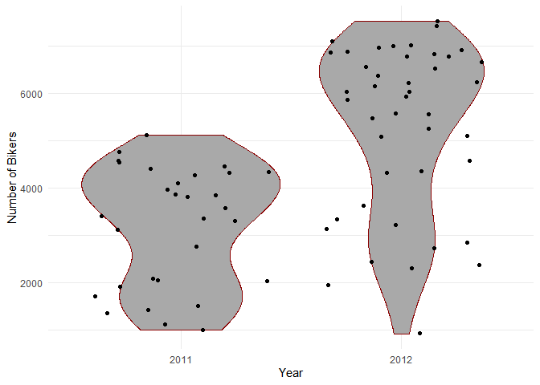
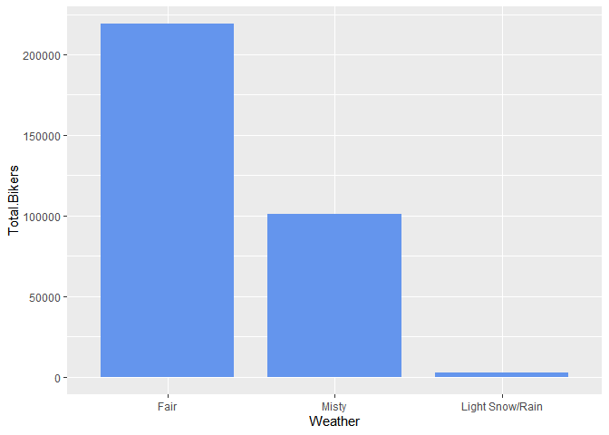
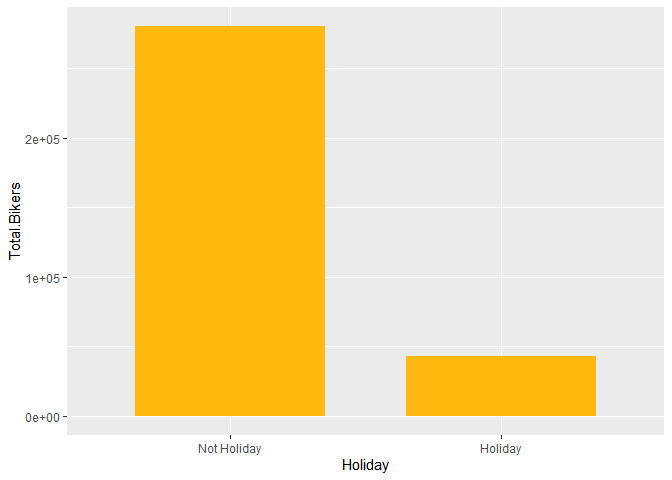
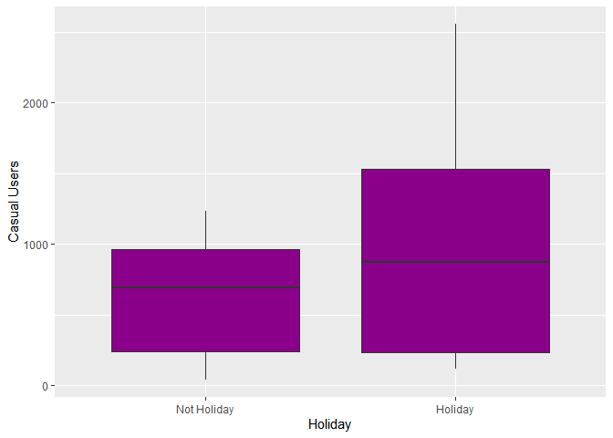

Bike Share Project
================
Soohee Jung, Kera Whitley

# Set up

Libraries and other set up should be in this chunk

``` r
library(tidyverse)
library(caret)
library(gbm)
library(shiny)
```

# Introduction

This dataset compiles the daily casual, registered and total (combined
casual and residual) bikers using this bike share. Looking at the
available variables in the dataset, there are several that are
attributes of the date, and the rest are attributes of the weather. We
will specifically be looking at the temperature, season, year and the
weather to predict the total number of bikers using the bike share.

\[Explain the variables\]

# Data

``` r
# Read in dataset
day.data <- read_csv("day.csv")
```

    ## 
    ## -- Column specification --------------------------------------------------------
    ## cols(
    ##   instant = col_double(),
    ##   dteday = col_date(format = ""),
    ##   season = col_double(),
    ##   yr = col_double(),
    ##   mnth = col_double(),
    ##   holiday = col_double(),
    ##   weekday = col_double(),
    ##   workingday = col_double(),
    ##   weathersit = col_double(),
    ##   temp = col_double(),
    ##   atemp = col_double(),
    ##   hum = col_double(),
    ##   windspeed = col_double(),
    ##   casual = col_double(),
    ##   registered = col_double(),
    ##   cnt = col_double()
    ## )

``` r
# Convert weekday column from numeric to character value
day.data$days[day.data$weekday==0] <- "Sunday"
day.data$days[day.data$weekday==1] <- "Monday"
day.data$days[day.data$weekday==2] <- "Tuesday"
day.data$days[day.data$weekday==3] <- "Wednesday"
day.data$days[day.data$weekday==4] <- "Thursday"
day.data$days[day.data$weekday==5] <- "Friday"
day.data$days[day.data$weekday==6] <- "Saturday"

# Get unique days
weekdays <- unique(day.data$days)

day <- day.data %>% filter(days == params$Day)

# Converting variables that should be factors into factor variables
day$season <- factor(day$season)
levels(day$season) <- c("Winter","Spring", "Summer", "Fall")

day$yr <- factor(day$yr)
levels(day$yr) <- c("2011", "2012")

day$mnth <- factor(day$mnth)
levels(day$mnth) <- c("Jan", "Feb", "Mar", "Apr", "May", "Jun", "Jul", "Aug", "Sep", "Oct", "Nov", "Dec")

day$holiday <- factor(day$holiday)
levels(day$holiday) <- c("Not Holiday", "Holiday")

day$workingday <- factor(day$workingday)
levels(day$workingday) <- c("Not Working", "Working")

day$weathersit <- factor(day$weathersit)
levels(day$weathersit) <- c("Fair", "Misty", "Light Snow/Rain", "Heavy Rain/Ice/Snow")

set.seed(13)
# The training set should be 70% of the data
n <- nrow(day) * 0.7
train <- sample_n(day, n, replace = FALSE)
test <- anti_join(day, train, by = "dteday")
```

# Summarizations

``` r
# Numerical summaries
summary(train)
```

    ##     instant          dteday              season      yr          mnth   
    ##  Min.   :  3.0   Min.   :2011-01-03   Winter:19   2011:30   Jan    : 9  
    ##  1st Qu.:213.0   1st Qu.:2011-08-01   Spring:19   2012:43   Aug    : 8  
    ##  Median :423.0   Median :2012-02-27   Summer:19             Jul    : 7  
    ##  Mean   :390.6   Mean   :2012-01-25   Fall  :16             Dec    : 7  
    ##  3rd Qu.:570.0   3rd Qu.:2012-07-23                         Mar    : 6  
    ##  Max.   :731.0   Max.   :2012-12-31                         Apr    : 6  
    ##                                                             (Other):30  
    ##         holiday      weekday        workingday               weathersit
    ##  Not Holiday:62   Min.   :1   Not Working:11   Fair               :47  
    ##  Holiday    :11   1st Qu.:1   Working    :62   Misty              :25  
    ##                   Median :1                    Light Snow/Rain    : 1  
    ##                   Mean   :1                    Heavy Rain/Ice/Snow: 0  
    ##                   3rd Qu.:1                                            
    ##                   Max.   :1                                            
    ##                                                                        
    ##       temp             atemp             hum           windspeed     
    ##  Min.   :0.09739   Min.   :0.1179   Min.   :0.3022   Min.   :0.0423  
    ##  1st Qu.:0.31333   1st Qu.:0.3037   1st Qu.:0.5043   1st Qu.:0.1312  
    ##  Median :0.52083   Median :0.5107   Median :0.6492   Median :0.1810  
    ##  Mean   :0.49126   Mean   :0.4717   Mean   :0.6266   Mean   :0.1912  
    ##  3rd Qu.:0.67833   3rd Qu.:0.6219   3rd Qu.:0.7342   3rd Qu.:0.2363  
    ##  Max.   :0.78167   Max.   :0.7241   Max.   :0.9113   Max.   :0.4179  
    ##                                                                      
    ##      casual         registered        cnt           days          
    ##  Min.   :  42.0   Min.   : 746   Min.   : 920   Length:73         
    ##  1st Qu.: 233.0   1st Qu.:2501   1st Qu.:3115   Class :character  
    ##  Median : 713.0   Median :3603   Median :4359   Mode  :character  
    ##  Mean   : 674.9   Mean   :3749   Mean   :4424                     
    ##  3rd Qu.: 998.0   3rd Qu.:5171   3rd Qu.:6153                     
    ##  Max.   :2557.0   Max.   :6435   Max.   :7525                     
    ## 

``` r
train %>% select(casual, registered) %>% colSums()
```

    ##     casual registered 
    ##      49265     273666

``` r
table(train$season, train$weathersit)
```

    ##         
    ##          Fair Misty Light Snow/Rain Heavy Rain/Ice/Snow
    ##   Winter   12     7               0                   0
    ##   Spring   11     8               0                   0
    ##   Summer   15     4               0                   0
    ##   Fall      9     6               1                   0

``` r
table(train$workingday, train$weathersit)
```

    ##              
    ##               Fair Misty Light Snow/Rain Heavy Rain/Ice/Snow
    ##   Not Working    8     3               0                   0
    ##   Working       39    22               1                   0

``` r
train %>% group_by(yr) %>% summarize(Total.Bikers=sum(cnt))
```

    ## # A tibble: 2 x 2
    ##   yr    Total.Bikers
    ##   <fct>        <dbl>
    ## 1 2011         96016
    ## 2 2012        226915

``` r
# We can inspect the trend of users across years
ggplot(train, aes(x = yr, y = cnt)) + 
  geom_violin(fill = "dark grey", color = "dark red") + 
  geom_jitter(shape = 16) + 
  labs(x = "Year", y = "Number of Bikers") + 
  theme_minimal()
```

<!-- -->

``` r
train %>% group_by(mnth) %>% 
  summarize(Total.casual=sum(casual),Total.registered=sum(registered),
            Total.Bikers=sum(cnt))
```

    ## # A tibble: 12 x 4
    ##    mnth  Total.casual Total.registered Total.Bikers
    ##    <fct>        <dbl>            <dbl>        <dbl>
    ##  1 Jan           1203            16744        17947
    ##  2 Feb           1278            10905        12183
    ##  3 Mar           2962            18233        21195
    ##  4 Apr           5095            22473        27568
    ##  5 May           6698            19004        25702
    ##  6 Jun           4553            25535        30088
    ##  7 Jul           6574            35421        41995
    ##  8 Aug           7638            37393        45031
    ##  9 Sep           5106            22758        27864
    ## 10 Oct           4954            26434        31388
    ## 11 Nov           1188            15790        16978
    ## 12 Dec           2016            22976        24992

``` r
# We can inspect the trend of users across months using this plot.
# There may be a seasonal effect present.
ggplot(train, aes(x = mnth, y = cnt, fill = "red")) + 
  geom_col() + 
  geom_col(data = train, aes(x = mnth, y = casual, fill = "blue")) +
  labs(x = "Month", y = "Total Number of Bikers") +
  scale_fill_discrete(name = "Biker Type", labels = c("Casual", "Registered"))
```

<!-- -->

``` r
train %>% group_by(season,mnth) %>% 
  summarize(Total.casual=sum(casual),Total.registered=sum(registered),
            Total.Bikers=sum(cnt))
```

    ## `summarise()` has grouped output by 'season'. You can override using the `.groups` argument.

    ## # A tibble: 16 x 5
    ## # Groups:   season [4]
    ##    season mnth  Total.casual Total.registered Total.Bikers
    ##    <fct>  <fct>        <dbl>            <dbl>        <dbl>
    ##  1 Winter Jan           1203            16744        17947
    ##  2 Winter Feb           1278            10905        12183
    ##  3 Winter Mar           1544             9988        11532
    ##  4 Winter Dec            613             3036         3649
    ##  5 Spring Mar           1418             8245         9663
    ##  6 Spring Apr           5095            22473        27568
    ##  7 Spring May           6698            19004        25702
    ##  8 Spring Jun           3414            19895        23309
    ##  9 Summer Jun           1139             5640         6779
    ## 10 Summer Jul           6574            35421        41995
    ## 11 Summer Aug           7638            37393        45031
    ## 12 Summer Sep           4105            16323        20428
    ## 13 Fall   Sep           1001             6435         7436
    ## 14 Fall   Oct           4954            26434        31388
    ## 15 Fall   Nov           1188            15790        16978
    ## 16 Fall   Dec           1403            19940        21343

``` r
# We can inspect the trend of all users across season using this plot.
# There may be weather or temperature effect present.
ggplot(train, aes(x = season, y = cnt)) + 
  geom_violin() +
  geom_jitter(shape = 16, size = 3, aes(color = mnth)) +
  labs(x = "Season", y = "Number of Bikers") +
  scale_color_manual(name = "Month", values = c("#a6cee3", "#1f78b4", "#b2df8a", "#33a02c", 
                                                "#fb9a99", "#e31a1c", "#fdbf6f", "#ff7f00", 
                                                "#cab2d6", "#6a3d9a", "#dfc27d", "#b15928")) +
  theme_minimal()
```

<!-- -->

``` r
by.weather <- train %>% group_by(weathersit) %>% 
  summarize(Total.casual=sum(casual),Total.registered=sum(registered),
            Total.Bikers=sum(cnt))
by.weather
```

    ## # A tibble: 3 x 4
    ##   weathersit      Total.casual Total.registered Total.Bikers
    ##   <fct>                  <dbl>            <dbl>        <dbl>
    ## 1 Fair                   35436           183582       219018
    ## 2 Misty                  13609            87539       101148
    ## 3 Light Snow/Rain          220             2545         2765

``` r
# We can inspect the trend of all users across weather condition using this plot.
ggplot(by.weather, aes(x=weathersit, y=Total.Bikers))+geom_col(fill="cornflowerblue", width = 0.8)+
  scale_x_discrete(name="Weather")
```

<!-- -->

``` r
# We can inspect the trend of all users across temperature using this plot.
ggplot(train, aes(x=temp, y=cnt)) + geom_point() + geom_smooth()+
  scale_x_continuous(name="Temperature")+scale_y_discrete(name="Bikers")
```

    ## `geom_smooth()` using method = 'loess' and formula 'y ~ x'

<!-- -->

``` r
by.holi <- train %>% group_by(holiday) %>% 
  summarize(Total.casual=sum(casual),Total.registered=sum(registered),
            Total.Bikers=sum(cnt))
by.holi
```

    ## # A tibble: 2 x 4
    ##   holiday     Total.casual Total.registered Total.Bikers
    ##   <fct>              <dbl>            <dbl>        <dbl>
    ## 1 Not Holiday        38333           241973       280306
    ## 2 Holiday            10932            31693        42625

``` r
# We can inspect the trend of all users across whether holiday or not using this plot.
ggplot(by.holi, aes(x=holiday, y=Total.Bikers)) + geom_col(fill="darkgoldenrod1", width = 0.7)+
  scale_x_discrete(name="Holiday")
```

<!-- -->

``` r
# We can inspect the trend of casual users across whether holiday or not using this plot.
ggplot(train, aes(x=holiday, y=casual))+geom_boxplot(fill="darkmagenta")+
  scale_x_discrete(name="Holiday")+scale_y_continuous(name="Casual Users")
```

<!-- -->

``` r
# We can inspect the trend of registered users across whether holiday or not using this plot.
ggplot(train, aes(x=holiday, y=registered))+geom_boxplot(fill="darkorchid")+
  scale_x_discrete(name="Holiday")+scale_y_continuous(name="Registered Users")
```

<!-- -->

# Modeling

## Linear Regression Model

*Linear regression* tries to find a linear equation which describe the
relationship between a response variable and a explanation variable. The
best model fit is made by minimizing the sum of squared residuals.
Simple linear regression model can be extended in many ways and we call
them *Multiple Linear Regression*.

``` r
set.seed(13)
# multiple linear regression model 1
lmFit <- train(cnt ~ season + temp + I(temp^2), data=train, method="lm",
               trControl=trainControl(method="cv",number=10))
summary(lmFit)
```

    ## 
    ## Call:
    ## lm(formula = .outcome ~ ., data = dat)
    ## 
    ## Residuals:
    ##     Min      1Q  Median      3Q     Max 
    ## -2298.8  -865.5   236.7   973.3  2162.3 
    ## 
    ## Coefficients:
    ##              Estimate Std. Error t value Pr(>|t|)   
    ## (Intercept)    -799.9     1068.9  -0.748  0.45689   
    ## seasonSpring    353.3      591.5   0.597  0.55233   
    ## seasonSummer   1430.4      771.9   1.853  0.06828 . 
    ## seasonFall     1184.4      519.1   2.282  0.02569 * 
    ## temp          15276.9     5583.4   2.736  0.00795 **
    ## `I(temp^2)`  -10771.9     5902.8  -1.825  0.07248 . 
    ## ---
    ## Signif. codes:  0 '***' 0.001 '**' 0.01 '*' 0.05 '.' 0.1 ' ' 1
    ## 
    ## Residual standard error: 1222 on 67 degrees of freedom
    ## Multiple R-squared:  0.6088, Adjusted R-squared:  0.5796 
    ## F-statistic: 20.85 on 5 and 67 DF,  p-value: 1.674e-12

``` r
lmPred <- predict(lmFit, newdata=test)

# multiple linear regression model 2
set.seed(13)
mlrFit <- train(cnt ~ season + temp + yr, data = train, method = "lm", 
               trControl = trainControl(method = "cv", number = 10))
summary(mlrFit)
```

    ## 
    ## Call:
    ## lm(formula = .outcome ~ ., data = dat)
    ## 
    ## Residuals:
    ##     Min      1Q  Median      3Q     Max 
    ## -2604.1  -409.0   135.7   424.9  1558.6 
    ## 
    ## Coefficients:
    ##              Estimate Std. Error t value Pr(>|t|)    
    ## (Intercept)    -79.07     319.91  -0.247   0.8055    
    ## seasonSpring   673.98     369.65   1.823   0.0727 .  
    ## seasonSummer  1142.18     486.27   2.349   0.0218 *  
    ## seasonFall    1768.03     304.57   5.805 1.93e-07 ***
    ## temp          5108.88     929.61   5.496 6.52e-07 ***
    ## yr2012        1923.09     187.34  10.265 2.20e-15 ***
    ## ---
    ## Signif. codes:  0 '***' 0.001 '**' 0.01 '*' 0.05 '.' 0.1 ' ' 1
    ## 
    ## Residual standard error: 780.3 on 67 degrees of freedom
    ## Multiple R-squared:  0.8404, Adjusted R-squared:  0.8285 
    ## F-statistic: 70.54 on 5 and 67 DF,  p-value: < 2.2e-16

``` r
mlrPred <- predict(mlrFit, newdata = test)
```

## Random Forest Model

*Random forest model* is one of 3 major methods of *Ensemble tree
model*. Create a tree from a random subset of predictors for a bootstrap
sample and then train the tree. Repeat this for many times, say 100 or
1000 repeats. The final prediction is average of these predictions.

``` r
set.seed(13)
# Get random forest model fit
rfFit <- train(cnt ~ season + temp + weathersit, data=train,
               method="rf", 
               trControl=trainControl(method="cv",number=10))
rfFit
```

    ## Random Forest 
    ## 
    ## 73 samples
    ##  3 predictor
    ## 
    ## No pre-processing
    ## Resampling: Cross-Validated (10 fold) 
    ## Summary of sample sizes: 67, 67, 65, 65, 66, 66, ... 
    ## Resampling results across tuning parameters:
    ## 
    ##   mtry  RMSE      Rsquared   MAE     
    ##   2     1273.427  0.5997770  1124.109
    ##   4     1287.812  0.5719351  1136.518
    ##   7     1341.946  0.5341677  1165.450
    ## 
    ## RMSE was used to select the optimal model using the smallest value.
    ## The final value used for the model was mtry = 2.

``` r
rfPred <- predict(rfFit, newdata=test)
```

## Boosted Tree Model

The *boosted tree model* is a type of *ensemble tree model*. The way the
boosted tree works is that the trees are fit sequentially. Each new tree
is fit on on a modified version of the original data and the predictions
are updated as the trees are grown.

``` r
library(gbm)
set.seed(13)

boostFit <- gbm(cnt ~ season + temp + yr + weathersit, data = train, distribution = "gaussian", n.trees = 5000, 
                shrinkage = 0.1, interaction.depth = 4)
boostFit
```

    ## gbm(formula = cnt ~ season + temp + yr + weathersit, distribution = "gaussian", 
    ##     data = train, n.trees = 5000, interaction.depth = 4, shrinkage = 0.1)
    ## A gradient boosted model with gaussian loss function.
    ## 5000 iterations were performed.
    ## There were 4 predictors of which 4 had non-zero influence.

``` r
boostPred <- predict(boostFit, newdata = test, n.trees = 5000)
boostPred
```

    ##  [1] 1516.496 1413.704 1532.545 4361.009 3509.500 4187.614 3886.792 4156.368
    ##  [9] 3946.243 5330.365 4904.123 4188.876 4467.971 5114.987 4569.747 5324.677
    ## [17] 4611.901 3739.090 3673.785 3635.956 4615.904 2040.034 3070.414 2854.065
    ## [25] 4461.693 4194.745 5356.715 6400.585 6118.282 6382.474 5522.595 5339.121

# Comparison

``` r
set.seed(13)
# multiple linear regression model 1
multiRMSE <- postResample(lmPred, test$cnt)
multiRMSE
```

    ##         RMSE     Rsquared          MAE 
    ## 1499.3188134    0.2569797 1190.3649790

``` r
# multiple linear regression model 2
mlrRMSE <- postResample(mlrPred, test$cnt)
mlrRMSE
```

    ##         RMSE     Rsquared          MAE 
    ## 1216.2297418    0.4282043  714.1806683

``` r
# random forest model
rfRMSE <- postResample(rfPred, test$cnt)
rfRMSE
```

    ##         RMSE     Rsquared          MAE 
    ## 1372.1950563    0.3219606 1123.7431671

``` r
# boosted tree model
boostRMSE <- postResample(boostPred, test$cnt)
boostRMSE
```

    ##         RMSE     Rsquared          MAE 
    ## 1256.8466717    0.3892654  670.9009681

``` r
# compare
lowestRMSE <- c(MultipleLR1=multiRMSE[1],MultipleLR2=mlrRMSE[1],RandomForest=rfRMSE[1],Boosting=boostRMSE[1])
lowestRMSE
```

    ##  MultipleLR1.RMSE  MultipleLR2.RMSE RandomForest.RMSE     Boosting.RMSE 
    ##          1499.319          1216.230          1372.195          1256.847

The preferred model has the lowest RMSE. The model that has the lowest
RMSE for \[day\] is 2, and has the model \[equation\].
