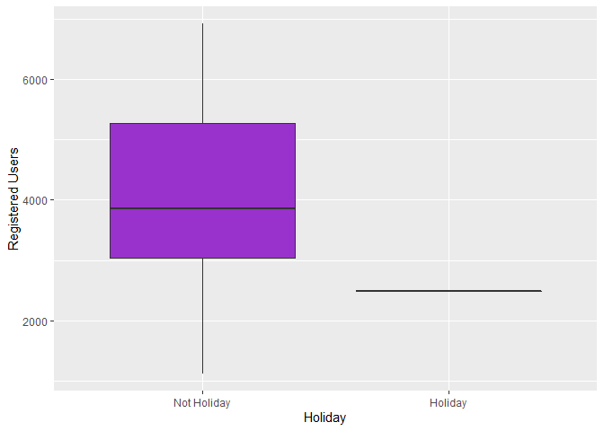

Bike Share Project
================
Soohee Jung, Kera Whitley

# Introduction

This dataset compiles the daily casual, registered and total (combined
casual and residual) bikers using this bike share. Looking at the
available variables in the dataset, there are several that are
attributes of the date, and the rest are attributes of the weather. We
will be looking at the temperature, season, and the year to predict the
total number of bikers using the bike share. The idea behind looking at
these particular variables being that, there are more people riding
bikes when the weather is nice. Year would come into play because the
longer the bike share is around, the more chances there are for people
to know about and use it.

Later, two multiple linear regression models, one random forest model
and one boosted models were fit. The variables specifically chosen were
season, temp, atemp, and yr. When exploring the data with different
plots and tables, it could be seen that the number of total bike share
users seemed to fluctuate with differences in these variables. The
correlation plot shows that theses variables have the highest either
positive or negative correlation with the total number of bikers, out of
the variables explored. The violin plots show firstly that there is a
definite difference in the number of total users by year, and that there
is a general trend with regard to season, but that month may not as good
of an indicator. The normalized temperature, the normalized temperature
feel both are fairly highly correlated to the total number of bikers.

# Data

``` r
# Read in dataset
day.data <- read_csv("day.csv")
```

    ## 
    ## -- Column specification ------------------------------------------------------------------------------------------------
    ## cols(
    ##   instant = col_double(),
    ##   dteday = col_date(format = ""),
    ##   season = col_double(),
    ##   yr = col_double(),
    ##   mnth = col_double(),
    ##   holiday = col_double(),
    ##   weekday = col_double(),
    ##   workingday = col_double(),
    ##   weathersit = col_double(),
    ##   temp = col_double(),
    ##   atemp = col_double(),
    ##   hum = col_double(),
    ##   windspeed = col_double(),
    ##   casual = col_double(),
    ##   registered = col_double(),
    ##   cnt = col_double()
    ## )

``` r
# Convert weekday column from numeric to character value
day.data$days[day.data$weekday==0] <- "Sunday"
day.data$days[day.data$weekday==1] <- "Monday"
day.data$days[day.data$weekday==2] <- "Tuesday"
day.data$days[day.data$weekday==3] <- "Wednesday"
day.data$days[day.data$weekday==4] <- "Thursday"
day.data$days[day.data$weekday==5] <- "Friday"
day.data$days[day.data$weekday==6] <- "Saturday"

# Get unique days
weekdays <- unique(day.data$days)

# Filter data to subset
day <- day.data %>% filter(days == params$Day)

# Converting variables that should be factors into factor variables
day$season <- factor(day$season)
levels(day$season) <- c("Winter","Spring", "Summer", "Fall")

day$yr <- factor(day$yr)
levels(day$yr) <- c("2011", "2012")

day$mnth <- factor(day$mnth)
levels(day$mnth) <- c("Jan", "Feb", "Mar", "Apr", "May", "Jun", "Jul", "Aug", "Sep", "Oct", "Nov", "Dec")

day$holiday <- factor(day$holiday)
levels(day$holiday) <- c("Not Holiday", "Holiday")

day$workingday <- factor(day$workingday)
levels(day$workingday) <- c("Not Working", "Working")

day$weathersit <- factor(day$weathersit)
levels(day$weathersit) <- c("Fair", "Misty", "Light Snow/Rain", "Heavy Rain/Ice/Snow")

set.seed(13)
# The training set should be 70% of the data
n <- nrow(day) * 0.7
train <- sample_n(day, n, replace = FALSE)
test <- anti_join(day, train, by = "dteday")
```

# Summarizations

produce some meaningful summary statistics and plots about the training
data we are working with. Explore the data a bit and then we are ready
to fit some models.

``` r
str(day.data)
```

    ## spec_tbl_df [731 x 17] (S3: spec_tbl_df/tbl_df/tbl/data.frame)
    ##  $ instant   : num [1:731] 1 2 3 4 5 6 7 8 9 10 ...
    ##  $ dteday    : Date[1:731], format: "2011-01-01" "2011-01-02" "2011-01-03" "2011-01-04" ...
    ##  $ season    : num [1:731] 1 1 1 1 1 1 1 1 1 1 ...
    ##  $ yr        : num [1:731] 0 0 0 0 0 0 0 0 0 0 ...
    ##  $ mnth      : num [1:731] 1 1 1 1 1 1 1 1 1 1 ...
    ##  $ holiday   : num [1:731] 0 0 0 0 0 0 0 0 0 0 ...
    ##  $ weekday   : num [1:731] 6 0 1 2 3 4 5 6 0 1 ...
    ##  $ workingday: num [1:731] 0 0 1 1 1 1 1 0 0 1 ...
    ##  $ weathersit: num [1:731] 2 2 1 1 1 1 2 2 1 1 ...
    ##  $ temp      : num [1:731] 0.344 0.363 0.196 0.2 0.227 ...
    ##  $ atemp     : num [1:731] 0.364 0.354 0.189 0.212 0.229 ...
    ##  $ hum       : num [1:731] 0.806 0.696 0.437 0.59 0.437 ...
    ##  $ windspeed : num [1:731] 0.16 0.249 0.248 0.16 0.187 ...
    ##  $ casual    : num [1:731] 331 131 120 108 82 88 148 68 54 41 ...
    ##  $ registered: num [1:731] 654 670 1229 1454 1518 ...
    ##  $ cnt       : num [1:731] 985 801 1349 1562 1600 ...
    ##  $ days      : chr [1:731] "Saturday" "Sunday" "Monday" "Tuesday" ...
    ##  - attr(*, "spec")=
    ##   .. cols(
    ##   ..   instant = col_double(),
    ##   ..   dteday = col_date(format = ""),
    ##   ..   season = col_double(),
    ##   ..   yr = col_double(),
    ##   ..   mnth = col_double(),
    ##   ..   holiday = col_double(),
    ##   ..   weekday = col_double(),
    ##   ..   workingday = col_double(),
    ##   ..   weathersit = col_double(),
    ##   ..   temp = col_double(),
    ##   ..   atemp = col_double(),
    ##   ..   hum = col_double(),
    ##   ..   windspeed = col_double(),
    ##   ..   casual = col_double(),
    ##   ..   registered = col_double(),
    ##   ..   cnt = col_double()
    ##   .. )

``` r
Correlation <- cor(select(day.data,-c(instant,dteday,weekday,days)), method="spearman")
corrplot(Correlation, method="number", type = 'lower', tl.col = 'black', 
         cl.ratio = 0.2, tl.srt = 45, number.cex = 0.7)
```

<!-- -->

``` r
# Numerical summaries
summary(train)
```

    ##     instant          dteday              season      yr          mnth           holiday      weekday        workingday
    ##  Min.   :  7.0   Min.   :2011-01-07   Winter:19   2011:30   Aug    : 9   Not Holiday:71   Min.   :5   Not Working: 1  
    ##  1st Qu.:215.2   1st Qu.:2011-08-03   Spring:19   2012:42   Dec    : 8   Holiday    : 1   1st Qu.:5   Working    :71  
    ##  Median :423.5   Median :2012-02-27   Summer:20             Jan    : 7                    Median :5                   
    ##  Mean   :390.4   Mean   :2012-01-25   Fall  :14             Apr    : 7                    Mean   :5                   
    ##  3rd Qu.:568.8   3rd Qu.:2012-07-21                         Jun    : 7                    3rd Qu.:5                   
    ##  Max.   :728.0   Max.   :2012-12-28                         Feb    : 6                    Max.   :5                   
    ##                                                             (Other):28                                                
    ##                weathersit      temp            atemp             hum           windspeed           casual      
    ##  Fair               :46   Min.   :0.1775   Min.   :0.1578   Min.   :0.3542   Min.   :0.02239   Min.   :  38.0  
    ##  Misty              :26   1st Qu.:0.3490   1st Qu.:0.3381   1st Qu.:0.5207   1st Qu.:0.13589   1st Qu.: 305.2  
    ##  Light Snow/Rain    : 0   Median :0.4950   Median :0.4634   Median :0.5900   Median :0.17019   Median : 796.5  
    ##  Heavy Rain/Ice/Snow: 0   Mean   :0.5053   Mean   :0.4789   Mean   :0.6012   Mean   :0.19009   Mean   : 802.7  
    ##                           3rd Qu.:0.6813   3rd Qu.:0.6167   3rd Qu.:0.6910   3rd Qu.:0.23229   3rd Qu.:1250.5  
    ##                           Max.   :0.8483   Max.   :0.8409   Max.   :0.8442   Max.   :0.41480   Max.   :2469.0  
    ##                                                                                                                
    ##    registered        cnt           days          
    ##  Min.   :1129   Min.   :1167   Length:72         
    ##  1st Qu.:3017   1st Qu.:3350   Class :character  
    ##  Median :3848   Median :4634   Mode  :character  
    ##  Mean   :4038   Mean   :4840                     
    ##  3rd Qu.:5251   3rd Qu.:6528                     
    ##  Max.   :6917   Max.   :8362                     
    ## 

``` r
train %>% select(casual, registered) %>% colSums()
```

    ##     casual registered 
    ##      57791     290725

``` r
table(train$season, train$weathersit)
```

    ##         
    ##          Fair Misty Light Snow/Rain Heavy Rain/Ice/Snow
    ##   Winter    8    11               0                   0
    ##   Spring   14     5               0                   0
    ##   Summer   14     6               0                   0
    ##   Fall     10     4               0                   0

``` r
table(train$workingday, train$weathersit)
```

    ##              
    ##               Fair Misty Light Snow/Rain Heavy Rain/Ice/Snow
    ##   Not Working    1     0               0                   0
    ##   Working       45    26               0                   0

``` r
# Total bikers grouped by year
train %>% group_by(yr) %>% summarize(Total.Bikers=sum(cnt))
```

    ## # A tibble: 2 x 2
    ##   yr    Total.Bikers
    ##   <fct>        <dbl>
    ## 1 2011         98647
    ## 2 2012        249869

``` r
# We can inspect the trend of users across years
ggplot(train, aes(x = yr, y = cnt)) + 
  geom_violin(fill = "dark grey", color = "dark red") + 
  geom_jitter(shape = 16) + 
  labs(x = "Year", y = "Number of Bikers") + 
  theme_minimal()
```

<!-- -->

``` r
# Total number of casual users, registered users and all bikers by month
train %>% group_by(mnth) %>% 
  summarize(Total.casual=sum(casual),Total.registered=sum(registered),
            Total.Bikers=sum(cnt))
```

    ## # A tibble: 12 x 4
    ##    mnth  Total.casual Total.registered Total.Bikers
    ##    <fct>        <dbl>            <dbl>        <dbl>
    ##  1 Jan           1126            17025        18151
    ##  2 Feb           1492            13988        15480
    ##  3 Mar           5142            21891        27033
    ##  4 Apr           6534            26671        33205
    ##  5 May           4741            19157        23898
    ##  6 Jun           7090            33622        40712
    ##  7 Jul           6115            27598        33713
    ##  8 Aug          10273            43353        53626
    ##  9 Sep           4719            26376        31095
    ## 10 Oct           4730            23641        28371
    ## 11 Nov           3316             9233        12549
    ## 12 Dec           2513            28170        30683

``` r
# We can inspect the trend of users across months using this plot.
# There may be a seasonal effect present.
ggplot(train, aes(x = mnth, y = cnt, fill = "red")) + 
  geom_col() + 
  geom_col(data = train, aes(x = mnth, y = casual, fill = "blue")) +
  labs(x = "Month", y = "Total Number of Bikers") +
  scale_fill_discrete(name = "Biker Type", labels = c("Casual", "Registered"))
```

<!-- -->

``` r
# Total number of casual, registered and all bikers by month within each season
train %>% group_by(season,mnth) %>% 
  summarize(Total.casual=sum(casual),Total.registered=sum(registered),
            Total.Bikers=sum(cnt))
```

    ## `summarise()` has grouped output by 'season'. You can override using the `.groups` argument.

    ## # A tibble: 16 x 5
    ## # Groups:   season [4]
    ##    season mnth  Total.casual Total.registered Total.Bikers
    ##    <fct>  <fct>        <dbl>            <dbl>        <dbl>
    ##  1 Winter Jan           1126            17025        18151
    ##  2 Winter Feb           1492            13988        15480
    ##  3 Winter Mar           1577             9425        11002
    ##  4 Winter Dec           1028             7899         8927
    ##  5 Spring Mar           3565            12466        16031
    ##  6 Spring Apr           6534            26671        33205
    ##  7 Spring May           4741            19157        23898
    ##  8 Spring Jun           5297            24129        29426
    ##  9 Summer Jun           1793             9493        11286
    ## 10 Summer Jul           6115            27598        33713
    ## 11 Summer Aug          10273            43353        53626
    ## 12 Summer Sep           3674            20006        23680
    ## 13 Fall   Sep           1045             6370         7415
    ## 14 Fall   Oct           4730            23641        28371
    ## 15 Fall   Nov           3316             9233        12549
    ## 16 Fall   Dec           1485            20271        21756

``` r
# We can inspect the trend of all users across season using this plot.
# There may be weather or temperature effect present.
ggplot(train, aes(x = season, y = cnt)) + 
  geom_violin() +
  geom_jitter(shape = 16, size = 3, aes(color = mnth)) +
  labs(x = "Season", y = "Number of Bikers") +
  scale_color_manual(name = "Month", values = c("#a6cee3", "#1f78b4", "#b2df8a", "#33a02c", 
                                                "#fb9a99", "#e31a1c", "#fdbf6f", "#ff7f00", 
                                                "#cab2d6", "#6a3d9a", "#dfc27d", "#b15928")) +
  theme_minimal()
```

<!-- -->

``` r
# Total number of casual, registered and all bikers by weather
by.weather <- train %>% group_by(weathersit) %>% 
  summarize(Total.casual=sum(casual),Total.registered=sum(registered),
            Total.Bikers=sum(cnt))
by.weather
```

    ## # A tibble: 2 x 4
    ##   weathersit Total.casual Total.registered Total.Bikers
    ##   <fct>             <dbl>            <dbl>        <dbl>
    ## 1 Fair              42058           196670       238728
    ## 2 Misty             15733            94055       109788

``` r
# We can inspect the trend of all users across weather condition using this plot.
ggplot(by.weather, aes(x=weathersit, y=Total.Bikers))+geom_col(fill="cornflowerblue", width = 0.8)+
  scale_x_discrete(name="Weather")
```

<!-- -->

``` r
# We can inspect the trend of all users across temperature using this plot.
ggplot(train, aes(x=temp, y=cnt)) + geom_point() + geom_smooth()+
  scale_x_continuous(name="Temperature")+scale_y_discrete(name="Bikers")
```

    ## `geom_smooth()` using method = 'loess' and formula 'y ~ x'

<!-- -->

``` r
# We can inspect the trend of all users across feeling temperature using this plot.
ggplot(train, aes(x=atemp, y=cnt)) + geom_point() + geom_smooth()+
  scale_x_continuous(name="Feeling Temperature")+scale_y_discrete(name="Bikers")
```

    ## `geom_smooth()` using method = 'loess' and formula 'y ~ x'

<!-- -->

``` r
# Total number of casual, registered and all bikers by holiday or not
by.holi <- train %>% group_by(holiday) %>% 
  summarize(Total.casual=sum(casual),Total.registered=sum(registered),
            Total.Bikers=sum(cnt))
by.holi
```

    ## # A tibble: 2 x 4
    ##   holiday     Total.casual Total.registered Total.Bikers
    ##   <fct>              <dbl>            <dbl>        <dbl>
    ## 1 Not Holiday        57149           288241       345390
    ## 2 Holiday              642             2484         3126

``` r
# We can inspect the trend of all users across whether holiday or not using this plot.
ggplot(by.holi, aes(x=holiday, y=Total.Bikers)) + geom_col(fill="darkgoldenrod1", width = 0.7)+
  scale_x_discrete(name="Holiday")
```

<!-- -->

``` r
# We can inspect the trend of casual users across whether holiday or not using this plot.
ggplot(train, aes(x=holiday, y=casual))+geom_boxplot(fill="darkmagenta")+
  scale_x_discrete(name="Holiday")+scale_y_continuous(name="Casual Users")
```

<!-- -->

``` r
# We can inspect the trend of registered users across whether holiday or not using this plot.
ggplot(train, aes(x=holiday, y=registered))+geom_boxplot(fill="darkorchid")+
  scale_x_discrete(name="Holiday")+scale_y_continuous(name="Registered Users")
```

<!-- -->

# Modeling

## Linear Regression Model

*Linear regression* tries to find a linear equation which describe the
relationship between a response variable and a explanation variable. The
best model fit is made by minimizing the sum of squared residuals.
Simple linear regression model can be extended in many ways and we call
them *Multiple Linear Regression*.

``` r
set.seed(13)
# multiple linear regression model 1
lmFit <- train(cnt ~ season + temp + atemp, data=train, method="lm",
               trControl=trainControl(method="cv",number=10))
summary(lmFit)
```

    ## 
    ## Call:
    ## lm(formula = .outcome ~ ., data = dat)
    ## 
    ## Residuals:
    ##     Min      1Q  Median      3Q     Max 
    ## -3072.8  -952.4  -226.4  1241.1  2905.2 
    ## 
    ## Coefficients:
    ##              Estimate Std. Error t value Pr(>|t|)   
    ## (Intercept)    1178.9      630.6   1.870  0.06597 . 
    ## seasonSpring   1534.6      573.7   2.675  0.00941 **
    ## seasonSummer    932.7      835.4   1.116  0.26826   
    ## seasonFall     1690.6      546.2   3.095  0.00289 **
    ## temp           8698.5     3514.3   2.475  0.01589 * 
    ## atemp         -3604.6     3406.7  -1.058  0.29386   
    ## ---
    ## Signif. codes:  0 '***' 0.001 '**' 0.01 '*' 0.05 '.' 0.1 ' ' 1
    ## 
    ## Residual standard error: 1483 on 66 degrees of freedom
    ## Multiple R-squared:  0.4962, Adjusted R-squared:  0.458 
    ## F-statistic:    13 on 5 and 66 DF,  p-value: 8.228e-09

``` r
lmPred <- predict(lmFit, newdata=test)

# multiple linear regression model 2
set.seed(13)
mlrFit <- train(cnt ~ season + temp + yr, data = train, method = "lm", 
               trControl = trainControl(method = "cv", number = 10))
summary(mlrFit)
```

    ## 
    ## Call:
    ## lm(formula = .outcome ~ ., data = dat)
    ## 
    ## Residuals:
    ##     Min      1Q  Median      3Q     Max 
    ## -2832.6  -657.4   249.2   593.5  1912.1 
    ## 
    ## Coefficients:
    ##              Estimate Std. Error t value Pr(>|t|)    
    ## (Intercept)     283.1      397.6   0.712 0.478933    
    ## seasonSpring   1675.0      358.4   4.674 1.50e-05 ***
    ## seasonSummer   1195.1      517.0   2.311 0.023938 *  
    ## seasonFall     1854.1      341.2   5.433 8.58e-07 ***
    ## temp           4087.1     1027.3   3.979 0.000175 ***
    ## yr2012         2327.8      225.9  10.303 2.25e-15 ***
    ## ---
    ## Signif. codes:  0 '***' 0.001 '**' 0.01 '*' 0.05 '.' 0.1 ' ' 1
    ## 
    ## Residual standard error: 926.2 on 66 degrees of freedom
    ## Multiple R-squared:  0.8036, Adjusted R-squared:  0.7887 
    ## F-statistic:    54 on 5 and 66 DF,  p-value: < 2.2e-16

``` r
mlrPred <- predict(mlrFit, newdata = test)
```

## Random Forest Model

*Random forest model* is one of 3 major methods of *Ensemble tree
model*. It is flexible and one big advantage of the random forest model
is that it can be used for both classification and regression models. It
creates multiple trees from a random subset of predictors for each
bootstrap sample and then train the trees. The final prediction is
average of these predictions.

``` r
set.seed(13)
# Get random forest model fit
rfFit <- train(cnt ~ season + temp + atemp + yr, data=train,
               method="rf", 
               trControl=trainControl(method="cv",number=10))
rfFit
```

    ## Random Forest 
    ## 
    ## 72 samples
    ##  4 predictor
    ## 
    ## No pre-processing
    ## Resampling: Cross-Validated (10 fold) 
    ## Summary of sample sizes: 66, 66, 65, 64, 65, 65, ... 
    ## Resampling results across tuning parameters:
    ## 
    ##   mtry  RMSE      Rsquared   MAE     
    ##   2     950.4355  0.8044147  791.4315
    ##   4     930.8603  0.8021760  747.3272
    ##   6     915.2065  0.8055960  738.5627
    ## 
    ## RMSE was used to select the optimal model using the smallest value.
    ## The final value used for the model was mtry = 6.

``` r
rfPred <- predict(rfFit, newdata=test)
```

## Boosted Tree Model

The *boosted tree model* is a type of *ensemble tree model*. The way the
boosted tree works is that the trees are fit sequentially. Once the
first tree has been fit, the residuals from that tree are recorded. They
are then used as the new response and a new tree is fit. The residuals
from this next tree are then used as the new response. this process
repeats a number of times, with 5000 not being unreasonable.

``` r
set.seed(13)

boostFit <- train(cnt ~ season + temp + yr, data = train, method = "gbm", verbose = FALSE,
                  preProcess = c("center", "scale"),
                  trControl = trainControl(method = "cv", number = 10))
boostFit
```

    ## Stochastic Gradient Boosting 
    ## 
    ## 72 samples
    ##  3 predictor
    ## 
    ## Pre-processing: centered (5), scaled (5) 
    ## Resampling: Cross-Validated (10 fold) 
    ## Summary of sample sizes: 66, 66, 65, 64, 65, 65, ... 
    ## Resampling results across tuning parameters:
    ## 
    ##   interaction.depth  n.trees  RMSE       Rsquared   MAE     
    ##   1                   50      1024.7606  0.7448696  869.6224
    ##   1                  100       987.2182  0.7603217  825.0626
    ##   1                  150       975.9073  0.7622217  810.5475
    ##   2                   50       984.1650  0.7614231  831.0748
    ##   2                  100       975.1168  0.7630597  813.7628
    ##   2                  150       976.0519  0.7617358  817.1868
    ##   3                   50       999.4227  0.7600185  836.3686
    ##   3                  100       984.9978  0.7644496  804.1596
    ##   3                  150       979.1433  0.7607793  803.0571
    ## 
    ## Tuning parameter 'shrinkage' was held constant at a value of 0.1
    ## Tuning parameter 'n.minobsinnode' was held constant
    ##  at a value of 10
    ## RMSE was used to select the optimal model using the smallest value.
    ## The final values used for the model were n.trees = 100, interaction.depth = 2, shrinkage = 0.1 and n.minobsinnode = 10.

``` r
boostPred <- predict(boostFit, newdata = test)
```

# Comparison

``` r
set.seed(13)
# multiple linear regression model 1
multiRMSE <- postResample(lmPred, test$cnt)

# multiple linear regression model 2
mlrRMSE <- postResample(mlrPred, test$cnt)

# random forest model
rfRMSE <- postResample(rfPred, test$cnt)

# boosted tree model
boostRMSE <- postResample(boostPred, test$cnt)

# compare
lowestRMSE <- c(MultipleLR1=multiRMSE[1],MultipleLR2=mlrRMSE[1],RandomForest=rfRMSE[1],Boosting=boostRMSE[1])
lowestRMSE
```

    ##  MultipleLR1.RMSE  MultipleLR2.RMSE RandomForest.RMSE     Boosting.RMSE 
    ##         1367.1881          798.0399          834.5428         1117.3037

The preferred model has the lowest RMSE. The model that has the lowest
RMSE for Friday is MultipleLR2.RMSE.
