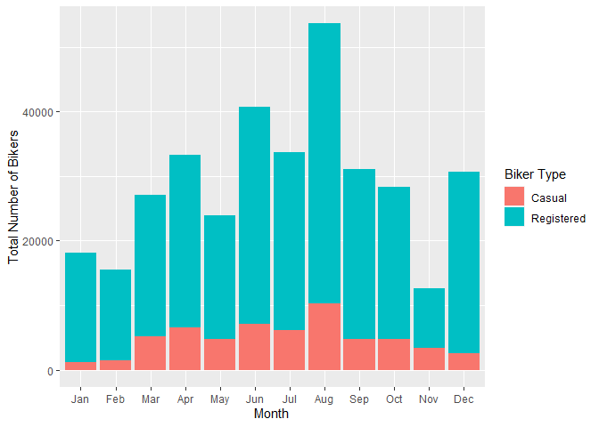
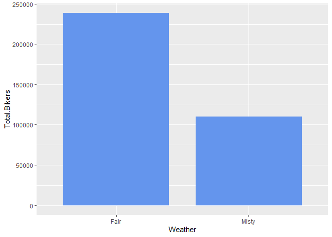
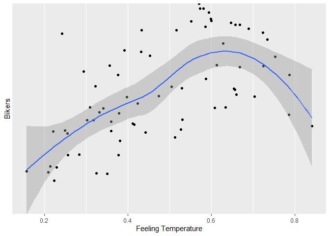
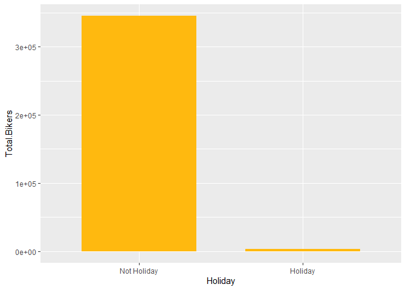

Bike Share Project
================
Soohee Jung, Kera Whitley

# Set up

Libraries and other set up should be in this chunk

``` r
library(tidyverse)
library(caret)
library(gbm)
library(shiny)
```

# Introduction

This dataset compiles the daily casual, registered and total (combined
casual and residual) bikers using this bike share. Looking at the
available variables in the dataset, there are several that are
attributes of the date, and the rest are attributes of the weather. We
will specifically be looking at the temperature, season, year and the
weather to predict the total number of bikers using the bike share.

\[Explain the variables\]

# Data

``` r
# Read in dataset
day.data <- read_csv("day.csv")
```

    ## 
    ## -- Column specification -------------------------------------------------------------------------------------------------------------------
    ## cols(
    ##   instant = col_double(),
    ##   dteday = col_date(format = ""),
    ##   season = col_double(),
    ##   yr = col_double(),
    ##   mnth = col_double(),
    ##   holiday = col_double(),
    ##   weekday = col_double(),
    ##   workingday = col_double(),
    ##   weathersit = col_double(),
    ##   temp = col_double(),
    ##   atemp = col_double(),
    ##   hum = col_double(),
    ##   windspeed = col_double(),
    ##   casual = col_double(),
    ##   registered = col_double(),
    ##   cnt = col_double()
    ## )

``` r
# Convert weekday column from numeric to character value
day.data$days[day.data$weekday==0] <- "Sunday"
day.data$days[day.data$weekday==1] <- "Monday"
day.data$days[day.data$weekday==2] <- "Tuesday"
day.data$days[day.data$weekday==3] <- "Wednesday"
day.data$days[day.data$weekday==4] <- "Thursday"
day.data$days[day.data$weekday==5] <- "Friday"
day.data$days[day.data$weekday==6] <- "Saturday"

# Get unique days
weekdays <- unique(day.data$days)

day <- day.data %>% filter(days == params$Day)

# Converting variables that should be factors into factor variables
day$season <- factor(day$season)
levels(day$season) <- c("Winter","Spring", "Summer", "Fall")

day$yr <- factor(day$yr)
levels(day$yr) <- c("2011", "2012")

day$mnth <- factor(day$mnth)
levels(day$mnth) <- c("Jan", "Feb", "Mar", "Apr", "May", "Jun", "Jul", "Aug", "Sep", "Oct", "Nov", "Dec")

day$holiday <- factor(day$holiday)
levels(day$holiday) <- c("Not Holiday", "Holiday")

day$workingday <- factor(day$workingday)
levels(day$workingday) <- c("Not Working", "Working")

day$weathersit <- factor(day$weathersit)
levels(day$weathersit) <- c("Fair", "Misty", "Light Snow/Rain", "Heavy Rain/Ice/Snow")

set.seed(13)
# The training set should be 70% of the data
n <- nrow(day) * 0.7
train <- sample_n(day, n, replace = FALSE)
test <- anti_join(day, train, by = "dteday")
```

# Summarizations

``` r
# Numerical summaries
summary(train)
```

    ##     instant          dteday              season      yr          mnth           holiday      weekday        workingday
    ##  Min.   :  7.0   Min.   :2011-01-07   Winter:19   2011:30   Aug    : 9   Not Holiday:71   Min.   :5   Not Working: 1  
    ##  1st Qu.:215.2   1st Qu.:2011-08-03   Spring:19   2012:42   Dec    : 8   Holiday    : 1   1st Qu.:5   Working    :71  
    ##  Median :423.5   Median :2012-02-27   Summer:20             Jan    : 7                    Median :5                   
    ##  Mean   :390.4   Mean   :2012-01-25   Fall  :14             Apr    : 7                    Mean   :5                   
    ##  3rd Qu.:568.8   3rd Qu.:2012-07-21                         Jun    : 7                    3rd Qu.:5                   
    ##  Max.   :728.0   Max.   :2012-12-28                         Feb    : 6                    Max.   :5                   
    ##                                                             (Other):28                                                
    ##                weathersit      temp            atemp             hum           windspeed           casual         registered  
    ##  Fair               :46   Min.   :0.1775   Min.   :0.1578   Min.   :0.3542   Min.   :0.02239   Min.   :  38.0   Min.   :1129  
    ##  Misty              :26   1st Qu.:0.3490   1st Qu.:0.3381   1st Qu.:0.5207   1st Qu.:0.13589   1st Qu.: 305.2   1st Qu.:3017  
    ##  Light Snow/Rain    : 0   Median :0.4950   Median :0.4634   Median :0.5900   Median :0.17019   Median : 796.5   Median :3848  
    ##  Heavy Rain/Ice/Snow: 0   Mean   :0.5053   Mean   :0.4789   Mean   :0.6012   Mean   :0.19009   Mean   : 802.7   Mean   :4038  
    ##                           3rd Qu.:0.6813   3rd Qu.:0.6167   3rd Qu.:0.6910   3rd Qu.:0.23229   3rd Qu.:1250.5   3rd Qu.:5251  
    ##                           Max.   :0.8483   Max.   :0.8409   Max.   :0.8442   Max.   :0.41480   Max.   :2469.0   Max.   :6917  
    ##                                                                                                                               
    ##       cnt           days          
    ##  Min.   :1167   Length:72         
    ##  1st Qu.:3350   Class :character  
    ##  Median :4634   Mode  :character  
    ##  Mean   :4840                     
    ##  3rd Qu.:6528                     
    ##  Max.   :8362                     
    ## 

``` r
train %>% select(casual, registered) %>% colSums()
```

    ##     casual registered 
    ##      57791     290725

``` r
table(train$season, train$weathersit)
```

    ##         
    ##          Fair Misty Light Snow/Rain Heavy Rain/Ice/Snow
    ##   Winter    8    11               0                   0
    ##   Spring   14     5               0                   0
    ##   Summer   14     6               0                   0
    ##   Fall     10     4               0                   0

``` r
table(train$workingday, train$weathersit)
```

    ##              
    ##               Fair Misty Light Snow/Rain Heavy Rain/Ice/Snow
    ##   Not Working    1     0               0                   0
    ##   Working       45    26               0                   0

``` r
train %>% group_by(yr) %>% summarize(Total.Bikers=sum(cnt))
```

    ## # A tibble: 2 x 2
    ##   yr    Total.Bikers
    ##   <fct>        <dbl>
    ## 1 2011         98647
    ## 2 2012        249869

``` r
# We can inspect the trend of users across years
ggplot(train, aes(x = yr, y = cnt)) + 
  geom_violin(fill = "dark grey", color = "dark red") + 
  geom_jitter(shape = 16) + 
  labs(x = "Year", y = "Number of Bikers") + 
  theme_minimal()
```

<!-- -->

``` r
train %>% group_by(mnth) %>% 
  summarize(Total.casual=sum(casual),Total.registered=sum(registered),
            Total.Bikers=sum(cnt))
```

    ## # A tibble: 12 x 4
    ##    mnth  Total.casual Total.registered Total.Bikers
    ##    <fct>        <dbl>            <dbl>        <dbl>
    ##  1 Jan           1126            17025        18151
    ##  2 Feb           1492            13988        15480
    ##  3 Mar           5142            21891        27033
    ##  4 Apr           6534            26671        33205
    ##  5 May           4741            19157        23898
    ##  6 Jun           7090            33622        40712
    ##  7 Jul           6115            27598        33713
    ##  8 Aug          10273            43353        53626
    ##  9 Sep           4719            26376        31095
    ## 10 Oct           4730            23641        28371
    ## 11 Nov           3316             9233        12549
    ## 12 Dec           2513            28170        30683

``` r
# We can inspect the trend of users across months using this plot.
# There may be a seasonal effect present.
ggplot(train, aes(x = mnth, y = cnt, fill = "red")) + 
  geom_col() + 
  geom_col(data = train, aes(x = mnth, y = casual, fill = "blue")) +
  labs(x = "Month", y = "Total Number of Bikers") +
  scale_fill_discrete(name = "Biker Type", labels = c("Casual", "Registered"))
```

<!-- -->

``` r
train %>% group_by(season,mnth) %>% 
  summarize(Total.casual=sum(casual),Total.registered=sum(registered),
            Total.Bikers=sum(cnt))
```

    ## `summarise()` has grouped output by 'season'. You can override using the `.groups` argument.

    ## # A tibble: 16 x 5
    ## # Groups:   season [4]
    ##    season mnth  Total.casual Total.registered Total.Bikers
    ##    <fct>  <fct>        <dbl>            <dbl>        <dbl>
    ##  1 Winter Jan           1126            17025        18151
    ##  2 Winter Feb           1492            13988        15480
    ##  3 Winter Mar           1577             9425        11002
    ##  4 Winter Dec           1028             7899         8927
    ##  5 Spring Mar           3565            12466        16031
    ##  6 Spring Apr           6534            26671        33205
    ##  7 Spring May           4741            19157        23898
    ##  8 Spring Jun           5297            24129        29426
    ##  9 Summer Jun           1793             9493        11286
    ## 10 Summer Jul           6115            27598        33713
    ## 11 Summer Aug          10273            43353        53626
    ## 12 Summer Sep           3674            20006        23680
    ## 13 Fall   Sep           1045             6370         7415
    ## 14 Fall   Oct           4730            23641        28371
    ## 15 Fall   Nov           3316             9233        12549
    ## 16 Fall   Dec           1485            20271        21756

``` r
# We can inspect the trend of all users across season using this plot.
# There may be weather or temperature effect present.
ggplot(train, aes(x = season, y = cnt)) + 
  geom_violin() +
  geom_jitter(shape = 16, size = 3, aes(color = mnth)) +
  labs(x = "Season", y = "Number of Bikers") +
  scale_color_manual(name = "Month", values = c("#a6cee3", "#1f78b4", "#b2df8a", "#33a02c", 
                                                "#fb9a99", "#e31a1c", "#fdbf6f", "#ff7f00", 
                                                "#cab2d6", "#6a3d9a", "#dfc27d", "#b15928")) +
  theme_minimal()
```

<!-- -->

``` r
by.weather <- train %>% group_by(weathersit) %>% 
  summarize(Total.casual=sum(casual),Total.registered=sum(registered),
            Total.Bikers=sum(cnt))
by.weather
```

    ## # A tibble: 2 x 4
    ##   weathersit Total.casual Total.registered Total.Bikers
    ##   <fct>             <dbl>            <dbl>        <dbl>
    ## 1 Fair              42058           196670       238728
    ## 2 Misty             15733            94055       109788

``` r
# We can inspect the trend of all users across weather condition using this plot.
ggplot(by.weather, aes(x=weathersit, y=Total.Bikers))+geom_col(fill="cornflowerblue", width = 0.8)+
  scale_x_discrete(name="Weather")
```

<!-- -->

``` r
# We can inspect the trend of all users across temperature using this plot.
ggplot(train, aes(x=temp, y=cnt)) + geom_point() + geom_smooth()+
  scale_x_continuous(name="Temperature")+scale_y_discrete(name="Bikers")
```

    ## `geom_smooth()` using method = 'loess' and formula 'y ~ x'

<!-- -->

``` r
by.holi <- train %>% group_by(holiday) %>% 
  summarize(Total.casual=sum(casual),Total.registered=sum(registered),
            Total.Bikers=sum(cnt))
by.holi
```

    ## # A tibble: 2 x 4
    ##   holiday     Total.casual Total.registered Total.Bikers
    ##   <fct>              <dbl>            <dbl>        <dbl>
    ## 1 Not Holiday        57149           288241       345390
    ## 2 Holiday              642             2484         3126

``` r
# We can inspect the trend of all users across whether holiday or not using this plot.
ggplot(by.holi, aes(x=holiday, y=Total.Bikers)) + geom_col(fill="darkgoldenrod1", width = 0.7)+
  scale_x_discrete(name="Holiday")
```

<!-- -->

``` r
# We can inspect the trend of casual users across whether holiday or not using this plot.
ggplot(train, aes(x=holiday, y=casual))+geom_boxplot(fill="darkmagenta")+
  scale_x_discrete(name="Holiday")+scale_y_continuous(name="Casual Users")
```

<!-- -->

``` r
# We can inspect the trend of registered users across whether holiday or not using this plot.
ggplot(train, aes(x=holiday, y=registered))+geom_boxplot(fill="darkorchid")+
  scale_x_discrete(name="Holiday")+scale_y_continuous(name="Registered Users")
```

<!-- -->

# Modeling

## Linear Regression Model

*Linear regression* tries to find a linear equation which describe the
relationship between a response variable and a explanation variable. The
best model fit is made by minimizing the sum of squared residuals.
Simple linear regression model can be extended in many ways and we call
them *Multiple Linear Regression*.

``` r
set.seed(13)
# multiple linear regression model 1
lmFit <- train(cnt ~ season + temp + I(temp^2), data=train, method="lm",
               trControl=trainControl(method="cv",number=10))
summary(lmFit)
```

    ## 
    ## Call:
    ## lm(formula = .outcome ~ ., data = dat)
    ## 
    ## Residuals:
    ##     Min      1Q  Median      3Q     Max 
    ## -2976.4 -1097.6   144.7  1163.4  2407.8 
    ## 
    ## Coefficients:
    ##              Estimate Std. Error t value Pr(>|t|)    
    ## (Intercept)   -2503.7     1312.0  -1.908 0.060702 .  
    ## seasonSpring   1247.5      549.9   2.268 0.026586 *  
    ## seasonSummer   1741.1      812.9   2.142 0.035888 *  
    ## seasonFall     1292.5      529.2   2.442 0.017276 *  
    ## temp          23299.3     6043.9   3.855 0.000265 ***
    ## `I(temp^2)`  -18806.5     6142.3  -3.062 0.003182 ** 
    ## ---
    ## Signif. codes:  0 '***' 0.001 '**' 0.01 '*' 0.05 '.' 0.1 ' ' 1
    ## 
    ## Residual standard error: 1400 on 66 degrees of freedom
    ## Multiple R-squared:  0.5514, Adjusted R-squared:  0.5174 
    ## F-statistic: 16.22 on 5 and 66 DF,  p-value: 2.079e-10

``` r
lmPred <- predict(lmFit, newdata=test)

# multiple linear regression model 2
set.seed(13)
mlrFit <- train(cnt ~ season + temp + yr, data = train, method = "lm", 
               trControl = trainControl(method = "cv", number = 10))
summary(mlrFit)
```

    ## 
    ## Call:
    ## lm(formula = .outcome ~ ., data = dat)
    ## 
    ## Residuals:
    ##     Min      1Q  Median      3Q     Max 
    ## -2832.6  -657.4   249.2   593.5  1912.1 
    ## 
    ## Coefficients:
    ##              Estimate Std. Error t value Pr(>|t|)    
    ## (Intercept)     283.1      397.6   0.712 0.478933    
    ## seasonSpring   1675.0      358.4   4.674 1.50e-05 ***
    ## seasonSummer   1195.1      517.0   2.311 0.023938 *  
    ## seasonFall     1854.1      341.2   5.433 8.58e-07 ***
    ## temp           4087.1     1027.3   3.979 0.000175 ***
    ## yr2012         2327.8      225.9  10.303 2.25e-15 ***
    ## ---
    ## Signif. codes:  0 '***' 0.001 '**' 0.01 '*' 0.05 '.' 0.1 ' ' 1
    ## 
    ## Residual standard error: 926.2 on 66 degrees of freedom
    ## Multiple R-squared:  0.8036, Adjusted R-squared:  0.7887 
    ## F-statistic:    54 on 5 and 66 DF,  p-value: < 2.2e-16

``` r
mlrPred <- predict(mlrFit, newdata = test)
```

## Random Forest Model

*Random forest model* is one of 3 major methods of *Ensemble tree
model*. Create a tree from a random subset of predictors for a bootstrap
sample and then train the tree. Repeat this for many times, say 100 or
1000 repeats. The final prediction is average of these predictions.

``` r
set.seed(13)
# Get random forest model fit
rfFit <- train(cnt ~ season + temp + weathersit, data=train,
               method="rf", 
               trControl=trainControl(method="cv",number=10))
rfFit
```

    ## Random Forest 
    ## 
    ## 72 samples
    ##  3 predictor
    ## 
    ## No pre-processing
    ## Resampling: Cross-Validated (10 fold) 
    ## Summary of sample sizes: 66, 66, 65, 64, 65, 65, ... 
    ## Resampling results across tuning parameters:
    ## 
    ##   mtry  RMSE      Rsquared   MAE     
    ##   2     1525.302  0.5104932  1327.401
    ##   4     1465.581  0.5351375  1276.660
    ##   7     1468.760  0.5459193  1237.941
    ## 
    ## RMSE was used to select the optimal model using the smallest value.
    ## The final value used for the model was mtry = 4.

``` r
rfPred <- predict(rfFit, newdata=test)
```

## Boosted Tree Model

The *boosted tree model* is a type of *ensemble tree model*. The way the
boosted tree works is that the trees are fit sequentially. Each new tree
is fit on on a modified version of the original data and the predictions
are updated as the trees are grown.

``` r
library(gbm)
set.seed(13)

boostFit <- gbm(cnt ~ season + temp + yr + weathersit, data = train, distribution = "gaussian", n.trees = 5000, 
                shrinkage = 0.1, interaction.depth = 4)
boostFit
```

    ## gbm(formula = cnt ~ season + temp + yr + weathersit, distribution = "gaussian", 
    ##     data = train, n.trees = 5000, interaction.depth = 4, shrinkage = 0.1)
    ## A gradient boosted model with gaussian loss function.
    ## 5000 iterations were performed.
    ## There were 4 predictors of which 4 had non-zero influence.

``` r
boostPred <- predict(boostFit, newdata = test, n.trees = 5000)
boostPred
```

    ##  [1] 1670.731 1507.741 1681.331 1610.140 4591.179 3915.402 3644.005 4571.668 3893.423 3893.423 5397.341 3426.005 5415.001 4772.776 5117.010
    ## [16] 5475.890 4921.914 4030.300 4054.671 3912.010 3666.801 1816.051 3174.396 3343.219 4995.120 8974.517 7794.509 6376.699 5732.329 5049.895
    ## [31] 4988.732 5629.771

# Comparison

``` r
set.seed(13)
# multiple linear regression model 1
multiRMSE <- postResample(lmPred, test$cnt)
multiRMSE
```

    ##         RMSE     Rsquared          MAE 
    ## 1430.8681624    0.3508941 1207.2762606

``` r
# multiple linear regression model 2
mlrRMSE <- postResample(mlrPred, test$cnt)
mlrRMSE
```

    ##        RMSE    Rsquared         MAE 
    ## 798.0399263   0.7356737 582.1255139

``` r
# random forest model
rfRMSE <- postResample(rfPred, test$cnt)
rfRMSE
```

    ##         RMSE     Rsquared          MAE 
    ## 1491.2956870    0.2655345 1212.0842576

``` r
# boosted tree model
boostRMSE <- postResample(boostPred, test$cnt)
boostRMSE
```

    ##         RMSE     Rsquared          MAE 
    ## 1106.5294987    0.5721673  825.0235215

``` r
# compare
lowestRMSE <- c(MultipleLR1=multiRMSE[1],MultipleLR2=mlrRMSE[1],RandomForest=rfRMSE[1],Boosting=boostRMSE[1])
lowestRMSE
```

    ##  MultipleLR1.RMSE  MultipleLR2.RMSE RandomForest.RMSE     Boosting.RMSE 
    ##         1430.8682          798.0399         1491.2957         1106.5295

The preferred model has the lowest RMSE. The model that has the lowest
RMSE for \[day\] is 2, and has the model \[equation\].
