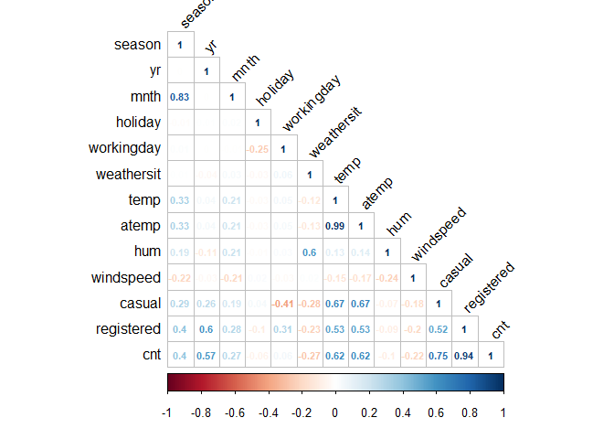
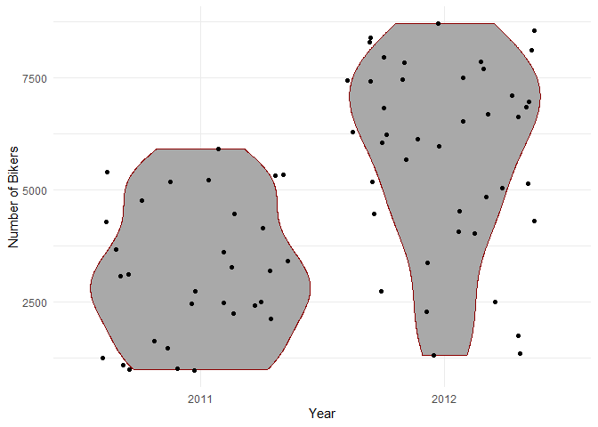
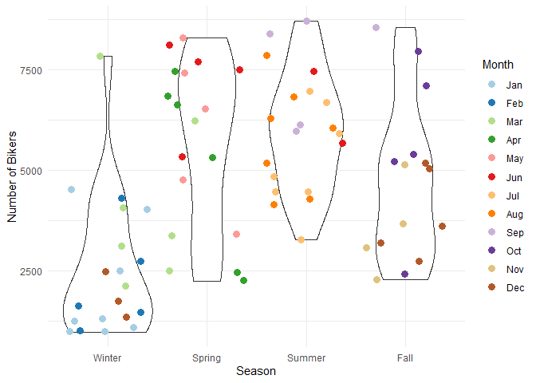
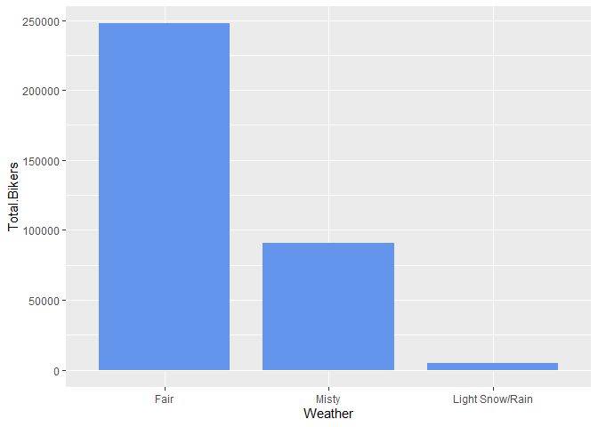
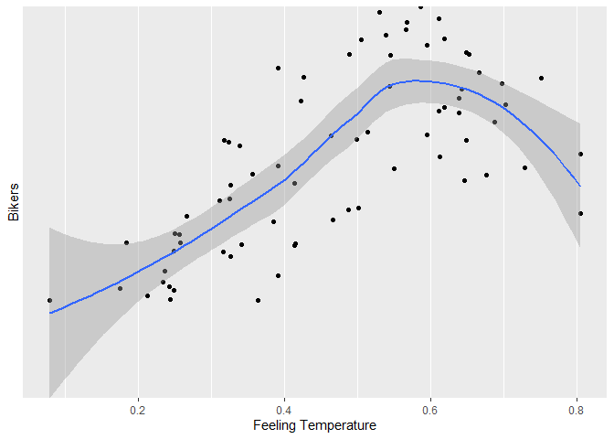
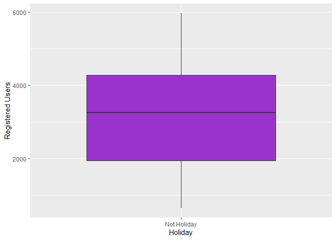

Bike Share Project
================
Soohee Jung, Kera Whitley

# Introduction

This dataset compiles the daily casual, registered and total (combined
casual and residual) bikers using this bike share. Looking at the
available variables in the dataset, there are several that are
attributes of the date, and the rest are attributes of the weather. We
will be looking at the temperature, season, and the year to predict the
total number of bikers using the bike share. The idea behind looking at
these particular variables being that, there are more people riding
bikes when the weather is nice. Year would come into play because the
longer the bike share is around, the more chances there are for people
to know about and use it.

Later, two multiple linear regression models, one random forest model
and one boosted models were fit. The variables specifically chosen were
season, temp, atemp, and yr. When exploring the data with different
plots and tables, it could be seen that the number of total bike share
users seemed to fluctuate with differences in these variables. The
correlation plot shows that theses variables have the highest either
positive or negative correlation with the total number of bikers, out of
the variables explored. The violin plots show firstly that there is a
definite difference in the number of total users by year, and that there
is a general trend with regard to season, but that month may not as good
of an indicator. The normalized temperature, the normalized temperature
feel both are fairly highly correlated to the total number of bikers.

# Data

``` r
# Read in dataset
day.data <- read_csv("day.csv")
```

    ## 
    ## -- Column specification ------------------------------------------------------------------------------------------------
    ## cols(
    ##   instant = col_double(),
    ##   dteday = col_date(format = ""),
    ##   season = col_double(),
    ##   yr = col_double(),
    ##   mnth = col_double(),
    ##   holiday = col_double(),
    ##   weekday = col_double(),
    ##   workingday = col_double(),
    ##   weathersit = col_double(),
    ##   temp = col_double(),
    ##   atemp = col_double(),
    ##   hum = col_double(),
    ##   windspeed = col_double(),
    ##   casual = col_double(),
    ##   registered = col_double(),
    ##   cnt = col_double()
    ## )

``` r
# Convert weekday column from numeric to character value
day.data$days[day.data$weekday==0] <- "Sunday"
day.data$days[day.data$weekday==1] <- "Monday"
day.data$days[day.data$weekday==2] <- "Tuesday"
day.data$days[day.data$weekday==3] <- "Wednesday"
day.data$days[day.data$weekday==4] <- "Thursday"
day.data$days[day.data$weekday==5] <- "Friday"
day.data$days[day.data$weekday==6] <- "Saturday"

# Get unique days
weekdays <- unique(day.data$days)

# Filter data to subset
day <- day.data %>% filter(days == params$Day)

# Converting variables that should be factors into factor variables
day$season <- factor(day$season)
levels(day$season) <- c("Winter","Spring", "Summer", "Fall")

day$yr <- factor(day$yr)
levels(day$yr) <- c("2011", "2012")

day$mnth <- factor(day$mnth)
levels(day$mnth) <- c("Jan", "Feb", "Mar", "Apr", "May", "Jun", "Jul", "Aug", "Sep", "Oct", "Nov", "Dec")

day$holiday <- factor(day$holiday)
levels(day$holiday) <- c("Not Holiday", "Holiday")

day$workingday <- factor(day$workingday)
levels(day$workingday) <- c("Not Working", "Working")

day$weathersit <- factor(day$weathersit)
levels(day$weathersit) <- c("Fair", "Misty", "Light Snow/Rain", "Heavy Rain/Ice/Snow")

set.seed(13)
# The training set should be 70% of the data
n <- nrow(day) * 0.7
train <- sample_n(day, n, replace = FALSE)
test <- anti_join(day, train, by = "dteday")
```

# Summarizations

produce some meaningful summary statistics and plots about the training
data we are working with. Explore the data a bit and then we are ready
to fit some models.

``` r
str(day.data)
```

    ## spec_tbl_df [731 x 17] (S3: spec_tbl_df/tbl_df/tbl/data.frame)
    ##  $ instant   : num [1:731] 1 2 3 4 5 6 7 8 9 10 ...
    ##  $ dteday    : Date[1:731], format: "2011-01-01" "2011-01-02" "2011-01-03" "2011-01-04" ...
    ##  $ season    : num [1:731] 1 1 1 1 1 1 1 1 1 1 ...
    ##  $ yr        : num [1:731] 0 0 0 0 0 0 0 0 0 0 ...
    ##  $ mnth      : num [1:731] 1 1 1 1 1 1 1 1 1 1 ...
    ##  $ holiday   : num [1:731] 0 0 0 0 0 0 0 0 0 0 ...
    ##  $ weekday   : num [1:731] 6 0 1 2 3 4 5 6 0 1 ...
    ##  $ workingday: num [1:731] 0 0 1 1 1 1 1 0 0 1 ...
    ##  $ weathersit: num [1:731] 2 2 1 1 1 1 2 2 1 1 ...
    ##  $ temp      : num [1:731] 0.344 0.363 0.196 0.2 0.227 ...
    ##  $ atemp     : num [1:731] 0.364 0.354 0.189 0.212 0.229 ...
    ##  $ hum       : num [1:731] 0.806 0.696 0.437 0.59 0.437 ...
    ##  $ windspeed : num [1:731] 0.16 0.249 0.248 0.16 0.187 ...
    ##  $ casual    : num [1:731] 331 131 120 108 82 88 148 68 54 41 ...
    ##  $ registered: num [1:731] 654 670 1229 1454 1518 ...
    ##  $ cnt       : num [1:731] 985 801 1349 1562 1600 ...
    ##  $ days      : chr [1:731] "Saturday" "Sunday" "Monday" "Tuesday" ...
    ##  - attr(*, "spec")=
    ##   .. cols(
    ##   ..   instant = col_double(),
    ##   ..   dteday = col_date(format = ""),
    ##   ..   season = col_double(),
    ##   ..   yr = col_double(),
    ##   ..   mnth = col_double(),
    ##   ..   holiday = col_double(),
    ##   ..   weekday = col_double(),
    ##   ..   workingday = col_double(),
    ##   ..   weathersit = col_double(),
    ##   ..   temp = col_double(),
    ##   ..   atemp = col_double(),
    ##   ..   hum = col_double(),
    ##   ..   windspeed = col_double(),
    ##   ..   casual = col_double(),
    ##   ..   registered = col_double(),
    ##   ..   cnt = col_double()
    ##   .. )

``` r
Correlation <- cor(select(day.data,-c(instant,dteday,weekday,days)), method="spearman")
corrplot(Correlation, method="number", type = 'lower', tl.col = 'black', 
         cl.ratio = 0.2, tl.srt = 45, number.cex = 0.7)
```

<!-- -->

``` r
# Numerical summaries
summary(train)
```

    ##     instant          dteday              season      yr          mnth           holiday      weekday        workingday
    ##  Min.   :  1.0   Min.   :2011-01-01   Winter:20   2011:31   Jan    : 8   Not Holiday:73   Min.   :6   Not Working:73  
    ##  1st Qu.:211.0   1st Qu.:2011-07-30   Spring:18   2012:42   Dec    : 8   Holiday    : 0   1st Qu.:6   Working    : 0  
    ##  Median :421.0   Median :2012-02-25   Summer:20             Mar    : 7                    Median :6                   
    ##  Mean   :388.6   Mean   :2012-01-23   Fall  :15             Jul    : 7                    Mean   :6                   
    ##  3rd Qu.:568.0   3rd Qu.:2012-07-21                         Aug    : 7                    3rd Qu.:6                   
    ##  Max.   :729.0   Max.   :2012-12-29                         Apr    : 6                    Max.   :6                   
    ##                                                             (Other):30                                                
    ##                weathersit      temp             atemp              hum           windspeed          casual    
    ##  Fair               :49   Min.   :0.05913   Min.   :0.07907   Min.   :0.1879   Min.   :0.0454   Min.   :  67  
    ##  Misty              :23   1st Qu.:0.32417   1st Qu.:0.32448   1st Qu.:0.4988   1st Qu.:0.1461   1st Qu.: 724  
    ##  Light Snow/Rain    : 1   Median :0.49500   Median :0.48673   Median :0.6012   Median :0.1928   Median :1448  
    ##  Heavy Rain/Ice/Snow: 0   Mean   :0.48666   Mean   :0.46660   Mean   :0.6007   Mean   :0.2012   Mean   :1525  
    ##                           3rd Qu.:0.65917   3rd Qu.:0.61238   3rd Qu.:0.7129   3rd Qu.:0.2351   3rd Qu.:2352  
    ##                           Max.   :0.86167   Max.   :0.80491   Max.   :0.9292   Max.   :0.5075   Max.   :3410  
    ##                                                                                                               
    ##    registered        cnt           days          
    ##  Min.   : 654   Min.   : 981   Length:73         
    ##  1st Qu.:1949   1st Qu.:2732   Class :character  
    ##  Median :3248   Median :4758   Mode  :character  
    ##  Mean   :3173   Mean   :4698                     
    ##  3rd Qu.:4280   3rd Qu.:6624                     
    ##  Max.   :5966   Max.   :8714                     
    ## 

``` r
train %>% select(casual, registered) %>% colSums()
```

    ##     casual registered 
    ##     111329     231653

``` r
table(train$season, train$weathersit)
```

    ##         
    ##          Fair Misty Light Snow/Rain Heavy Rain/Ice/Snow
    ##   Winter   13     7               0                   0
    ##   Spring   13     5               0                   0
    ##   Summer   12     7               1                   0
    ##   Fall     11     4               0                   0

``` r
table(train$workingday, train$weathersit)
```

    ##              
    ##               Fair Misty Light Snow/Rain Heavy Rain/Ice/Snow
    ##   Not Working   49    23               1                   0
    ##   Working        0     0               0                   0

``` r
# Total bikers grouped by year
train %>% group_by(yr) %>% summarize(Total.Bikers=sum(cnt))
```

    ## # A tibble: 2 x 2
    ##   yr    Total.Bikers
    ##   <fct>        <dbl>
    ## 1 2011         98829
    ## 2 2012        244153

``` r
# We can inspect the trend of users across years
ggplot(train, aes(x = yr, y = cnt)) + 
  geom_violin(fill = "dark grey", color = "dark red") + 
  geom_jitter(shape = 16) + 
  labs(x = "Year", y = "Number of Bikers") + 
  theme_minimal()
```

<!-- -->

``` r
# Total number of casual users, registered users and all bikers by month
train %>% group_by(mnth) %>% 
  summarize(Total.casual=sum(casual),Total.registered=sum(registered),
            Total.Bikers=sum(cnt))
```

    ## # A tibble: 12 x 4
    ##    mnth  Total.casual Total.registered Total.Bikers
    ##    <fct>        <dbl>            <dbl>        <dbl>
    ##  1 Jan           3014            13636        16650
    ##  2 Feb           2672             8490        11162
    ##  3 Mar          10574            18680        29254
    ##  4 Apr          12330            18630        30960
    ##  5 May          11790            18636        30426
    ##  6 Jun          14447            27360        41807
    ##  7 Jul          12265            24371        36636
    ##  8 Aug          14187            26489        40676
    ##  9 Sep          12170            25610        37780
    ## 10 Oct           9897            18232        28129
    ## 11 Nov           3753            10393        14146
    ## 12 Dec           4230            21126        25356

``` r
# We can inspect the trend of users across months using this plot.
# There may be a seasonal effect present.
ggplot(train, aes(x = mnth, y = cnt, fill = "red")) + 
  geom_col() + 
  geom_col(data = train, aes(x = mnth, y = casual, fill = "blue")) +
  labs(x = "Month", y = "Total Number of Bikers") +
  scale_fill_discrete(name = "Biker Type", labels = c("Casual", "Registered"))
```

<!-- -->

``` r
# Total number of casual, registered and all bikers by month within each season
train %>% group_by(season,mnth) %>% 
  summarize(Total.casual=sum(casual),Total.registered=sum(registered),
            Total.Bikers=sum(cnt))
```

    ## `summarise()` has grouped output by 'season'. You can override using the `.groups` argument.

    ## # A tibble: 16 x 5
    ## # Groups:   season [4]
    ##    season mnth  Total.casual Total.registered Total.Bikers
    ##    <fct>  <fct>        <dbl>            <dbl>        <dbl>
    ##  1 Winter Jan           3014            13636        16650
    ##  2 Winter Feb           2672             8490        11162
    ##  3 Winter Mar           6259            10892        17151
    ##  4 Winter Dec           1029             4546         5575
    ##  5 Spring Mar           4315             7788        12103
    ##  6 Spring Apr          12330            18630        30960
    ##  7 Spring May          11790            18636        30426
    ##  8 Spring Jun          10335            18327        28662
    ##  9 Summer Jun           4112             9033        13145
    ## 10 Summer Jul          12265            24371        36636
    ## 11 Summer Aug          14187            26489        40676
    ## 12 Summer Sep           9581            19644        29225
    ## 13 Fall   Sep           2589             5966         8555
    ## 14 Fall   Oct           9897            18232        28129
    ## 15 Fall   Nov           3753            10393        14146
    ## 16 Fall   Dec           3201            16580        19781

``` r
# We can inspect the trend of all users across season using this plot.
# There may be weather or temperature effect present.
ggplot(train, aes(x = season, y = cnt)) + 
  geom_violin() +
  geom_jitter(shape = 16, size = 3, aes(color = mnth)) +
  labs(x = "Season", y = "Number of Bikers") +
  scale_color_manual(name = "Month", values = c("#a6cee3", "#1f78b4", "#b2df8a", "#33a02c", 
                                                "#fb9a99", "#e31a1c", "#fdbf6f", "#ff7f00", 
                                                "#cab2d6", "#6a3d9a", "#dfc27d", "#b15928")) +
  theme_minimal()
```

<!-- -->

``` r
# Total number of casual, registered and all bikers by weather
by.weather <- train %>% group_by(weathersit) %>% 
  summarize(Total.casual=sum(casual),Total.registered=sum(registered),
            Total.Bikers=sum(cnt))
by.weather
```

    ## # A tibble: 3 x 4
    ##   weathersit      Total.casual Total.registered Total.Bikers
    ##   <fct>                  <dbl>            <dbl>        <dbl>
    ## 1 Fair                   82962           164678       247640
    ## 2 Misty                  27103            63780        90883
    ## 3 Light Snow/Rain         1264             3195         4459

``` r
# We can inspect the trend of all users across weather condition using this plot.
ggplot(by.weather, aes(x=weathersit, y=Total.Bikers))+geom_col(fill="cornflowerblue", width = 0.8)+
  scale_x_discrete(name="Weather")
```

<!-- -->

``` r
# We can inspect the trend of all users across temperature using this plot.
ggplot(train, aes(x=temp, y=cnt)) + geom_point() + geom_smooth()+
  scale_x_continuous(name="Temperature")+scale_y_discrete(name="Bikers")
```

    ## `geom_smooth()` using method = 'loess' and formula 'y ~ x'

<!-- -->

``` r
# We can inspect the trend of all users across feeling temperature using this plot.
ggplot(train, aes(x=atemp, y=cnt)) + geom_point() + geom_smooth()+
  scale_x_continuous(name="Feeling Temperature")+scale_y_discrete(name="Bikers")
```

    ## `geom_smooth()` using method = 'loess' and formula 'y ~ x'

<!-- -->

``` r
# Total number of casual, registered and all bikers by holiday or not
by.holi <- train %>% group_by(holiday) %>% 
  summarize(Total.casual=sum(casual),Total.registered=sum(registered),
            Total.Bikers=sum(cnt))
by.holi
```

    ## # A tibble: 1 x 4
    ##   holiday     Total.casual Total.registered Total.Bikers
    ##   <fct>              <dbl>            <dbl>        <dbl>
    ## 1 Not Holiday       111329           231653       342982

``` r
# We can inspect the trend of all users across whether holiday or not using this plot.
ggplot(by.holi, aes(x=holiday, y=Total.Bikers)) + geom_col(fill="darkgoldenrod1", width = 0.7)+
  scale_x_discrete(name="Holiday")
```

<!-- -->

``` r
# We can inspect the trend of casual users across whether holiday or not using this plot.
ggplot(train, aes(x=holiday, y=casual))+geom_boxplot(fill="darkmagenta")+
  scale_x_discrete(name="Holiday")+scale_y_continuous(name="Casual Users")
```

<!-- -->

``` r
# We can inspect the trend of registered users across whether holiday or not using this plot.
ggplot(train, aes(x=holiday, y=registered))+geom_boxplot(fill="darkorchid")+
  scale_x_discrete(name="Holiday")+scale_y_continuous(name="Registered Users")
```

<!-- -->

# Modeling

## Linear Regression Model

*Linear regression* tries to find a linear equation which describe the
relationship between a response variable and a explanation variable. The
best model fit is made by minimizing the sum of squared residuals.
Simple linear regression model can be extended in many ways and we call
them *Multiple Linear Regression*.

``` r
set.seed(13)
# multiple linear regression model 1
lmFit <- train(cnt ~ season + temp + atemp, data=train, method="lm",
               trControl=trainControl(method="cv",number=10))
summary(lmFit)
```

    ## 
    ## Call:
    ## lm(formula = .outcome ~ ., data = dat)
    ## 
    ## Residuals:
    ##     Min      1Q  Median      3Q     Max 
    ## -4014.9  -960.4  -106.5  1105.8  3469.9 
    ## 
    ## Coefficients:
    ##              Estimate Std. Error t value Pr(>|t|)   
    ## (Intercept)   -360.64     730.66  -0.494  0.62322   
    ## seasonSpring  1288.87     653.45   1.972  0.05269 . 
    ## seasonSummer    48.21     940.67   0.051  0.95928   
    ## seasonFall    1484.67     556.27   2.669  0.00954 **
    ## temp         -1125.61   13572.14  -0.083  0.93415   
    ## atemp        10653.06   14552.27   0.732  0.46669   
    ## ---
    ## Signif. codes:  0 '***' 0.001 '**' 0.01 '*' 0.05 '.' 0.1 ' ' 1
    ## 
    ## Residual standard error: 1575 on 67 degrees of freedom
    ## Multiple R-squared:  0.5519, Adjusted R-squared:  0.5185 
    ## F-statistic:  16.5 on 5 and 67 DF,  p-value: 1.371e-10

``` r
lmPred <- predict(lmFit, newdata=test)

# multiple linear regression model 2
set.seed(13)
mlrFit <- train(cnt ~ season + temp + yr, data = train, method = "lm", 
               trControl = trainControl(method = "cv", number = 10))
summary(mlrFit)
```

    ## 
    ## Call:
    ## lm(formula = .outcome ~ ., data = dat)
    ## 
    ## Residuals:
    ##      Min       1Q   Median       3Q      Max 
    ## -2963.10  -617.09   -13.71   575.62  2903.88 
    ## 
    ## Coefficients:
    ##              Estimate Std. Error t value Pr(>|t|)    
    ## (Intercept)  -735.746    493.140  -1.492 0.140403    
    ## seasonSpring 1295.462    486.325   2.664 0.009669 ** 
    ## seasonSummer   -5.843    672.997  -0.009 0.993099    
    ## seasonFall   1675.777    418.644   4.003 0.000159 ***
    ## temp         7335.399   1359.631   5.395 9.65e-07 ***
    ## yr2012       2089.343    288.267   7.248 5.44e-10 ***
    ## ---
    ## Signif. codes:  0 '***' 0.001 '**' 0.01 '*' 0.05 '.' 0.1 ' ' 1
    ## 
    ## Residual standard error: 1184 on 67 degrees of freedom
    ## Multiple R-squared:  0.7468, Adjusted R-squared:  0.7279 
    ## F-statistic: 39.53 on 5 and 67 DF,  p-value: < 2.2e-16

``` r
mlrPred <- predict(mlrFit, newdata = test)
```

## Random Forest Model

*Random forest model* is one of 3 major methods of *Ensemble tree
model*. It is flexible and one big advantage of the random forest model
is that it can be used for both classification and regression models. It
creates multiple trees from a random subset of predictors for each
bootstrap sample and then train the trees. The final prediction is
average of these predictions.

``` r
set.seed(13)
# Get random forest model fit
rfFit <- train(cnt ~ season + temp + atemp + yr, data=train,
               method="rf", 
               trControl=trainControl(method="cv",number=10))
rfFit
```

    ## Random Forest 
    ## 
    ## 73 samples
    ##  4 predictor
    ## 
    ## No pre-processing
    ## Resampling: Cross-Validated (10 fold) 
    ## Summary of sample sizes: 67, 67, 65, 65, 66, 66, ... 
    ## Resampling results across tuning parameters:
    ## 
    ##   mtry  RMSE      Rsquared   MAE     
    ##   2     1107.549  0.7923627  919.1881
    ##   4     1094.085  0.8089880  894.9806
    ##   6     1078.844  0.8204045  883.0511
    ## 
    ## RMSE was used to select the optimal model using the smallest value.
    ## The final value used for the model was mtry = 6.

``` r
rfPred <- predict(rfFit, newdata=test)
```

## Boosted Tree Model

The *boosted tree model* is a type of *ensemble tree model*. The way the
boosted tree works is that the trees are fit sequentially. Once the
first tree has been fit, the residuals from that tree are recorded. They
are then used as the new response and a new tree is fit. The residuals
from this next tree are then used as the new response. this process
repeats a number of times, with 5000 not being unreasonable.

``` r
set.seed(13)

boostFit <- train(cnt ~ season + temp + yr, data = train, method = "gbm", verbose = FALSE,
                  preProcess = c("center", "scale"),
                  trControl = trainControl(method = "cv", number = 10))
boostFit
```

    ## Stochastic Gradient Boosting 
    ## 
    ## 73 samples
    ##  3 predictor
    ## 
    ## Pre-processing: centered (5), scaled (5) 
    ## Resampling: Cross-Validated (10 fold) 
    ## Summary of sample sizes: 67, 67, 65, 65, 66, 66, ... 
    ## Resampling results across tuning parameters:
    ## 
    ##   interaction.depth  n.trees  RMSE      Rsquared   MAE      
    ##   1                   50      1252.518  0.7199600  1075.5070
    ##   1                  100      1180.551  0.7416048   989.2648
    ##   1                  150      1159.116  0.7542272   963.9329
    ##   2                   50      1203.371  0.7332428  1017.1642
    ##   2                  100      1190.188  0.7503925  1000.1111
    ##   2                  150      1164.388  0.7611197   975.4147
    ##   3                   50      1223.554  0.7380919  1048.1002
    ##   3                  100      1183.920  0.7538620   994.7147
    ##   3                  150      1160.356  0.7638358   971.9083
    ## 
    ## Tuning parameter 'shrinkage' was held constant at a value of 0.1
    ## Tuning parameter 'n.minobsinnode' was held constant
    ##  at a value of 10
    ## RMSE was used to select the optimal model using the smallest value.
    ## The final values used for the model were n.trees = 150, interaction.depth = 1, shrinkage = 0.1 and n.minobsinnode = 10.

``` r
boostPred <- predict(boostFit, newdata = test)
```

# Comparison

``` r
set.seed(13)
# multiple linear regression model 1
multiRMSE <- postResample(lmPred, test$cnt)

# multiple linear regression model 2
mlrRMSE <- postResample(mlrPred, test$cnt)

# random forest model
rfRMSE <- postResample(rfPred, test$cnt)

# boosted tree model
boostRMSE <- postResample(boostPred, test$cnt)

# compare
lowestRMSE <- c(MultipleLR1=multiRMSE[1],MultipleLR2=mlrRMSE[1],RandomForest=rfRMSE[1],Boosting=boostRMSE[1])
lowestRMSE
```

    ##  MultipleLR1.RMSE  MultipleLR2.RMSE RandomForest.RMSE     Boosting.RMSE 
    ##          1631.426          1102.348          1114.350          1115.307

The preferred model has the lowest RMSE. The model that has the lowest
RMSE for Saturday is MultipleLR2.RMSE.
