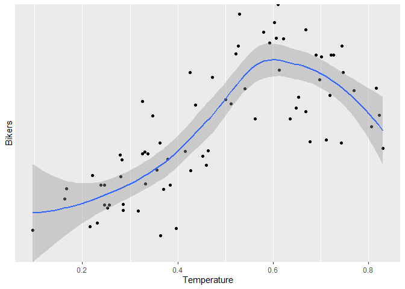
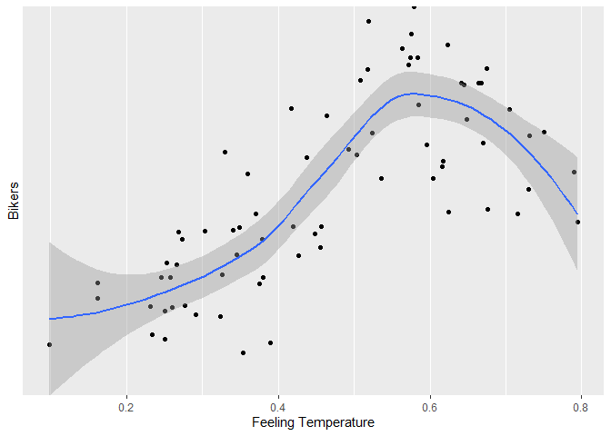

Bike Share Project
================
Soohee Jung, Kera Whitley

# Introduction

This dataset compiles the daily casual, registered and total (combined
casual and residual) bikers using this bike share. Looking at the
available variables in the dataset, there are several that are
attributes of the date, and the rest are attributes of the weather. We
will be looking at the temperature, season, and the year to predict the
total number of bikers using the bike share. The idea behind looking at
these particular variables being that, there are more people riding
bikes when the weather is nice. Year would come into play because the
longer the bike share is around, the more chances there are for people
to know about and use it.

Later, two multiple linear regression models, one random forest model
and one boosted models were fit. The variables specifically chosen were
season, temp, atemp, and yr. When exploring the data with different
plots and tables, it could be seen that the number of total bike share
users seemed to fluctuate with differences in these variables. The
correlation plot shows that theses variables have the highest either
positive or negative correlation with the total number of bikers, out of
the variables explored. The violin plots show firstly that there is a
definite difference in the number of total users by year, and that there
is a general trend with regard to season, but that month may not as good
of an indicator. The normalized temperature, the normalized temperature
feel both are fairly highly correlated to the total number of bikers.

# Data

``` r
# Read in dataset
day.data <- read_csv("day.csv")
```

    ## 
    ## -- Column specification ------------------------------------------------------------------------------------------------
    ## cols(
    ##   instant = col_double(),
    ##   dteday = col_date(format = ""),
    ##   season = col_double(),
    ##   yr = col_double(),
    ##   mnth = col_double(),
    ##   holiday = col_double(),
    ##   weekday = col_double(),
    ##   workingday = col_double(),
    ##   weathersit = col_double(),
    ##   temp = col_double(),
    ##   atemp = col_double(),
    ##   hum = col_double(),
    ##   windspeed = col_double(),
    ##   casual = col_double(),
    ##   registered = col_double(),
    ##   cnt = col_double()
    ## )

``` r
# Convert weekday column from numeric to character value
day.data$days[day.data$weekday==0] <- "Sunday"
day.data$days[day.data$weekday==1] <- "Monday"
day.data$days[day.data$weekday==2] <- "Tuesday"
day.data$days[day.data$weekday==3] <- "Wednesday"
day.data$days[day.data$weekday==4] <- "Thursday"
day.data$days[day.data$weekday==5] <- "Friday"
day.data$days[day.data$weekday==6] <- "Saturday"

# Get unique days
weekdays <- unique(day.data$days)

# Filter data to subset
day <- day.data %>% filter(days == params$Day)

# Converting variables that should be factors into factor variables
day$season <- factor(day$season)
levels(day$season) <- c("Winter","Spring", "Summer", "Fall")

day$yr <- factor(day$yr)
levels(day$yr) <- c("2011", "2012")

day$mnth <- factor(day$mnth)
levels(day$mnth) <- c("Jan", "Feb", "Mar", "Apr", "May", "Jun", "Jul", "Aug", "Sep", "Oct", "Nov", "Dec")

day$holiday <- factor(day$holiday)
levels(day$holiday) <- c("Not Holiday", "Holiday")

day$workingday <- factor(day$workingday)
levels(day$workingday) <- c("Not Working", "Working")

day$weathersit <- factor(day$weathersit)
levels(day$weathersit) <- c("Fair", "Misty", "Light Snow/Rain", "Heavy Rain/Ice/Snow")

set.seed(13)
# The training set should be 70% of the data
n <- nrow(day) * 0.7
train <- sample_n(day, n, replace = FALSE)
test <- anti_join(day, train, by = "dteday")
```

# Summarizations

produce some meaningful summary statistics and plots about the training
data we are working with. Explore the data a bit and then we are ready
to fit some models.

``` r
str(day.data)
```

    ## spec_tbl_df [731 x 17] (S3: spec_tbl_df/tbl_df/tbl/data.frame)
    ##  $ instant   : num [1:731] 1 2 3 4 5 6 7 8 9 10 ...
    ##  $ dteday    : Date[1:731], format: "2011-01-01" "2011-01-02" "2011-01-03" "2011-01-04" ...
    ##  $ season    : num [1:731] 1 1 1 1 1 1 1 1 1 1 ...
    ##  $ yr        : num [1:731] 0 0 0 0 0 0 0 0 0 0 ...
    ##  $ mnth      : num [1:731] 1 1 1 1 1 1 1 1 1 1 ...
    ##  $ holiday   : num [1:731] 0 0 0 0 0 0 0 0 0 0 ...
    ##  $ weekday   : num [1:731] 6 0 1 2 3 4 5 6 0 1 ...
    ##  $ workingday: num [1:731] 0 0 1 1 1 1 1 0 0 1 ...
    ##  $ weathersit: num [1:731] 2 2 1 1 1 1 2 2 1 1 ...
    ##  $ temp      : num [1:731] 0.344 0.363 0.196 0.2 0.227 ...
    ##  $ atemp     : num [1:731] 0.364 0.354 0.189 0.212 0.229 ...
    ##  $ hum       : num [1:731] 0.806 0.696 0.437 0.59 0.437 ...
    ##  $ windspeed : num [1:731] 0.16 0.249 0.248 0.16 0.187 ...
    ##  $ casual    : num [1:731] 331 131 120 108 82 88 148 68 54 41 ...
    ##  $ registered: num [1:731] 654 670 1229 1454 1518 ...
    ##  $ cnt       : num [1:731] 985 801 1349 1562 1600 ...
    ##  $ days      : chr [1:731] "Saturday" "Sunday" "Monday" "Tuesday" ...
    ##  - attr(*, "spec")=
    ##   .. cols(
    ##   ..   instant = col_double(),
    ##   ..   dteday = col_date(format = ""),
    ##   ..   season = col_double(),
    ##   ..   yr = col_double(),
    ##   ..   mnth = col_double(),
    ##   ..   holiday = col_double(),
    ##   ..   weekday = col_double(),
    ##   ..   workingday = col_double(),
    ##   ..   weathersit = col_double(),
    ##   ..   temp = col_double(),
    ##   ..   atemp = col_double(),
    ##   ..   hum = col_double(),
    ##   ..   windspeed = col_double(),
    ##   ..   casual = col_double(),
    ##   ..   registered = col_double(),
    ##   ..   cnt = col_double()
    ##   .. )

``` r
Correlation <- cor(select(day.data,-c(instant,dteday,weekday,days)), method="spearman")
corrplot(Correlation, method="number", type = 'lower', tl.col = 'black', 
         cl.ratio = 0.2, tl.srt = 45, number.cex = 0.7)
```

<!-- -->

``` r
# Numerical summaries
summary(train)
```

    ##     instant          dteday              season      yr          mnth           holiday      weekday        workingday
    ##  Min.   :  2.0   Min.   :2011-01-02   Winter:20   2011:30   Jan    : 9   Not Holiday:73   Min.   :0   Not Working:73  
    ##  1st Qu.:212.0   1st Qu.:2011-07-31   Spring:18   2012:43   Jul    : 8   Holiday    : 0   1st Qu.:0   Working    : 0  
    ##  Median :422.0   Median :2012-02-26   Summer:19             Aug    : 7                    Median :0                   
    ##  Mean   :389.6   Mean   :2012-01-24   Fall  :16             Dec    : 7                    Mean   :0                   
    ##  3rd Qu.:569.0   3rd Qu.:2012-07-22                         Mar    : 6                    3rd Qu.:0                   
    ##  Max.   :730.0   Max.   :2012-12-30                         Apr    : 6                    Max.   :0                   
    ##                                                             (Other):30                                                
    ##                weathersit      temp             atemp              hum           windspeed           casual    
    ##  Fair               :51   Min.   :0.09652   Min.   :0.09884   Min.   :0.2758   Min.   :0.06345   Min.   : 120  
    ##  Misty              :21   1st Qu.:0.32583   1st Qu.:0.32575   1st Qu.:0.4900   1st Qu.:0.14116   1st Qu.: 599  
    ##  Light Snow/Rain    : 1   Median :0.46333   Median :0.45706   Median :0.5833   Median :0.18595   Median :1208  
    ##  Heavy Rain/Ice/Snow: 0   Mean   :0.48404   Mean   :0.46639   Mean   :0.6132   Mean   :0.18716   Mean   :1342  
    ##                           3rd Qu.:0.65333   3rd Qu.:0.61555   3rd Qu.:0.7275   3rd Qu.:0.22513   3rd Qu.:2166  
    ##                           Max.   :0.83000   Max.   :0.79483   Max.   :0.8808   Max.   :0.35075   Max.   :3283  
    ##                                                                                                                
    ##    registered        cnt           days          
    ##  Min.   : 670   Min.   : 801   Length:73         
    ##  1st Qu.:2071   1st Qu.:2689   Class :character  
    ##  Median :2851   Median :3873   Mode  :character  
    ##  Mean   :2928   Mean   :4270                     
    ##  3rd Qu.:3772   3rd Qu.:5892                     
    ##  Max.   :5657   Max.   :8227                     
    ## 

``` r
train %>% select(casual, registered) %>% colSums()
```

    ##     casual registered 
    ##      97938     213775

``` r
table(train$season, train$weathersit)
```

    ##         
    ##          Fair Misty Light Snow/Rain Heavy Rain/Ice/Snow
    ##   Winter   16     4               0                   0
    ##   Spring   10     7               1                   0
    ##   Summer   14     5               0                   0
    ##   Fall     11     5               0                   0

``` r
table(train$workingday, train$weathersit)
```

    ##              
    ##               Fair Misty Light Snow/Rain Heavy Rain/Ice/Snow
    ##   Not Working   51    21               1                   0
    ##   Working        0     0               0                   0

``` r
# Total bikers grouped by year
train %>% group_by(yr) %>% summarize(Total.Bikers=sum(cnt))
```

    ## # A tibble: 2 x 2
    ##   yr    Total.Bikers
    ##   <fct>        <dbl>
    ## 1 2011         92842
    ## 2 2012        218871

``` r
# We can inspect the trend of users across years
ggplot(train, aes(x = yr, y = cnt)) + 
  geom_violin(fill = "dark grey", color = "dark red") + 
  geom_jitter(shape = 16) + 
  labs(x = "Year", y = "Number of Bikers") + 
  theme_minimal()
```

<!-- -->

``` r
# Total number of casual users, registered users and all bikers by month
train %>% group_by(mnth) %>% 
  summarize(Total.casual=sum(casual),Total.registered=sum(registered),
            Total.Bikers=sum(cnt))
```

    ## # A tibble: 12 x 4
    ##    mnth  Total.casual Total.registered Total.Bikers
    ##    <fct>        <dbl>            <dbl>        <dbl>
    ##  1 Jan           2995            14342        17337
    ##  2 Feb           2523             8579        11102
    ##  3 Mar           6950            13942        20892
    ##  4 Apr          10382            15131        25513
    ##  5 May          13234            19296        32530
    ##  6 Jun          11588            21426        33014
    ##  7 Jul          13821            29630        43451
    ##  8 Aug          10465            22825        33290
    ##  9 Sep          11818            24348        36166
    ## 10 Oct           7622            15997        23619
    ## 11 Nov           3107            11015        14122
    ## 12 Dec           3433            17244        20677

``` r
# We can inspect the trend of users across months using this plot.
# There may be a seasonal effect present.
ggplot(train, aes(x = mnth, y = cnt, fill = "red")) + 
  geom_col() + 
  geom_col(data = train, aes(x = mnth, y = casual, fill = "blue")) +
  labs(x = "Month", y = "Total Number of Bikers") +
  scale_fill_discrete(name = "Biker Type", labels = c("Casual", "Registered"))
```

<!-- -->

``` r
# Total number of casual, registered and all bikers by month within each season
train %>% group_by(season,mnth) %>% 
  summarize(Total.casual=sum(casual),Total.registered=sum(registered),
            Total.Bikers=sum(cnt))
```

    ## `summarise()` has grouped output by 'season'. You can override using the `.groups` argument.

    ## # A tibble: 16 x 5
    ## # Groups:   season [4]
    ##    season mnth  Total.casual Total.registered Total.Bikers
    ##    <fct>  <fct>        <dbl>            <dbl>        <dbl>
    ##  1 Winter Jan           2995            14342        17337
    ##  2 Winter Feb           2523             8579        11102
    ##  3 Winter Mar           4946             9257        14203
    ##  4 Winter Dec            772             2811         3583
    ##  5 Spring Mar           2004             4685         6689
    ##  6 Spring Apr          10382            15131        25513
    ##  7 Spring May          13234            19296        32530
    ##  8 Spring Jun           9037            17086        26123
    ##  9 Summer Jun           2551             4340         6891
    ## 10 Summer Jul          13821            29630        43451
    ## 11 Summer Aug          10465            22825        33290
    ## 12 Summer Sep           7349            14021        21370
    ## 13 Fall   Sep           4469            10327        14796
    ## 14 Fall   Oct           7622            15997        23619
    ## 15 Fall   Nov           3107            11015        14122
    ## 16 Fall   Dec           2661            14433        17094

``` r
# We can inspect the trend of all users across season using this plot.
# There may be weather or temperature effect present.
ggplot(train, aes(x = season, y = cnt)) + 
  geom_violin() +
  geom_jitter(shape = 16, size = 3, aes(color = mnth)) +
  labs(x = "Season", y = "Number of Bikers") +
  scale_color_manual(name = "Month", values = c("#a6cee3", "#1f78b4", "#b2df8a", "#33a02c", 
                                                "#fb9a99", "#e31a1c", "#fdbf6f", "#ff7f00", 
                                                "#cab2d6", "#6a3d9a", "#dfc27d", "#b15928")) +
  theme_minimal()
```

<!-- -->

``` r
# Total number of casual, registered and all bikers by weather
by.weather <- train %>% group_by(weathersit) %>% 
  summarize(Total.casual=sum(casual),Total.registered=sum(registered),
            Total.Bikers=sum(cnt))
by.weather
```

    ## # A tibble: 3 x 4
    ##   weathersit      Total.casual Total.registered Total.Bikers
    ##   <fct>                  <dbl>            <dbl>        <dbl>
    ## 1 Fair                   71922           153743       225665
    ## 2 Misty                  25896            59125        85021
    ## 3 Light Snow/Rain          120              907         1027

``` r
# We can inspect the trend of all users across weather condition using this plot.
ggplot(by.weather, aes(x=weathersit, y=Total.Bikers))+geom_col(fill="cornflowerblue", width = 0.8)+
  scale_x_discrete(name="Weather")
```

<!-- -->

``` r
# We can inspect the trend of all users across temperature using this plot.
ggplot(train, aes(x=temp, y=cnt)) + geom_point() + geom_smooth()+
  scale_x_continuous(name="Temperature")+scale_y_discrete(name="Bikers")
```

    ## `geom_smooth()` using method = 'loess' and formula 'y ~ x'

<!-- -->

``` r
# We can inspect the trend of all users across feeling temperature using this plot.
ggplot(train, aes(x=atemp, y=cnt)) + geom_point() + geom_smooth()+
  scale_x_continuous(name="Feeling Temperature")+scale_y_discrete(name="Bikers")
```

    ## `geom_smooth()` using method = 'loess' and formula 'y ~ x'

<!-- -->

``` r
# Total number of casual, registered and all bikers by holiday or not
by.holi <- train %>% group_by(holiday) %>% 
  summarize(Total.casual=sum(casual),Total.registered=sum(registered),
            Total.Bikers=sum(cnt))
by.holi
```

    ## # A tibble: 1 x 4
    ##   holiday     Total.casual Total.registered Total.Bikers
    ##   <fct>              <dbl>            <dbl>        <dbl>
    ## 1 Not Holiday        97938           213775       311713

``` r
# We can inspect the trend of all users across whether holiday or not using this plot.
ggplot(by.holi, aes(x=holiday, y=Total.Bikers)) + geom_col(fill="darkgoldenrod1", width = 0.7)+
  scale_x_discrete(name="Holiday")
```

<!-- -->

``` r
# We can inspect the trend of casual users across whether holiday or not using this plot.
ggplot(train, aes(x=holiday, y=casual))+geom_boxplot(fill="darkmagenta")+
  scale_x_discrete(name="Holiday")+scale_y_continuous(name="Casual Users")
```

<!-- -->

``` r
# We can inspect the trend of registered users across whether holiday or not using this plot.
ggplot(train, aes(x=holiday, y=registered))+geom_boxplot(fill="darkorchid")+
  scale_x_discrete(name="Holiday")+scale_y_continuous(name="Registered Users")
```

<!-- -->

# Modeling

## Linear Regression Model

*Linear regression* tries to find a linear equation which describe the
relationship between a response variable and a explanation variable. The
best model fit is made by minimizing the sum of squared residuals.
Simple linear regression model can be extended in many ways and we call
them *Multiple Linear Regression*.

``` r
set.seed(13)
# multiple linear regression model 1
lmFit <- train(cnt ~ season + temp + atemp, data=train, method="lm",
               trControl=trainControl(method="cv",number=10))
summary(lmFit)
```

    ## 
    ## Call:
    ## lm(formula = .outcome ~ ., data = dat)
    ## 
    ## Residuals:
    ##     Min      1Q  Median      3Q     Max 
    ## -2918.1  -785.8  -176.2   849.0  3610.5 
    ## 
    ## Coefficients:
    ##              Estimate Std. Error t value Pr(>|t|)  
    ## (Intercept)     434.0      651.4   0.666   0.5075  
    ## seasonSpring    839.9      597.2   1.406   0.1642  
    ## seasonSummer   -221.4      820.0  -0.270   0.7880  
    ## seasonFall     1348.4      529.7   2.546   0.0132 *
    ## temp          21232.9    12376.5   1.716   0.0909 .
    ## atemp        -14765.5    13630.8  -1.083   0.2826  
    ## ---
    ## Signif. codes:  0 '***' 0.001 '**' 0.01 '*' 0.05 '.' 0.1 ' ' 1
    ## 
    ## Residual standard error: 1347 on 67 degrees of freedom
    ## Multiple R-squared:  0.5746, Adjusted R-squared:  0.5428 
    ## F-statistic:  18.1 on 5 and 67 DF,  p-value: 2.551e-11

``` r
lmPred <- predict(lmFit, newdata=test)

# multiple linear regression model 2
set.seed(13)
mlrFit <- train(cnt ~ season + temp + yr, data = train, method = "lm", 
               trControl = trainControl(method = "cv", number = 10))
summary(mlrFit)
```

    ## 
    ## Call:
    ## lm(formula = .outcome ~ ., data = dat)
    ## 
    ## Residuals:
    ##     Min      1Q  Median      3Q     Max 
    ## -3685.7  -449.5   -12.1   565.2  2953.1 
    ## 
    ## Coefficients:
    ##              Estimate Std. Error t value Pr(>|t|)    
    ## (Intercept)    -671.3      444.1  -1.512  0.13533    
    ## seasonSpring    834.2      465.9   1.791  0.07787 .  
    ## seasonSummer   -147.7      644.4  -0.229  0.81946    
    ## seasonFall     1291.2      384.4   3.359  0.00129 ** 
    ## temp           7233.0     1267.8   5.705 2.86e-07 ***
    ## yr2012         1680.8      255.0   6.591 8.13e-09 ***
    ## ---
    ## Signif. codes:  0 '***' 0.001 '**' 0.01 '*' 0.05 '.' 0.1 ' ' 1
    ## 
    ## Residual standard error: 1058 on 67 degrees of freedom
    ## Multiple R-squared:  0.7374, Adjusted R-squared:  0.7178 
    ## F-statistic: 37.62 on 5 and 67 DF,  p-value: < 2.2e-16

``` r
mlrPred <- predict(mlrFit, newdata = test)
```

## Random Forest Model

*Random forest model* is one of 3 major methods of *Ensemble tree
model*. It is flexible and one big advantage of the random forest model
is that it can be used for both classification and regression models. It
creates multiple trees from a random subset of predictors for each
bootstrap sample and then train the trees. The final prediction is
average of these predictions.

``` r
set.seed(13)
# Get random forest model fit
rfFit <- train(cnt ~ season + temp + atemp + yr, data=train,
               method="rf", 
               trControl=trainControl(method="cv",number=10))
rfFit
```

    ## Random Forest 
    ## 
    ## 73 samples
    ##  4 predictor
    ## 
    ## No pre-processing
    ## Resampling: Cross-Validated (10 fold) 
    ## Summary of sample sizes: 67, 67, 65, 65, 66, 66, ... 
    ## Resampling results across tuning parameters:
    ## 
    ##   mtry  RMSE      Rsquared   MAE     
    ##   2     901.5308  0.8354099  718.6959
    ##   4     889.9118  0.8520330  699.1287
    ##   6     889.9033  0.8496013  694.0031
    ## 
    ## RMSE was used to select the optimal model using the smallest value.
    ## The final value used for the model was mtry = 6.

``` r
rfPred <- predict(rfFit, newdata=test)
```

## Boosted Tree Model

The *boosted tree model* is a type of *ensemble tree model*. The way the
boosted tree works is that the trees are fit sequentially. Once the
first tree has been fit, the residuals from that tree are recorded. They
are then used as the new response and a new tree is fit. The residuals
from this next tree are then used as the new response. this process
repeats a number of times, with 5000 not being unreasonable.

``` r
set.seed(13)

boostFit <- train(cnt ~ season + temp + yr, data = train, method = "gbm", verbose = FALSE,
                  preProcess = c("center", "scale"),
                  trControl = trainControl(method = "cv", number = 10))
boostFit
```

    ## Stochastic Gradient Boosting 
    ## 
    ## 73 samples
    ##  3 predictor
    ## 
    ## Pre-processing: centered (5), scaled (5) 
    ## Resampling: Cross-Validated (10 fold) 
    ## Summary of sample sizes: 67, 67, 65, 65, 66, 66, ... 
    ## Resampling results across tuning parameters:
    ## 
    ##   interaction.depth  n.trees  RMSE      Rsquared   MAE     
    ##   1                   50      933.2603  0.8188014  779.4910
    ##   1                  100      895.7465  0.8328158  742.1707
    ##   1                  150      891.0810  0.8355840  724.8617
    ##   2                   50      906.8403  0.8414754  757.0732
    ##   2                  100      902.4735  0.8409293  737.4066
    ##   2                  150      910.7401  0.8427596  739.4568
    ##   3                   50      902.0599  0.8389875  745.8177
    ##   3                  100      888.3877  0.8431099  732.3893
    ##   3                  150      884.4788  0.8474034  725.7621
    ## 
    ## Tuning parameter 'shrinkage' was held constant at a value of 0.1
    ## Tuning parameter 'n.minobsinnode' was held constant
    ##  at a value of 10
    ## RMSE was used to select the optimal model using the smallest value.
    ## The final values used for the model were n.trees = 150, interaction.depth = 3, shrinkage = 0.1 and n.minobsinnode = 10.

``` r
boostPred <- predict(boostFit, newdata = test)
```

# Comparison

``` r
set.seed(13)
# multiple linear regression model 1
multiRMSE <- postResample(lmPred, test$cnt)

# multiple linear regression model 2
mlrRMSE <- postResample(mlrPred, test$cnt)

# random forest model
rfRMSE <- postResample(rfPred, test$cnt)

# boosted tree model
boostRMSE <- postResample(boostPred, test$cnt)

# compare
lowestRMSE <- c(MultipleLR1=multiRMSE[1],MultipleLR2=mlrRMSE[1],RandomForest=rfRMSE[1],Boosting=boostRMSE[1])
lowestRMSE
```

    ##  MultipleLR1.RMSE  MultipleLR2.RMSE RandomForest.RMSE     Boosting.RMSE 
    ##         1238.2174          836.0628          961.3769          906.6138

The preferred model has the lowest RMSE. The model that has the lowest
RMSE for Sunday is MultipleLR2.RMSE.
