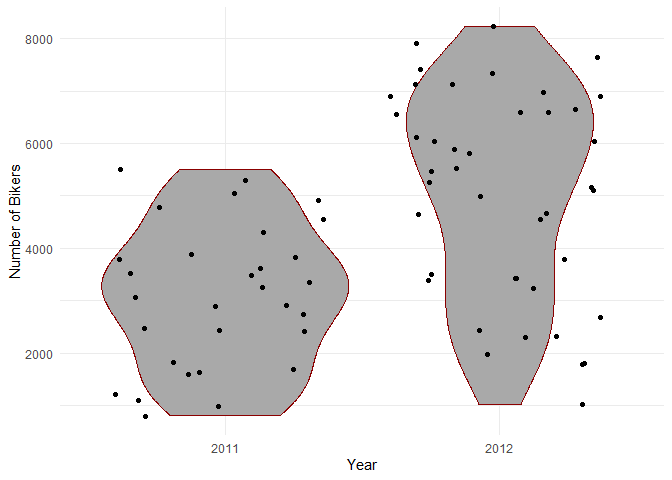
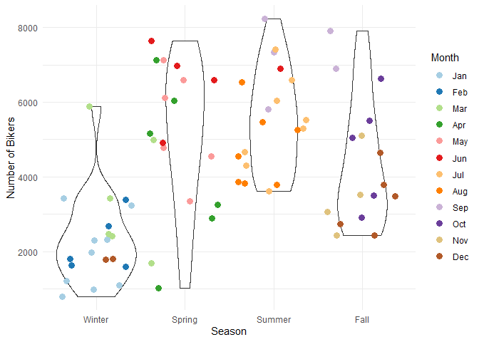

Bike Share Project
================
Soohee Jung, Kera Whitley

# Set up

Libraries and other set up should be in this chunk

``` r
library(tidyverse)
library(caret)
library(gbm)
library(shiny)
```

# Introduction

This dataset compiles the daily casual, registered and total (combined
casual and residual) bikers using this bike share. Looking at the
available variables in the dataset, there are several that are
attributes of the date, and the rest are attributes of the weather. We
will specifically be looking at the temperature, season, year and the
weather to predict the total number of bikers using the bike share.

\[Explain the variables\]

# Data

``` r
# Read in dataset
day.data <- read_csv("day.csv")
```

    ## 
    ## -- Column specification -------------------------------------------------------------------------------------------------------------------
    ## cols(
    ##   instant = col_double(),
    ##   dteday = col_date(format = ""),
    ##   season = col_double(),
    ##   yr = col_double(),
    ##   mnth = col_double(),
    ##   holiday = col_double(),
    ##   weekday = col_double(),
    ##   workingday = col_double(),
    ##   weathersit = col_double(),
    ##   temp = col_double(),
    ##   atemp = col_double(),
    ##   hum = col_double(),
    ##   windspeed = col_double(),
    ##   casual = col_double(),
    ##   registered = col_double(),
    ##   cnt = col_double()
    ## )

``` r
# Convert weekday column from numeric to character value
day.data$days[day.data$weekday==0] <- "Sunday"
day.data$days[day.data$weekday==1] <- "Monday"
day.data$days[day.data$weekday==2] <- "Tuesday"
day.data$days[day.data$weekday==3] <- "Wednesday"
day.data$days[day.data$weekday==4] <- "Thursday"
day.data$days[day.data$weekday==5] <- "Friday"
day.data$days[day.data$weekday==6] <- "Saturday"

# Get unique days
weekdays <- unique(day.data$days)

day <- day.data %>% filter(days == params$Day)

# Converting variables that should be factors into factor variables
day$season <- factor(day$season)
levels(day$season) <- c("Winter","Spring", "Summer", "Fall")

day$yr <- factor(day$yr)
levels(day$yr) <- c("2011", "2012")

day$mnth <- factor(day$mnth)
levels(day$mnth) <- c("Jan", "Feb", "Mar", "Apr", "May", "Jun", "Jul", "Aug", "Sep", "Oct", "Nov", "Dec")

day$holiday <- factor(day$holiday)
levels(day$holiday) <- c("Not Holiday", "Holiday")

day$workingday <- factor(day$workingday)
levels(day$workingday) <- c("Not Working", "Working")

day$weathersit <- factor(day$weathersit)
levels(day$weathersit) <- c("Fair", "Misty", "Light Snow/Rain", "Heavy Rain/Ice/Snow")

set.seed(13)
# The training set should be 70% of the data
n <- nrow(day) * 0.7
train <- sample_n(day, n, replace = FALSE)
test <- anti_join(day, train, by = "dteday")
```

# Summarizations

``` r
# Numerical summaries
summary(train)
```

    ##     instant          dteday              season      yr          mnth           holiday      weekday        workingday
    ##  Min.   :  2.0   Min.   :2011-01-02   Winter:20   2011:30   Jan    : 9   Not Holiday:73   Min.   :0   Not Working:73  
    ##  1st Qu.:212.0   1st Qu.:2011-07-31   Spring:18   2012:43   Jul    : 8   Holiday    : 0   1st Qu.:0   Working    : 0  
    ##  Median :422.0   Median :2012-02-26   Summer:19             Aug    : 7                    Median :0                   
    ##  Mean   :389.6   Mean   :2012-01-24   Fall  :16             Dec    : 7                    Mean   :0                   
    ##  3rd Qu.:569.0   3rd Qu.:2012-07-22                         Mar    : 6                    3rd Qu.:0                   
    ##  Max.   :730.0   Max.   :2012-12-30                         Apr    : 6                    Max.   :0                   
    ##                                                             (Other):30                                                
    ##                weathersit      temp             atemp              hum           windspeed           casual       registered  
    ##  Fair               :51   Min.   :0.09652   Min.   :0.09884   Min.   :0.2758   Min.   :0.06345   Min.   : 120   Min.   : 670  
    ##  Misty              :21   1st Qu.:0.32583   1st Qu.:0.32575   1st Qu.:0.4900   1st Qu.:0.14116   1st Qu.: 599   1st Qu.:2071  
    ##  Light Snow/Rain    : 1   Median :0.46333   Median :0.45706   Median :0.5833   Median :0.18595   Median :1208   Median :2851  
    ##  Heavy Rain/Ice/Snow: 0   Mean   :0.48404   Mean   :0.46639   Mean   :0.6132   Mean   :0.18716   Mean   :1342   Mean   :2928  
    ##                           3rd Qu.:0.65333   3rd Qu.:0.61555   3rd Qu.:0.7275   3rd Qu.:0.22513   3rd Qu.:2166   3rd Qu.:3772  
    ##                           Max.   :0.83000   Max.   :0.79483   Max.   :0.8808   Max.   :0.35075   Max.   :3283   Max.   :5657  
    ##                                                                                                                               
    ##       cnt           days          
    ##  Min.   : 801   Length:73         
    ##  1st Qu.:2689   Class :character  
    ##  Median :3873   Mode  :character  
    ##  Mean   :4270                     
    ##  3rd Qu.:5892                     
    ##  Max.   :8227                     
    ## 

``` r
train %>% select(casual, registered) %>% colSums()
```

    ##     casual registered 
    ##      97938     213775

``` r
table(train$season, train$weathersit)
```

    ##         
    ##          Fair Misty Light Snow/Rain Heavy Rain/Ice/Snow
    ##   Winter   16     4               0                   0
    ##   Spring   10     7               1                   0
    ##   Summer   14     5               0                   0
    ##   Fall     11     5               0                   0

``` r
table(train$workingday, train$weathersit)
```

    ##              
    ##               Fair Misty Light Snow/Rain Heavy Rain/Ice/Snow
    ##   Not Working   51    21               1                   0
    ##   Working        0     0               0                   0

``` r
train %>% group_by(yr) %>% summarize(Total.Bikers=sum(cnt))
```

    ## # A tibble: 2 x 2
    ##   yr    Total.Bikers
    ##   <fct>        <dbl>
    ## 1 2011         92842
    ## 2 2012        218871

``` r
# We can inspect the trend of users across years
ggplot(train, aes(x = yr, y = cnt)) + 
  geom_violin(fill = "dark grey", color = "dark red") + 
  geom_jitter(shape = 16) + 
  labs(x = "Year", y = "Number of Bikers") + 
  theme_minimal()
```

<!-- -->

``` r
train %>% group_by(mnth) %>% 
  summarize(Total.casual=sum(casual),Total.registered=sum(registered),
            Total.Bikers=sum(cnt))
```

    ## # A tibble: 12 x 4
    ##    mnth  Total.casual Total.registered Total.Bikers
    ##    <fct>        <dbl>            <dbl>        <dbl>
    ##  1 Jan           2995            14342        17337
    ##  2 Feb           2523             8579        11102
    ##  3 Mar           6950            13942        20892
    ##  4 Apr          10382            15131        25513
    ##  5 May          13234            19296        32530
    ##  6 Jun          11588            21426        33014
    ##  7 Jul          13821            29630        43451
    ##  8 Aug          10465            22825        33290
    ##  9 Sep          11818            24348        36166
    ## 10 Oct           7622            15997        23619
    ## 11 Nov           3107            11015        14122
    ## 12 Dec           3433            17244        20677

``` r
# We can inspect the trend of users across months using this plot.
# There may be a seasonal effect present.
ggplot(train, aes(x = mnth, y = cnt, fill = "red")) + 
  geom_col() + 
  geom_col(data = train, aes(x = mnth, y = casual, fill = "blue")) +
  labs(x = "Month", y = "Total Number of Bikers") +
  scale_fill_discrete(name = "Biker Type", labels = c("Casual", "Registered"))
```

<!-- -->

``` r
train %>% group_by(season,mnth) %>% 
  summarize(Total.casual=sum(casual),Total.registered=sum(registered),
            Total.Bikers=sum(cnt))
```

    ## `summarise()` has grouped output by 'season'. You can override using the `.groups` argument.

    ## # A tibble: 16 x 5
    ## # Groups:   season [4]
    ##    season mnth  Total.casual Total.registered Total.Bikers
    ##    <fct>  <fct>        <dbl>            <dbl>        <dbl>
    ##  1 Winter Jan           2995            14342        17337
    ##  2 Winter Feb           2523             8579        11102
    ##  3 Winter Mar           4946             9257        14203
    ##  4 Winter Dec            772             2811         3583
    ##  5 Spring Mar           2004             4685         6689
    ##  6 Spring Apr          10382            15131        25513
    ##  7 Spring May          13234            19296        32530
    ##  8 Spring Jun           9037            17086        26123
    ##  9 Summer Jun           2551             4340         6891
    ## 10 Summer Jul          13821            29630        43451
    ## 11 Summer Aug          10465            22825        33290
    ## 12 Summer Sep           7349            14021        21370
    ## 13 Fall   Sep           4469            10327        14796
    ## 14 Fall   Oct           7622            15997        23619
    ## 15 Fall   Nov           3107            11015        14122
    ## 16 Fall   Dec           2661            14433        17094

``` r
# We can inspect the trend of all users across season using this plot.
# There may be weather or temperature effect present.
ggplot(train, aes(x = season, y = cnt)) + 
  geom_violin() +
  geom_jitter(shape = 16, size = 3, aes(color = mnth)) +
  labs(x = "Season", y = "Number of Bikers") +
  scale_color_manual(name = "Month", values = c("#a6cee3", "#1f78b4", "#b2df8a", "#33a02c", 
                                                "#fb9a99", "#e31a1c", "#fdbf6f", "#ff7f00", 
                                                "#cab2d6", "#6a3d9a", "#dfc27d", "#b15928")) +
  theme_minimal()
```

<!-- -->

``` r
by.weather <- train %>% group_by(weathersit) %>% 
  summarize(Total.casual=sum(casual),Total.registered=sum(registered),
            Total.Bikers=sum(cnt))
by.weather
```

    ## # A tibble: 3 x 4
    ##   weathersit      Total.casual Total.registered Total.Bikers
    ##   <fct>                  <dbl>            <dbl>        <dbl>
    ## 1 Fair                   71922           153743       225665
    ## 2 Misty                  25896            59125        85021
    ## 3 Light Snow/Rain          120              907         1027

``` r
# We can inspect the trend of all users across weather condition using this plot.
ggplot(by.weather, aes(x=weathersit, y=Total.Bikers))+geom_col(fill="cornflowerblue", width = 0.8)+
  scale_x_discrete(name="Weather")
```

<!-- -->

``` r
# We can inspect the trend of all users across temperature using this plot.
ggplot(train, aes(x=temp, y=cnt)) + geom_point() + geom_smooth()+
  scale_x_continuous(name="Temperature")+scale_y_discrete(name="Bikers")
```

    ## `geom_smooth()` using method = 'loess' and formula 'y ~ x'

<!-- -->

``` r
by.holi <- train %>% group_by(holiday) %>% 
  summarize(Total.casual=sum(casual),Total.registered=sum(registered),
            Total.Bikers=sum(cnt))
by.holi
```

    ## # A tibble: 1 x 4
    ##   holiday     Total.casual Total.registered Total.Bikers
    ##   <fct>              <dbl>            <dbl>        <dbl>
    ## 1 Not Holiday        97938           213775       311713

``` r
# We can inspect the trend of all users across whether holiday or not using this plot.
ggplot(by.holi, aes(x=holiday, y=Total.Bikers)) + geom_col(fill="darkgoldenrod1", width = 0.7)+
  scale_x_discrete(name="Holiday")
```

<!-- -->

``` r
# We can inspect the trend of casual users across whether holiday or not using this plot.
ggplot(train, aes(x=holiday, y=casual))+geom_boxplot(fill="darkmagenta")+
  scale_x_discrete(name="Holiday")+scale_y_continuous(name="Casual Users")
```

<!-- -->

``` r
# We can inspect the trend of registered users across whether holiday or not using this plot.
ggplot(train, aes(x=holiday, y=registered))+geom_boxplot(fill="darkorchid")+
  scale_x_discrete(name="Holiday")+scale_y_continuous(name="Registered Users")
```

<!-- -->

# Modeling

## Linear Regression Model

*Linear regression* tries to find a linear equation which describe the
relationship between a response variable and a explanation variable. The
best model fit is made by minimizing the sum of squared residuals.
Simple linear regression model can be extended in many ways and we call
them *Multiple Linear Regression*.

``` r
set.seed(13)
# multiple linear regression model 1
lmFit <- train(cnt ~ season + temp + I(temp^2), data=train, method="lm",
               trControl=trainControl(method="cv",number=10))
summary(lmFit)
```

    ## 
    ## Call:
    ## lm(formula = .outcome ~ ., data = dat)
    ## 
    ## Residuals:
    ##     Min      1Q  Median      3Q     Max 
    ## -3176.1  -866.8  -138.4  1002.3  2890.2 
    ## 
    ## Coefficients:
    ##              Estimate Std. Error t value Pr(>|t|)    
    ## (Intercept)   -2272.3     1072.5  -2.119 0.037817 *  
    ## seasonSpring    553.8      578.0   0.958 0.341507    
    ## seasonSummer    259.1      815.2   0.318 0.751623    
    ## seasonFall      829.7      485.9   1.708 0.092337 .  
    ## temp          20282.2     5192.4   3.906 0.000221 ***
    ## `I(temp^2)`  -13496.5     5418.5  -2.491 0.015229 *  
    ## ---
    ## Signif. codes:  0 '***' 0.001 '**' 0.01 '*' 0.05 '.' 0.1 ' ' 1
    ## 
    ## Residual standard error: 1299 on 67 degrees of freedom
    ## Multiple R-squared:  0.6038, Adjusted R-squared:  0.5742 
    ## F-statistic: 20.42 on 5 and 67 DF,  p-value: 2.521e-12

``` r
lmPred <- predict(lmFit, newdata=test)

# multiple linear regression model 2
set.seed(13)
mlrFit <- train(cnt ~ season + temp + yr, data = train, method = "lm", 
               trControl = trainControl(method = "cv", number = 10))
summary(mlrFit)
```

    ## 
    ## Call:
    ## lm(formula = .outcome ~ ., data = dat)
    ## 
    ## Residuals:
    ##     Min      1Q  Median      3Q     Max 
    ## -3685.7  -449.5   -12.1   565.2  2953.1 
    ## 
    ## Coefficients:
    ##              Estimate Std. Error t value Pr(>|t|)    
    ## (Intercept)    -671.3      444.1  -1.512  0.13533    
    ## seasonSpring    834.2      465.9   1.791  0.07787 .  
    ## seasonSummer   -147.7      644.4  -0.229  0.81946    
    ## seasonFall     1291.2      384.4   3.359  0.00129 ** 
    ## temp           7233.0     1267.8   5.705 2.86e-07 ***
    ## yr2012         1680.8      255.0   6.591 8.13e-09 ***
    ## ---
    ## Signif. codes:  0 '***' 0.001 '**' 0.01 '*' 0.05 '.' 0.1 ' ' 1
    ## 
    ## Residual standard error: 1058 on 67 degrees of freedom
    ## Multiple R-squared:  0.7374, Adjusted R-squared:  0.7178 
    ## F-statistic: 37.62 on 5 and 67 DF,  p-value: < 2.2e-16

``` r
mlrPred <- predict(mlrFit, newdata = test)
```

## Random Forest Model

*Random forest model* is one of 3 major methods of *Ensemble tree
model*. Create a tree from a random subset of predictors for a bootstrap
sample and then train the tree. Repeat this for many times, say 100 or
1000 repeats. The final prediction is average of these predictions.

``` r
set.seed(13)
# Get random forest model fit
rfFit <- train(cnt ~ season + temp + weathersit, data=train,
               method="rf", 
               trControl=trainControl(method="cv",number=10))
rfFit
```

    ## Random Forest 
    ## 
    ## 73 samples
    ##  3 predictor
    ## 
    ## No pre-processing
    ## Resampling: Cross-Validated (10 fold) 
    ## Summary of sample sizes: 67, 67, 65, 65, 66, 66, ... 
    ## Resampling results across tuning parameters:
    ## 
    ##   mtry  RMSE      Rsquared   MAE      
    ##   2     1256.123  0.6539193  1071.6696
    ##   4     1168.312  0.6821927   996.1567
    ##   7     1183.740  0.6920491   982.7245
    ## 
    ## RMSE was used to select the optimal model using the smallest value.
    ## The final value used for the model was mtry = 4.

``` r
rfPred <- predict(rfFit, newdata=test)
```

## Boosted Tree Model

The *boosted tree model* is a type of *ensemble tree model*. The way the
boosted tree works is that the trees are fit sequentially. Each new tree
is fit on on a modified version of the original data and the predictions
are updated as the trees are grown.

``` r
library(gbm)
set.seed(13)

boostFit <- gbm(cnt ~ season + temp + yr + weathersit, data = train, distribution = "gaussian", n.trees = 5000, 
                shrinkage = 0.1, interaction.depth = 4)
boostFit
```

    ## gbm(formula = cnt ~ season + temp + yr + weathersit, distribution = "gaussian", 
    ##     data = train, n.trees = 5000, interaction.depth = 4, shrinkage = 0.1)
    ## A gradient boosted model with gaussian loss function.
    ## 5000 iterations were performed.
    ## There were 4 predictors of which 4 had non-zero influence.

``` r
boostPred <- predict(boostFit, newdata = test, n.trees = 5000)
boostPred
```

    ##  [1] 1113.605 2687.138 1983.361 2399.955 4957.127 5231.568 5438.061 4199.241 4732.311 3910.480 3893.491 4112.188 4097.173 4097.173 3409.489
    ## [16] 4994.272 3242.061 4596.956 3027.526 4164.144 3804.450 1390.678 2155.748 2202.994 2905.817 3989.931 7033.165 5178.412 5963.179 5721.537
    ## [31] 5145.777 4271.578

# Comparison

``` r
set.seed(13)
# multiple linear regression model 1
multiRMSE <- postResample(lmPred, test$cnt)
multiRMSE
```

    ##         RMSE     Rsquared          MAE 
    ## 1172.8423265    0.5289928 1030.9132354

``` r
# multiple linear regression model 2
mlrRMSE <- postResample(mlrPred, test$cnt)
mlrRMSE
```

    ##        RMSE    Rsquared         MAE 
    ## 836.0627758   0.7337251 667.5032210

``` r
# random forest model
rfRMSE <- postResample(rfPred, test$cnt)
rfRMSE
```

    ##        RMSE    Rsquared         MAE 
    ## 1385.582282    0.347786 1086.485315

``` r
# boosted tree model
boostRMSE <- postResample(boostPred, test$cnt)
boostRMSE
```

    ##         RMSE     Rsquared          MAE 
    ## 1052.2088776    0.5759549  879.8600697

``` r
# compare
lowestRMSE <- c(MultipleLR1=multiRMSE[1],MultipleLR2=mlrRMSE[1],RandomForest=rfRMSE[1],Boosting=boostRMSE[1])
lowestRMSE
```

    ##  MultipleLR1.RMSE  MultipleLR2.RMSE RandomForest.RMSE     Boosting.RMSE 
    ##         1172.8423          836.0628         1385.5823         1052.2089

The preferred model has the lowest RMSE. The model that has the lowest
RMSE for \[day\] is 2, and has the model \[equation\].
