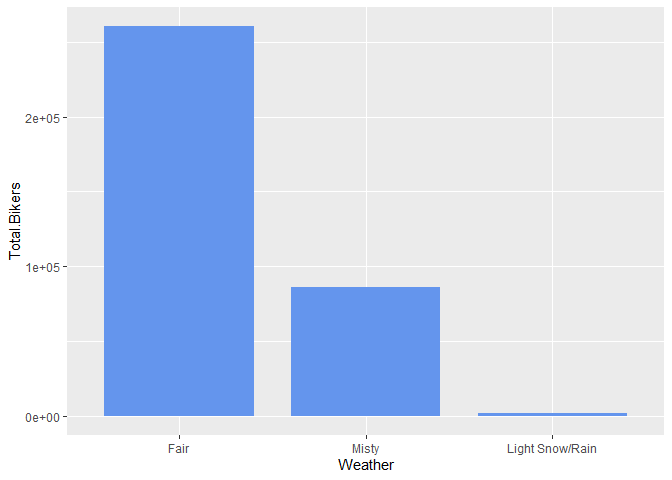
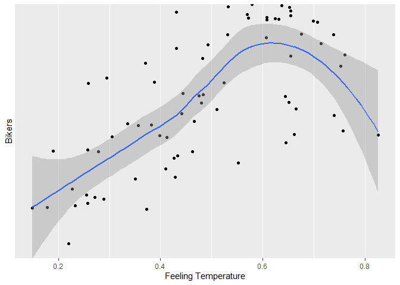

Bike Share Project
================
Soohee Jung, Kera Whitley

# Introduction

This dataset compiles the daily casual, registered and total (combined
casual and residual) bikers using this bike share. Looking at the
available variables in the dataset, there are several that are
attributes of the date, and the rest are attributes of the weather. We
will be looking at the temperature, season, and the year to predict the
total number of bikers using the bike share. The idea behind looking at
these particular variables being that, there are more people riding
bikes when the weather is nice. Year would come into play because the
longer the bike share is around, the more chances there are for people
to know about and use it.

Later, two multiple linear regression models, one random forest model
and one boosted models were fit. The variables specifically chosen were
season, temp, atemp, and yr. When exploring the data with different
plots and tables, it could be seen that the number of total bike share
users seemed to fluctuate with differences in these variables. The
correlation plot shows that theses variables have the highest either
positive or negative correlation with the total number of bikers, out of
the variables explored. The violin plots show firstly that there is a
definite difference in the number of total users by year, and that there
is a general trend with regard to season, but that month may not as good
of an indicator. The normalized temperature, the normalized temperature
feel both are fairly highly correlated to the total number of bikers.

# Data

``` r
# Read in dataset
day.data <- read_csv("day.csv")
```

    ## 
    ## -- Column specification ------------------------------------------------------------------------------------------------
    ## cols(
    ##   instant = col_double(),
    ##   dteday = col_date(format = ""),
    ##   season = col_double(),
    ##   yr = col_double(),
    ##   mnth = col_double(),
    ##   holiday = col_double(),
    ##   weekday = col_double(),
    ##   workingday = col_double(),
    ##   weathersit = col_double(),
    ##   temp = col_double(),
    ##   atemp = col_double(),
    ##   hum = col_double(),
    ##   windspeed = col_double(),
    ##   casual = col_double(),
    ##   registered = col_double(),
    ##   cnt = col_double()
    ## )

``` r
# Convert weekday column from numeric to character value
day.data$days[day.data$weekday==0] <- "Sunday"
day.data$days[day.data$weekday==1] <- "Monday"
day.data$days[day.data$weekday==2] <- "Tuesday"
day.data$days[day.data$weekday==3] <- "Wednesday"
day.data$days[day.data$weekday==4] <- "Thursday"
day.data$days[day.data$weekday==5] <- "Friday"
day.data$days[day.data$weekday==6] <- "Saturday"

# Get unique days
weekdays <- unique(day.data$days)

# Filter data to subset
day <- day.data %>% filter(days == params$Day)

# Converting variables that should be factors into factor variables
day$season <- factor(day$season)
levels(day$season) <- c("Winter","Spring", "Summer", "Fall")

day$yr <- factor(day$yr)
levels(day$yr) <- c("2011", "2012")

day$mnth <- factor(day$mnth)
levels(day$mnth) <- c("Jan", "Feb", "Mar", "Apr", "May", "Jun", "Jul", "Aug", "Sep", "Oct", "Nov", "Dec")

day$holiday <- factor(day$holiday)
levels(day$holiday) <- c("Not Holiday", "Holiday")

day$workingday <- factor(day$workingday)
levels(day$workingday) <- c("Not Working", "Working")

day$weathersit <- factor(day$weathersit)
levels(day$weathersit) <- c("Fair", "Misty", "Light Snow/Rain", "Heavy Rain/Ice/Snow")

set.seed(13)
# The training set should be 70% of the data
n <- nrow(day) * 0.7
train <- sample_n(day, n, replace = FALSE)
test <- anti_join(day, train, by = "dteday")
```

# Summarizations

produce some meaningful summary statistics and plots about the training
data we are working with. Explore the data a bit and then we are ready
to fit some models.

``` r
str(day.data)
```

    ## spec_tbl_df [731 x 17] (S3: spec_tbl_df/tbl_df/tbl/data.frame)
    ##  $ instant   : num [1:731] 1 2 3 4 5 6 7 8 9 10 ...
    ##  $ dteday    : Date[1:731], format: "2011-01-01" "2011-01-02" "2011-01-03" "2011-01-04" ...
    ##  $ season    : num [1:731] 1 1 1 1 1 1 1 1 1 1 ...
    ##  $ yr        : num [1:731] 0 0 0 0 0 0 0 0 0 0 ...
    ##  $ mnth      : num [1:731] 1 1 1 1 1 1 1 1 1 1 ...
    ##  $ holiday   : num [1:731] 0 0 0 0 0 0 0 0 0 0 ...
    ##  $ weekday   : num [1:731] 6 0 1 2 3 4 5 6 0 1 ...
    ##  $ workingday: num [1:731] 0 0 1 1 1 1 1 0 0 1 ...
    ##  $ weathersit: num [1:731] 2 2 1 1 1 1 2 2 1 1 ...
    ##  $ temp      : num [1:731] 0.344 0.363 0.196 0.2 0.227 ...
    ##  $ atemp     : num [1:731] 0.364 0.354 0.189 0.212 0.229 ...
    ##  $ hum       : num [1:731] 0.806 0.696 0.437 0.59 0.437 ...
    ##  $ windspeed : num [1:731] 0.16 0.249 0.248 0.16 0.187 ...
    ##  $ casual    : num [1:731] 331 131 120 108 82 88 148 68 54 41 ...
    ##  $ registered: num [1:731] 654 670 1229 1454 1518 ...
    ##  $ cnt       : num [1:731] 985 801 1349 1562 1600 ...
    ##  $ days      : chr [1:731] "Saturday" "Sunday" "Monday" "Tuesday" ...
    ##  - attr(*, "spec")=
    ##   .. cols(
    ##   ..   instant = col_double(),
    ##   ..   dteday = col_date(format = ""),
    ##   ..   season = col_double(),
    ##   ..   yr = col_double(),
    ##   ..   mnth = col_double(),
    ##   ..   holiday = col_double(),
    ##   ..   weekday = col_double(),
    ##   ..   workingday = col_double(),
    ##   ..   weathersit = col_double(),
    ##   ..   temp = col_double(),
    ##   ..   atemp = col_double(),
    ##   ..   hum = col_double(),
    ##   ..   windspeed = col_double(),
    ##   ..   casual = col_double(),
    ##   ..   registered = col_double(),
    ##   ..   cnt = col_double()
    ##   .. )

``` r
Correlation <- cor(select(day.data,-c(instant,dteday,weekday,days)), method="spearman")
corrplot(Correlation, method="number", type = 'lower', tl.col = 'black', 
         cl.ratio = 0.2, tl.srt = 45, number.cex = 0.7)
```

<!-- -->

``` r
# Numerical summaries
summary(train)
```

    ##     instant          dteday              season      yr          mnth           holiday      weekday        workingday
    ##  Min.   :  6.0   Min.   :2011-01-06   Winter:18   2011:30   Aug    : 9   Not Holiday:70   Min.   :4   Not Working: 2  
    ##  1st Qu.:214.2   1st Qu.:2011-08-02   Spring:19   2012:42   Dec    : 8   Holiday    : 2   1st Qu.:4   Working    :70  
    ##  Median :422.5   Median :2012-02-26   Summer:20             Jan    : 7                    Median :4                   
    ##  Mean   :389.4   Mean   :2012-01-24   Fall  :15             Mar    : 7                    Mean   :4                   
    ##  3rd Qu.:567.8   3rd Qu.:2012-07-20                         Feb    : 6                    3rd Qu.:4                   
    ##  Max.   :727.0   Max.   :2012-12-27                         Apr    : 6                    Max.   :4                   
    ##                                                             (Other):29                                                
    ##                weathersit      temp            atemp             hum           windspeed           casual      
    ##  Fair               :50   Min.   :0.1443   Min.   :0.1495   Min.   :0.3050   Min.   :0.04727   Min.   :  15.0  
    ##  Misty              :21   1st Qu.:0.3598   1st Qu.:0.3665   1st Qu.:0.5198   1st Qu.:0.13387   1st Qu.: 266.5  
    ##  Light Snow/Rain    : 1   Median :0.4942   Median :0.4814   Median :0.5935   Median :0.17569   Median : 608.5  
    ##  Heavy Rain/Ice/Snow: 0   Mean   :0.5098   Mean   :0.4884   Mean   :0.6041   Mean   :0.18550   Mean   : 624.9  
    ##                           3rd Qu.:0.6960   3rd Qu.:0.6444   3rd Qu.:0.6766   3rd Qu.:0.22326   3rd Qu.: 925.5  
    ##                           Max.   :0.8275   Max.   :0.8264   Max.   :0.9183   Max.   :0.44156   Max.   :1405.0  
    ##                                                                                                                
    ##    registered        cnt           days          
    ##  Min.   : 416   Min.   : 431   Length:72         
    ##  1st Qu.:3126   1st Qu.:3287   Class :character  
    ##  Median :4053   Median :4778   Mode  :character  
    ##  Mean   :4207   Mean   :4832                     
    ##  3rd Qu.:5713   3rd Qu.:6793                     
    ##  Max.   :6781   Max.   :7804                     
    ## 

``` r
train %>% select(casual, registered) %>% colSums()
```

    ##     casual registered 
    ##      44995     302887

``` r
table(train$season, train$weathersit)
```

    ##         
    ##          Fair Misty Light Snow/Rain Heavy Rain/Ice/Snow
    ##   Winter   11     7               0                   0
    ##   Spring   14     4               1                   0
    ##   Summer   16     4               0                   0
    ##   Fall      9     6               0                   0

``` r
table(train$workingday, train$weathersit)
```

    ##              
    ##               Fair Misty Light Snow/Rain Heavy Rain/Ice/Snow
    ##   Not Working    2     0               0                   0
    ##   Working       48    21               1                   0

``` r
# Total bikers grouped by year
train %>% group_by(yr) %>% summarize(Total.Bikers=sum(cnt))
```

    ## # A tibble: 2 x 2
    ##   yr    Total.Bikers
    ##   <fct>        <dbl>
    ## 1 2011         94010
    ## 2 2012        253872

``` r
# We can inspect the trend of users across years
ggplot(train, aes(x = yr, y = cnt)) + 
  geom_violin(fill = "dark grey", color = "dark red") + 
  geom_jitter(shape = 16) + 
  labs(x = "Year", y = "Number of Bikers") + 
  theme_minimal()
```

<!-- -->

``` r
# Total number of casual users, registered users and all bikers by month
train %>% group_by(mnth) %>% 
  summarize(Total.casual=sum(casual),Total.registered=sum(registered),
            Total.Bikers=sum(cnt))
```

    ## # A tibble: 12 x 4
    ##    mnth  Total.casual Total.registered Total.Bikers
    ##    <fct>        <dbl>            <dbl>        <dbl>
    ##  1 Jan            969            17731        18700
    ##  2 Feb           1173            15020        16193
    ##  3 Mar           3748            25922        29670
    ##  4 Apr           4276            25589        29865
    ##  5 May           4750            25750        30500
    ##  6 Jun           5216            31308        36524
    ##  7 Jul           5599            29714        35313
    ##  8 Aug           8737            45608        54345
    ##  9 Sep           3355            25765        29120
    ## 10 Oct           3125            23646        26771
    ## 11 Nov           1981             7925         9906
    ## 12 Dec           2066            28909        30975

``` r
# We can inspect the trend of users across months using this plot.
# There may be a seasonal effect present.
ggplot(train, aes(x = mnth, y = cnt, fill = "red")) + 
  geom_col() + 
  geom_col(data = train, aes(x = mnth, y = casual, fill = "blue")) +
  labs(x = "Month", y = "Total Number of Bikers") +
  scale_fill_discrete(name = "Biker Type", labels = c("Casual", "Registered"))
```

<!-- -->

``` r
# Total number of casual, registered and all bikers by month within each season
train %>% group_by(season,mnth) %>% 
  summarize(Total.casual=sum(casual),Total.registered=sum(registered),
            Total.Bikers=sum(cnt))
```

    ## `summarise()` has grouped output by 'season'. You can override using the `.groups` argument.

    ## # A tibble: 16 x 5
    ## # Groups:   season [4]
    ##    season mnth  Total.casual Total.registered Total.Bikers
    ##    <fct>  <fct>        <dbl>            <dbl>        <dbl>
    ##  1 Winter Jan            969            17731        18700
    ##  2 Winter Feb           1173            15020        16193
    ##  3 Winter Mar           1235            11881        13116
    ##  4 Winter Dec            474             4708         5182
    ##  5 Spring Mar           2513            14041        16554
    ##  6 Spring Apr           4276            25589        29865
    ##  7 Spring May           4750            25750        30500
    ##  8 Spring Jun           3517            20223        23740
    ##  9 Summer Jun           1699            11085        12784
    ## 10 Summer Jul           5599            29714        35313
    ## 11 Summer Aug           8737            45608        54345
    ## 12 Summer Sep           2604            19123        21727
    ## 13 Fall   Sep            751             6642         7393
    ## 14 Fall   Oct           3125            23646        26771
    ## 15 Fall   Nov           1981             7925         9906
    ## 16 Fall   Dec           1592            24201        25793

``` r
# We can inspect the trend of all users across season using this plot.
# There may be weather or temperature effect present.
ggplot(train, aes(x = season, y = cnt)) + 
  geom_violin() +
  geom_jitter(shape = 16, size = 3, aes(color = mnth)) +
  labs(x = "Season", y = "Number of Bikers") +
  scale_color_manual(name = "Month", values = c("#a6cee3", "#1f78b4", "#b2df8a", "#33a02c", 
                                                "#fb9a99", "#e31a1c", "#fdbf6f", "#ff7f00", 
                                                "#cab2d6", "#6a3d9a", "#dfc27d", "#b15928")) +
  theme_minimal()
```

<!-- -->

``` r
# Total number of casual, registered and all bikers by weather
by.weather <- train %>% group_by(weathersit) %>% 
  summarize(Total.casual=sum(casual),Total.registered=sum(registered),
            Total.Bikers=sum(cnt))
by.weather
```

    ## # A tibble: 3 x 4
    ##   weathersit      Total.casual Total.registered Total.Bikers
    ##   <fct>                  <dbl>            <dbl>        <dbl>
    ## 1 Fair                   36147           224258       260405
    ## 2 Misty                   8669            77123        85792
    ## 3 Light Snow/Rain          179             1506         1685

``` r
# We can inspect the trend of all users across weather condition using this plot.
ggplot(by.weather, aes(x=weathersit, y=Total.Bikers))+geom_col(fill="cornflowerblue", width = 0.8)+
  scale_x_discrete(name="Weather")
```

<!-- -->

``` r
# We can inspect the trend of all users across temperature using this plot.
ggplot(train, aes(x=temp, y=cnt)) + geom_point() + geom_smooth()+
  scale_x_continuous(name="Temperature")+scale_y_discrete(name="Bikers")
```

    ## `geom_smooth()` using method = 'loess' and formula 'y ~ x'

<!-- -->

``` r
# We can inspect the trend of all users across feeling temperature using this plot.
ggplot(train, aes(x=atemp, y=cnt)) + geom_point() + geom_smooth()+
  scale_x_continuous(name="Feeling Temperature")+scale_y_discrete(name="Bikers")
```

    ## `geom_smooth()` using method = 'loess' and formula 'y ~ x'

<!-- -->

``` r
# Total number of casual, registered and all bikers by holiday or not
by.holi <- train %>% group_by(holiday) %>% 
  summarize(Total.casual=sum(casual),Total.registered=sum(registered),
            Total.Bikers=sum(cnt))
by.holi
```

    ## # A tibble: 2 x 4
    ##   holiday     Total.casual Total.registered Total.Bikers
    ##   <fct>              <dbl>            <dbl>        <dbl>
    ## 1 Not Holiday        43480           300482       343962
    ## 2 Holiday             1515             2405         3920

``` r
# We can inspect the trend of all users across whether holiday or not using this plot.
ggplot(by.holi, aes(x=holiday, y=Total.Bikers)) + geom_col(fill="darkgoldenrod1", width = 0.7)+
  scale_x_discrete(name="Holiday")
```

<!-- -->

``` r
# We can inspect the trend of casual users across whether holiday or not using this plot.
ggplot(train, aes(x=holiday, y=casual))+geom_boxplot(fill="darkmagenta")+
  scale_x_discrete(name="Holiday")+scale_y_continuous(name="Casual Users")
```

<!-- -->

``` r
# We can inspect the trend of registered users across whether holiday or not using this plot.
ggplot(train, aes(x=holiday, y=registered))+geom_boxplot(fill="darkorchid")+
  scale_x_discrete(name="Holiday")+scale_y_continuous(name="Registered Users")
```

<!-- -->

# Modeling

## Linear Regression Model

*Linear regression* tries to find a linear equation which describe the
relationship between a response variable and a explanation variable. The
best model fit is made by minimizing the sum of squared residuals.
Simple linear regression model can be extended in many ways and we call
them *Multiple Linear Regression*.

``` r
set.seed(13)
# multiple linear regression model 1
lmFit <- train(cnt ~ season + temp + atemp, data=train, method="lm",
               trControl=trainControl(method="cv",number=10))
summary(lmFit)
```

    ## 
    ## Call:
    ## lm(formula = .outcome ~ ., data = dat)
    ## 
    ## Residuals:
    ##      Min       1Q   Median       3Q      Max 
    ## -3126.50  -986.04    77.78  1210.88  2864.93 
    ## 
    ## Coefficients:
    ##              Estimate Std. Error t value Pr(>|t|)  
    ## (Intercept)    1157.3      729.0   1.587   0.1172  
    ## seasonSpring   1065.4      598.1   1.781   0.0795 .
    ## seasonSummer    704.9      821.3   0.858   0.3938  
    ## seasonFall     1118.5      552.4   2.025   0.0469 *
    ## temp          12505.6    11716.3   1.067   0.2897  
    ## atemp         -6982.6    12729.1  -0.549   0.5852  
    ## ---
    ## Signif. codes:  0 '***' 0.001 '**' 0.01 '*' 0.05 '.' 0.1 ' ' 1
    ## 
    ## Residual standard error: 1520 on 66 degrees of freedom
    ## Multiple R-squared:  0.4804, Adjusted R-squared:  0.4411 
    ## F-statistic: 12.21 on 5 and 66 DF,  p-value: 2.174e-08

``` r
lmPred <- predict(lmFit, newdata=test)

# multiple linear regression model 2
set.seed(13)
mlrFit <- train(cnt ~ season + temp + yr, data = train, method = "lm", 
               trControl = trainControl(method = "cv", number = 10))
summary(mlrFit)
```

    ## 
    ## Call:
    ## lm(formula = .outcome ~ ., data = dat)
    ## 
    ## Residuals:
    ##     Min      1Q  Median      3Q     Max 
    ## -3028.6  -567.4   242.1   547.1  1676.5 
    ## 
    ## Coefficients:
    ##              Estimate Std. Error t value Pr(>|t|)    
    ## (Intercept)     208.9      368.8   0.566 0.573078    
    ## seasonSpring   1211.5      342.8   3.534 0.000754 ***
    ## seasonSummer    898.0      465.6   1.929 0.058078 .  
    ## seasonFall     1194.7      317.9   3.759 0.000365 ***
    ## temp           4631.1      925.9   5.002 4.46e-06 ***
    ## yr2012         2475.5      214.3  11.549  < 2e-16 ***
    ## ---
    ## Signif. codes:  0 '***' 0.001 '**' 0.01 '*' 0.05 '.' 0.1 ' ' 1
    ## 
    ## Residual standard error: 876.6 on 66 degrees of freedom
    ## Multiple R-squared:  0.8272, Adjusted R-squared:  0.8141 
    ## F-statistic:  63.2 on 5 and 66 DF,  p-value: < 2.2e-16

``` r
mlrPred <- predict(mlrFit, newdata = test)
```

## Random Forest Model

*Random forest model* is one of 3 major methods of *Ensemble tree
model*. It is flexible and one big advantage of the random forest model
is that it can be used for both classification and regression models. It
creates multiple trees from a random subset of predictors for each
bootstrap sample and then train the trees. The final prediction is
average of these predictions.

``` r
set.seed(13)
# Get random forest model fit
rfFit <- train(cnt ~ season + temp + atemp + yr, data=train,
               method="rf", 
               trControl=trainControl(method="cv",number=10))
rfFit
```

    ## Random Forest 
    ## 
    ## 72 samples
    ##  4 predictor
    ## 
    ## No pre-processing
    ## Resampling: Cross-Validated (10 fold) 
    ## Summary of sample sizes: 66, 66, 65, 64, 65, 65, ... 
    ## Resampling results across tuning parameters:
    ## 
    ##   mtry  RMSE      Rsquared   MAE     
    ##   2     908.6415  0.7776230  738.7241
    ##   4     906.4774  0.7728775  727.0882
    ##   6     902.2019  0.7763251  719.1185
    ## 
    ## RMSE was used to select the optimal model using the smallest value.
    ## The final value used for the model was mtry = 6.

``` r
rfPred <- predict(rfFit, newdata=test)
```

## Boosted Tree Model

The *boosted tree model* is a type of *ensemble tree model*. The way the
boosted tree works is that the trees are fit sequentially. Once the
first tree has been fit, the residuals from that tree are recorded. They
are then used as the new response and a new tree is fit. The residuals
from this next tree are then used as the new response. this process
repeats a number of times, with 5000 not being unreasonable.

``` r
set.seed(13)

boostFit <- train(cnt ~ season + temp + yr, data = train, method = "gbm", verbose = FALSE,
                  preProcess = c("center", "scale"),
                  trControl = trainControl(method = "cv", number = 10))
boostFit
```

    ## Stochastic Gradient Boosting 
    ## 
    ## 72 samples
    ##  3 predictor
    ## 
    ## Pre-processing: centered (5), scaled (5) 
    ## Resampling: Cross-Validated (10 fold) 
    ## Summary of sample sizes: 66, 66, 65, 64, 65, 65, ... 
    ## Resampling results across tuning parameters:
    ## 
    ##   interaction.depth  n.trees  RMSE      Rsquared   MAE     
    ##   1                   50      891.5413  0.7889961  723.1136
    ##   1                  100      886.3750  0.7979575  719.3291
    ##   1                  150      878.7077  0.7994827  702.5871
    ##   2                   50      883.6834  0.7955049  714.1902
    ##   2                  100      865.6588  0.8016462  709.7616
    ##   2                  150      867.7740  0.7968870  709.1915
    ##   3                   50      878.2466  0.7929330  722.3422
    ##   3                  100      871.0116  0.7990285  713.5265
    ##   3                  150      867.7621  0.7993405  718.6832
    ## 
    ## Tuning parameter 'shrinkage' was held constant at a value of 0.1
    ## Tuning parameter 'n.minobsinnode' was held constant
    ##  at a value of 10
    ## RMSE was used to select the optimal model using the smallest value.
    ## The final values used for the model were n.trees = 100, interaction.depth = 2, shrinkage = 0.1 and n.minobsinnode = 10.

``` r
boostPred <- predict(boostFit, newdata = test)
```

# Comparison

``` r
set.seed(13)
# multiple linear regression model 1
multiRMSE <- postResample(lmPred, test$cnt)

# multiple linear regression model 2
mlrRMSE <- postResample(mlrPred, test$cnt)

# random forest model
rfRMSE <- postResample(rfPred, test$cnt)

# boosted tree model
boostRMSE <- postResample(boostPred, test$cnt)

# compare
lowestRMSE <- c(MultipleLR1=multiRMSE[1],MultipleLR2=mlrRMSE[1],RandomForest=rfRMSE[1],Boosting=boostRMSE[1])
lowestRMSE
```

    ##  MultipleLR1.RMSE  MultipleLR2.RMSE RandomForest.RMSE     Boosting.RMSE 
    ##         1578.9739          795.5060          890.0728          890.6975

The preferred model has the lowest RMSE. The model that has the lowest
RMSE for Thursday is MultipleLR2.RMSE.
