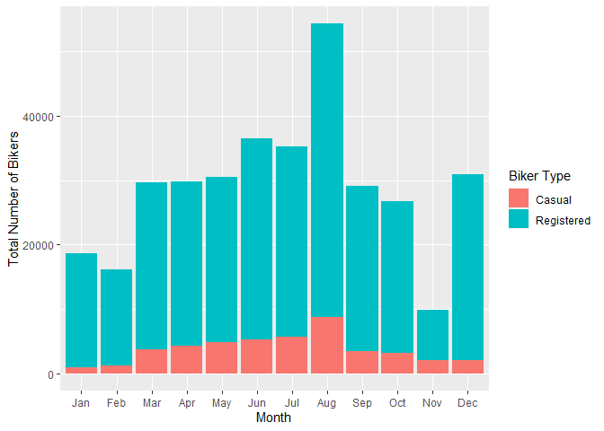

Bike Share Project
================
Soohee Jung, Kera Whitley

# Set up

Libraries and other set up should be in this chunk

``` r
library(tidyverse)
library(caret)
library(gbm)
library(shiny)
```

# Introduction

This dataset compiles the daily casual, registered and total (combined
casual and residual) bikers using this bike share. Looking at the
available variables in the dataset, there are several that are
attributes of the date, and the rest are attributes of the weather. We
will specifically be looking at the temperature, season, year and the
weather to predict the total number of bikers using the bike share.

\[Explain the variables\]

# Data

``` r
# Read in dataset
day.data <- read_csv("day.csv")
```

    ## 
    ## -- Column specification -------------------------------------------------------------------------------------------------------------------
    ## cols(
    ##   instant = col_double(),
    ##   dteday = col_date(format = ""),
    ##   season = col_double(),
    ##   yr = col_double(),
    ##   mnth = col_double(),
    ##   holiday = col_double(),
    ##   weekday = col_double(),
    ##   workingday = col_double(),
    ##   weathersit = col_double(),
    ##   temp = col_double(),
    ##   atemp = col_double(),
    ##   hum = col_double(),
    ##   windspeed = col_double(),
    ##   casual = col_double(),
    ##   registered = col_double(),
    ##   cnt = col_double()
    ## )

``` r
# Convert weekday column from numeric to character value
day.data$days[day.data$weekday==0] <- "Sunday"
day.data$days[day.data$weekday==1] <- "Monday"
day.data$days[day.data$weekday==2] <- "Tuesday"
day.data$days[day.data$weekday==3] <- "Wednesday"
day.data$days[day.data$weekday==4] <- "Thursday"
day.data$days[day.data$weekday==5] <- "Friday"
day.data$days[day.data$weekday==6] <- "Saturday"

# Get unique days
weekdays <- unique(day.data$days)

day <- day.data %>% filter(days == params$Day)

# Converting variables that should be factors into factor variables
day$season <- factor(day$season)
levels(day$season) <- c("Winter","Spring", "Summer", "Fall")

day$yr <- factor(day$yr)
levels(day$yr) <- c("2011", "2012")

day$mnth <- factor(day$mnth)
levels(day$mnth) <- c("Jan", "Feb", "Mar", "Apr", "May", "Jun", "Jul", "Aug", "Sep", "Oct", "Nov", "Dec")

day$holiday <- factor(day$holiday)
levels(day$holiday) <- c("Not Holiday", "Holiday")

day$workingday <- factor(day$workingday)
levels(day$workingday) <- c("Not Working", "Working")

day$weathersit <- factor(day$weathersit)
levels(day$weathersit) <- c("Fair", "Misty", "Light Snow/Rain", "Heavy Rain/Ice/Snow")

set.seed(13)
# The training set should be 70% of the data
n <- nrow(day) * 0.7
train <- sample_n(day, n, replace = FALSE)
test <- anti_join(day, train, by = "dteday")
```

# Summarizations

``` r
# Numerical summaries
summary(train)
```

    ##     instant          dteday              season      yr          mnth           holiday      weekday        workingday
    ##  Min.   :  6.0   Min.   :2011-01-06   Winter:18   2011:30   Aug    : 9   Not Holiday:70   Min.   :4   Not Working: 2  
    ##  1st Qu.:214.2   1st Qu.:2011-08-02   Spring:19   2012:42   Dec    : 8   Holiday    : 2   1st Qu.:4   Working    :70  
    ##  Median :422.5   Median :2012-02-26   Summer:20             Jan    : 7                    Median :4                   
    ##  Mean   :389.4   Mean   :2012-01-24   Fall  :15             Mar    : 7                    Mean   :4                   
    ##  3rd Qu.:567.8   3rd Qu.:2012-07-20                         Feb    : 6                    3rd Qu.:4                   
    ##  Max.   :727.0   Max.   :2012-12-27                         Apr    : 6                    Max.   :4                   
    ##                                                             (Other):29                                                
    ##                weathersit      temp            atemp             hum           windspeed           casual         registered  
    ##  Fair               :50   Min.   :0.1443   Min.   :0.1495   Min.   :0.3050   Min.   :0.04727   Min.   :  15.0   Min.   : 416  
    ##  Misty              :21   1st Qu.:0.3598   1st Qu.:0.3665   1st Qu.:0.5198   1st Qu.:0.13387   1st Qu.: 266.5   1st Qu.:3126  
    ##  Light Snow/Rain    : 1   Median :0.4942   Median :0.4814   Median :0.5935   Median :0.17569   Median : 608.5   Median :4053  
    ##  Heavy Rain/Ice/Snow: 0   Mean   :0.5098   Mean   :0.4884   Mean   :0.6041   Mean   :0.18550   Mean   : 624.9   Mean   :4207  
    ##                           3rd Qu.:0.6960   3rd Qu.:0.6444   3rd Qu.:0.6766   3rd Qu.:0.22326   3rd Qu.: 925.5   3rd Qu.:5713  
    ##                           Max.   :0.8275   Max.   :0.8264   Max.   :0.9183   Max.   :0.44156   Max.   :1405.0   Max.   :6781  
    ##                                                                                                                               
    ##       cnt           days          
    ##  Min.   : 431   Length:72         
    ##  1st Qu.:3287   Class :character  
    ##  Median :4778   Mode  :character  
    ##  Mean   :4832                     
    ##  3rd Qu.:6793                     
    ##  Max.   :7804                     
    ## 

``` r
train %>% select(casual, registered) %>% colSums()
```

    ##     casual registered 
    ##      44995     302887

``` r
table(train$season, train$weathersit)
```

    ##         
    ##          Fair Misty Light Snow/Rain Heavy Rain/Ice/Snow
    ##   Winter   11     7               0                   0
    ##   Spring   14     4               1                   0
    ##   Summer   16     4               0                   0
    ##   Fall      9     6               0                   0

``` r
table(train$workingday, train$weathersit)
```

    ##              
    ##               Fair Misty Light Snow/Rain Heavy Rain/Ice/Snow
    ##   Not Working    2     0               0                   0
    ##   Working       48    21               1                   0

``` r
train %>% group_by(yr) %>% summarize(Total.Bikers=sum(cnt))
```

    ## # A tibble: 2 x 2
    ##   yr    Total.Bikers
    ##   <fct>        <dbl>
    ## 1 2011         94010
    ## 2 2012        253872

``` r
# We can inspect the trend of users across years
ggplot(train, aes(x = yr, y = cnt)) + 
  geom_violin(fill = "dark grey", color = "dark red") + 
  geom_jitter(shape = 16) + 
  labs(x = "Year", y = "Number of Bikers") + 
  theme_minimal()
```

<!-- -->

``` r
train %>% group_by(mnth) %>% 
  summarize(Total.casual=sum(casual),Total.registered=sum(registered),
            Total.Bikers=sum(cnt))
```

    ## # A tibble: 12 x 4
    ##    mnth  Total.casual Total.registered Total.Bikers
    ##    <fct>        <dbl>            <dbl>        <dbl>
    ##  1 Jan            969            17731        18700
    ##  2 Feb           1173            15020        16193
    ##  3 Mar           3748            25922        29670
    ##  4 Apr           4276            25589        29865
    ##  5 May           4750            25750        30500
    ##  6 Jun           5216            31308        36524
    ##  7 Jul           5599            29714        35313
    ##  8 Aug           8737            45608        54345
    ##  9 Sep           3355            25765        29120
    ## 10 Oct           3125            23646        26771
    ## 11 Nov           1981             7925         9906
    ## 12 Dec           2066            28909        30975

``` r
# We can inspect the trend of users across months using this plot.
# There may be a seasonal effect present.
ggplot(train, aes(x = mnth, y = cnt, fill = "red")) + 
  geom_col() + 
  geom_col(data = train, aes(x = mnth, y = casual, fill = "blue")) +
  labs(x = "Month", y = "Total Number of Bikers") +
  scale_fill_discrete(name = "Biker Type", labels = c("Casual", "Registered"))
```

<!-- -->

``` r
train %>% group_by(season,mnth) %>% 
  summarize(Total.casual=sum(casual),Total.registered=sum(registered),
            Total.Bikers=sum(cnt))
```

    ## `summarise()` has grouped output by 'season'. You can override using the `.groups` argument.

    ## # A tibble: 16 x 5
    ## # Groups:   season [4]
    ##    season mnth  Total.casual Total.registered Total.Bikers
    ##    <fct>  <fct>        <dbl>            <dbl>        <dbl>
    ##  1 Winter Jan            969            17731        18700
    ##  2 Winter Feb           1173            15020        16193
    ##  3 Winter Mar           1235            11881        13116
    ##  4 Winter Dec            474             4708         5182
    ##  5 Spring Mar           2513            14041        16554
    ##  6 Spring Apr           4276            25589        29865
    ##  7 Spring May           4750            25750        30500
    ##  8 Spring Jun           3517            20223        23740
    ##  9 Summer Jun           1699            11085        12784
    ## 10 Summer Jul           5599            29714        35313
    ## 11 Summer Aug           8737            45608        54345
    ## 12 Summer Sep           2604            19123        21727
    ## 13 Fall   Sep            751             6642         7393
    ## 14 Fall   Oct           3125            23646        26771
    ## 15 Fall   Nov           1981             7925         9906
    ## 16 Fall   Dec           1592            24201        25793

``` r
# We can inspect the trend of all users across season using this plot.
# There may be weather or temperature effect present.
ggplot(train, aes(x = season, y = cnt)) + 
  geom_violin() +
  geom_jitter(shape = 16, size = 3, aes(color = mnth)) +
  labs(x = "Season", y = "Number of Bikers") +
  scale_color_manual(name = "Month", values = c("#a6cee3", "#1f78b4", "#b2df8a", "#33a02c", 
                                                "#fb9a99", "#e31a1c", "#fdbf6f", "#ff7f00", 
                                                "#cab2d6", "#6a3d9a", "#dfc27d", "#b15928")) +
  theme_minimal()
```

<!-- -->

``` r
by.weather <- train %>% group_by(weathersit) %>% 
  summarize(Total.casual=sum(casual),Total.registered=sum(registered),
            Total.Bikers=sum(cnt))
by.weather
```

    ## # A tibble: 3 x 4
    ##   weathersit      Total.casual Total.registered Total.Bikers
    ##   <fct>                  <dbl>            <dbl>        <dbl>
    ## 1 Fair                   36147           224258       260405
    ## 2 Misty                   8669            77123        85792
    ## 3 Light Snow/Rain          179             1506         1685

``` r
# We can inspect the trend of all users across weather condition using this plot.
ggplot(by.weather, aes(x=weathersit, y=Total.Bikers))+geom_col(fill="cornflowerblue", width = 0.8)+
  scale_x_discrete(name="Weather")
```

<!-- -->

``` r
# We can inspect the trend of all users across temperature using this plot.
ggplot(train, aes(x=temp, y=cnt)) + geom_point() + geom_smooth()+
  scale_x_continuous(name="Temperature")+scale_y_discrete(name="Bikers")
```

    ## `geom_smooth()` using method = 'loess' and formula 'y ~ x'

<!-- -->

``` r
by.holi <- train %>% group_by(holiday) %>% 
  summarize(Total.casual=sum(casual),Total.registered=sum(registered),
            Total.Bikers=sum(cnt))
by.holi
```

    ## # A tibble: 2 x 4
    ##   holiday     Total.casual Total.registered Total.Bikers
    ##   <fct>              <dbl>            <dbl>        <dbl>
    ## 1 Not Holiday        43480           300482       343962
    ## 2 Holiday             1515             2405         3920

``` r
# We can inspect the trend of all users across whether holiday or not using this plot.
ggplot(by.holi, aes(x=holiday, y=Total.Bikers)) + geom_col(fill="darkgoldenrod1", width = 0.7)+
  scale_x_discrete(name="Holiday")
```

<!-- -->

``` r
# We can inspect the trend of casual users across whether holiday or not using this plot.
ggplot(train, aes(x=holiday, y=casual))+geom_boxplot(fill="darkmagenta")+
  scale_x_discrete(name="Holiday")+scale_y_continuous(name="Casual Users")
```

<!-- -->

``` r
# We can inspect the trend of registered users across whether holiday or not using this plot.
ggplot(train, aes(x=holiday, y=registered))+geom_boxplot(fill="darkorchid")+
  scale_x_discrete(name="Holiday")+scale_y_continuous(name="Registered Users")
```

<!-- -->

# Modeling

## Linear Regression Model

*Linear regression* tries to find a linear equation which describe the
relationship between a response variable and a explanation variable. The
best model fit is made by minimizing the sum of squared residuals.
Simple linear regression model can be extended in many ways and we call
them *Multiple Linear Regression*.

``` r
set.seed(13)
# multiple linear regression model 1
lmFit <- train(cnt ~ season + temp + I(temp^2), data=train, method="lm",
               trControl=trainControl(method="cv",number=10))
summary(lmFit)
```

    ## 
    ## Call:
    ## lm(formula = .outcome ~ ., data = dat)
    ## 
    ## Residuals:
    ##     Min      1Q  Median      3Q     Max 
    ## -3047.2 -1068.5   290.2  1147.9  2505.9 
    ## 
    ## Coefficients:
    ##              Estimate Std. Error t value Pr(>|t|)    
    ## (Intercept)   -2208.2     1285.6  -1.718 0.090555 .  
    ## seasonSpring    872.0      569.7   1.531 0.130606    
    ## seasonSummer   1346.6      791.5   1.701 0.093593 .  
    ## seasonFall      876.8      531.1   1.651 0.103506    
    ## temp          21972.0     5893.8   3.728 0.000403 ***
    ## `I(temp^2)`  -16712.0     6013.7  -2.779 0.007095 ** 
    ## ---
    ## Signif. codes:  0 '***' 0.001 '**' 0.01 '*' 0.05 '.' 0.1 ' ' 1
    ## 
    ## Residual standard error: 1442 on 66 degrees of freedom
    ## Multiple R-squared:  0.5327, Adjusted R-squared:  0.4973 
    ## F-statistic: 15.05 on 5 and 66 DF,  p-value: 7.587e-10

``` r
lmPred <- predict(lmFit, newdata=test)

# multiple linear regression model 2
set.seed(13)
mlrFit <- train(cnt ~ season + temp + yr, data = train, method = "lm", 
               trControl = trainControl(method = "cv", number = 10))
summary(mlrFit)
```

    ## 
    ## Call:
    ## lm(formula = .outcome ~ ., data = dat)
    ## 
    ## Residuals:
    ##     Min      1Q  Median      3Q     Max 
    ## -3028.6  -567.4   242.1   547.1  1676.5 
    ## 
    ## Coefficients:
    ##              Estimate Std. Error t value Pr(>|t|)    
    ## (Intercept)     208.9      368.8   0.566 0.573078    
    ## seasonSpring   1211.5      342.8   3.534 0.000754 ***
    ## seasonSummer    898.0      465.6   1.929 0.058078 .  
    ## seasonFall     1194.7      317.9   3.759 0.000365 ***
    ## temp           4631.1      925.9   5.002 4.46e-06 ***
    ## yr2012         2475.5      214.3  11.549  < 2e-16 ***
    ## ---
    ## Signif. codes:  0 '***' 0.001 '**' 0.01 '*' 0.05 '.' 0.1 ' ' 1
    ## 
    ## Residual standard error: 876.6 on 66 degrees of freedom
    ## Multiple R-squared:  0.8272, Adjusted R-squared:  0.8141 
    ## F-statistic:  63.2 on 5 and 66 DF,  p-value: < 2.2e-16

``` r
mlrPred <- predict(mlrFit, newdata = test)
```

## Random Forest Model

*Random forest model* is one of 3 major methods of *Ensemble tree
model*. Create a tree from a random subset of predictors for a bootstrap
sample and then train the tree. Repeat this for many times, say 100 or
1000 repeats. The final prediction is average of these predictions.

``` r
set.seed(13)
# Get random forest model fit
rfFit <- train(cnt ~ season + temp + weathersit, data=train,
               method="rf", 
               trControl=trainControl(method="cv",number=10))
rfFit
```

    ## Random Forest 
    ## 
    ## 72 samples
    ##  3 predictor
    ## 
    ## No pre-processing
    ## Resampling: Cross-Validated (10 fold) 
    ## Summary of sample sizes: 66, 66, 65, 64, 65, 65, ... 
    ## Resampling results across tuning parameters:
    ## 
    ##   mtry  RMSE      Rsquared   MAE     
    ##   2     1472.316  0.5240856  1279.500
    ##   4     1429.614  0.5170391  1187.843
    ##   7     1488.173  0.4862676  1213.290
    ## 
    ## RMSE was used to select the optimal model using the smallest value.
    ## The final value used for the model was mtry = 4.

``` r
rfPred <- predict(rfFit, newdata=test)
```

## Boosted Tree Model

The *boosted tree model* is a type of *ensemble tree model*. The way the
boosted tree works is that the trees are fit sequentially. Each new tree
is fit on on a modified version of the original data and the predictions
are updated as the trees are grown.

``` r
library(gbm)
set.seed(13)

boostFit <- gbm(cnt ~ season + temp + yr + weathersit, data = train, distribution = "gaussian", n.trees = 5000, 
                shrinkage = 0.1, interaction.depth = 4)
boostFit
```

    ## gbm(formula = cnt ~ season + temp + yr + weathersit, distribution = "gaussian", 
    ##     data = train, n.trees = 5000, interaction.depth = 4, shrinkage = 0.1)
    ## A gradient boosted model with gaussian loss function.
    ## 5000 iterations were performed.
    ## There were 4 predictors of which 4 had non-zero influence.

``` r
boostPred <- predict(boostFit, newdata = test, n.trees = 5000)
boostPred
```

    ##  [1] 1413.432 1413.432 2815.811 4369.709 3667.446 5465.952 5316.727 3731.108 3974.773 4332.264 4404.791 4398.160 3995.138 4039.610 2809.658
    ## [16] 4183.435 5073.737 3475.494 3544.025 3297.849 3170.624 1413.432 2929.618 3166.967 5443.215 5106.625 6478.919 6945.164 7446.158 4926.418
    ## [31] 4875.873 5292.224

# Comparison

``` r
set.seed(13)
# multiple linear regression model 1
multiRMSE <- postResample(lmPred, test$cnt)
multiRMSE
```

    ##         RMSE     Rsquared          MAE 
    ## 1680.6083579    0.2577285 1430.4346257

``` r
# multiple linear regression model 2
mlrRMSE <- postResample(mlrPred, test$cnt)
mlrRMSE
```

    ##        RMSE    Rsquared         MAE 
    ## 795.5059638   0.7816587 620.4348794

``` r
# random forest model
rfRMSE <- postResample(rfPred, test$cnt)
rfRMSE
```

    ##         RMSE     Rsquared          MAE 
    ## 1684.1845889    0.2350437 1345.2010992

``` r
# boosted tree model
boostRMSE <- postResample(boostPred, test$cnt)
boostRMSE
```

    ##        RMSE    Rsquared         MAE 
    ## 821.5110521   0.7610005 618.7922096

``` r
# compare
lowestRMSE <- c(MultipleLR1=multiRMSE[1],MultipleLR2=mlrRMSE[1],RandomForest=rfRMSE[1],Boosting=boostRMSE[1])
lowestRMSE
```

    ##  MultipleLR1.RMSE  MultipleLR2.RMSE RandomForest.RMSE     Boosting.RMSE 
    ##         1680.6084          795.5060         1684.1846          821.5111

The preferred model has the lowest RMSE. The model that has the lowest
RMSE for \[day\] is 2, and has the model \[equation\].
