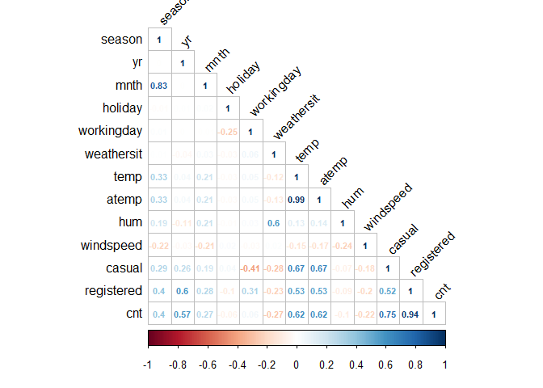
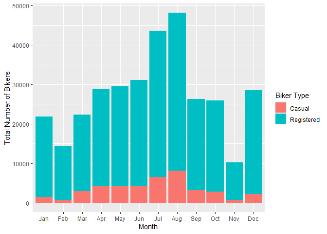
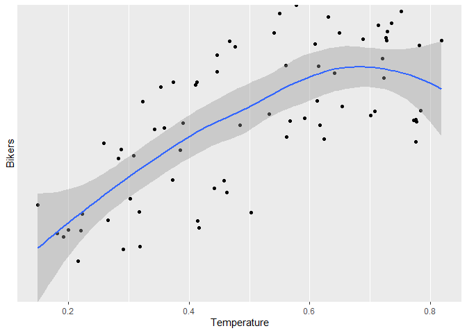

Bike Share Project
================
Soohee Jung, Kera Whitley

# Introduction

This dataset compiles the daily casual, registered and total (combined
casual and residual) bikers using this bike share. Looking at the
available variables in the dataset, there are several that are
attributes of the date, and the rest are attributes of the weather. We
will be looking at the temperature, season, and the year to predict the
total number of bikers using the bike share. The idea behind looking at
these particular variables being that, there are more people riding
bikes when the weather is nice. Year would come into play because the
longer the bike share is around, the more chances there are for people
to know about and use it.

Later, two multiple linear regression models, one random forest model
and one boosted models were fit. The variables specifically chosen were
season, temp, atemp, and yr. When exploring the data with different
plots and tables, it could be seen that the number of total bike share
users seemed to fluctuate with differences in these variables. The
correlation plot shows that theses variables have the highest either
positive or negative correlation with the total number of bikers, out of
the variables explored. The violin plots show firstly that there is a
definite difference in the number of total users by year, and that there
is a general trend with regard to season, but that month may not as good
of an indicator. The normalized temperature, the normalized temperature
feel both are fairly highly correlated to the total number of bikers.

# Data

``` r
# Read in dataset
day.data <- read_csv("day.csv")
```

    ## 
    ## -- Column specification ------------------------------------------------------------------------------------------------
    ## cols(
    ##   instant = col_double(),
    ##   dteday = col_date(format = ""),
    ##   season = col_double(),
    ##   yr = col_double(),
    ##   mnth = col_double(),
    ##   holiday = col_double(),
    ##   weekday = col_double(),
    ##   workingday = col_double(),
    ##   weathersit = col_double(),
    ##   temp = col_double(),
    ##   atemp = col_double(),
    ##   hum = col_double(),
    ##   windspeed = col_double(),
    ##   casual = col_double(),
    ##   registered = col_double(),
    ##   cnt = col_double()
    ## )

``` r
# Convert weekday column from numeric to character value
day.data$days[day.data$weekday==0] <- "Sunday"
day.data$days[day.data$weekday==1] <- "Monday"
day.data$days[day.data$weekday==2] <- "Tuesday"
day.data$days[day.data$weekday==3] <- "Wednesday"
day.data$days[day.data$weekday==4] <- "Thursday"
day.data$days[day.data$weekday==5] <- "Friday"
day.data$days[day.data$weekday==6] <- "Saturday"

# Get unique days
weekdays <- unique(day.data$days)

# Filter data to subset
day <- day.data %>% filter(days == params$Day)

# Converting variables that should be factors into factor variables
day$season <- factor(day$season)
levels(day$season) <- c("Winter","Spring", "Summer", "Fall")

day$yr <- factor(day$yr)
levels(day$yr) <- c("2011", "2012")

day$mnth <- factor(day$mnth)
levels(day$mnth) <- c("Jan", "Feb", "Mar", "Apr", "May", "Jun", "Jul", "Aug", "Sep", "Oct", "Nov", "Dec")

day$holiday <- factor(day$holiday)
levels(day$holiday) <- c("Not Holiday", "Holiday")

day$workingday <- factor(day$workingday)
levels(day$workingday) <- c("Not Working", "Working")

day$weathersit <- factor(day$weathersit)
levels(day$weathersit) <- c("Fair", "Misty", "Light Snow/Rain", "Heavy Rain/Ice/Snow")

set.seed(13)
# The training set should be 70% of the data
n <- nrow(day) * 0.7
train <- sample_n(day, n, replace = FALSE)
test <- anti_join(day, train, by = "dteday")
```

# Summarizations

produce some meaningful summary statistics and plots about the training
data we are working with. Explore the data a bit and then we are ready
to fit some models.

``` r
str(day.data)
```

    ## spec_tbl_df [731 x 17] (S3: spec_tbl_df/tbl_df/tbl/data.frame)
    ##  $ instant   : num [1:731] 1 2 3 4 5 6 7 8 9 10 ...
    ##  $ dteday    : Date[1:731], format: "2011-01-01" "2011-01-02" "2011-01-03" "2011-01-04" ...
    ##  $ season    : num [1:731] 1 1 1 1 1 1 1 1 1 1 ...
    ##  $ yr        : num [1:731] 0 0 0 0 0 0 0 0 0 0 ...
    ##  $ mnth      : num [1:731] 1 1 1 1 1 1 1 1 1 1 ...
    ##  $ holiday   : num [1:731] 0 0 0 0 0 0 0 0 0 0 ...
    ##  $ weekday   : num [1:731] 6 0 1 2 3 4 5 6 0 1 ...
    ##  $ workingday: num [1:731] 0 0 1 1 1 1 1 0 0 1 ...
    ##  $ weathersit: num [1:731] 2 2 1 1 1 1 2 2 1 1 ...
    ##  $ temp      : num [1:731] 0.344 0.363 0.196 0.2 0.227 ...
    ##  $ atemp     : num [1:731] 0.364 0.354 0.189 0.212 0.229 ...
    ##  $ hum       : num [1:731] 0.806 0.696 0.437 0.59 0.437 ...
    ##  $ windspeed : num [1:731] 0.16 0.249 0.248 0.16 0.187 ...
    ##  $ casual    : num [1:731] 331 131 120 108 82 88 148 68 54 41 ...
    ##  $ registered: num [1:731] 654 670 1229 1454 1518 ...
    ##  $ cnt       : num [1:731] 985 801 1349 1562 1600 ...
    ##  $ days      : chr [1:731] "Saturday" "Sunday" "Monday" "Tuesday" ...
    ##  - attr(*, "spec")=
    ##   .. cols(
    ##   ..   instant = col_double(),
    ##   ..   dteday = col_date(format = ""),
    ##   ..   season = col_double(),
    ##   ..   yr = col_double(),
    ##   ..   mnth = col_double(),
    ##   ..   holiday = col_double(),
    ##   ..   weekday = col_double(),
    ##   ..   workingday = col_double(),
    ##   ..   weathersit = col_double(),
    ##   ..   temp = col_double(),
    ##   ..   atemp = col_double(),
    ##   ..   hum = col_double(),
    ##   ..   windspeed = col_double(),
    ##   ..   casual = col_double(),
    ##   ..   registered = col_double(),
    ##   ..   cnt = col_double()
    ##   .. )

``` r
Correlation <- cor(select(day.data,-c(instant,dteday,weekday,days)), method="spearman")
corrplot(Correlation, method="number", type = 'lower', tl.col = 'black', 
         cl.ratio = 0.2, tl.srt = 45, number.cex = 0.7)
```

<!-- -->

``` r
# Numerical summaries
summary(train)
```

    ##     instant          dteday              season      yr          mnth           holiday      weekday        workingday
    ##  Min.   :  4.0   Min.   :2011-01-04   Winter:18   2011:30   Jan    : 8   Not Holiday:71   Min.   :2   Not Working: 1  
    ##  1st Qu.:212.2   1st Qu.:2011-07-31   Spring:19   2012:42   Aug    : 8   Holiday    : 1   1st Qu.:2   Working    :71  
    ##  Median :420.5   Median :2012-02-24   Summer:19             Jul    : 7                    Median :2                   
    ##  Mean   :387.4   Mean   :2012-01-22   Fall  :16             Dec    : 7                    Mean   :2                   
    ##  3rd Qu.:565.8   3rd Qu.:2012-07-18                         Feb    : 6                    3rd Qu.:2                   
    ##  Max.   :725.0   Max.   :2012-12-25                         Mar    : 6                    Max.   :2                   
    ##                                                             (Other):30                                                
    ##                weathersit      temp            atemp             hum           windspeed           casual      
    ##  Fair               :44   Min.   :0.1500   Min.   :0.1263   Min.   :0.2900   Min.   :0.05321   Min.   :   9.0  
    ##  Misty              :25   1st Qu.:0.3506   1st Qu.:0.3464   1st Qu.:0.5401   1st Qu.:0.13806   1st Qu.: 219.8  
    ##  Light Snow/Rain    : 3   Median :0.4933   Median :0.4830   Median :0.6485   Median :0.19061   Median : 542.5  
    ##  Heavy Rain/Ice/Snow: 0   Mean   :0.5040   Mean   :0.4828   Mean   :0.6367   Mean   :0.19641   Mean   : 572.0  
    ##                           3rd Qu.:0.6621   3rd Qu.:0.6160   3rd Qu.:0.7359   3rd Qu.:0.23632   3rd Qu.: 886.8  
    ##                           Max.   :0.8183   Max.   :0.7557   Max.   :0.9625   Max.   :0.38807   Max.   :1348.0  
    ##                                                                                                                
    ##    registered        cnt           days          
    ##  Min.   : 573   Min.   : 683   Length:72         
    ##  1st Qu.:2816   1st Qu.:2930   Class :character  
    ##  Median :4057   Median :4620   Mode  :character  
    ##  Mean   :4019   Mean   :4591                     
    ##  3rd Qu.:5358   3rd Qu.:6316                     
    ##  Max.   :6697   Max.   :7767                     
    ## 

``` r
train %>% select(casual, registered) %>% colSums()
```

    ##     casual registered 
    ##      41187     289373

``` r
table(train$season, train$weathersit)
```

    ##         
    ##          Fair Misty Light Snow/Rain Heavy Rain/Ice/Snow
    ##   Winter   12     6               0                   0
    ##   Spring   11     8               0                   0
    ##   Summer   16     3               0                   0
    ##   Fall      5     8               3                   0

``` r
table(train$workingday, train$weathersit)
```

    ##              
    ##               Fair Misty Light Snow/Rain Heavy Rain/Ice/Snow
    ##   Not Working    0     1               0                   0
    ##   Working       44    24               3                   0

``` r
# Total bikers grouped by year
train %>% group_by(yr) %>% summarize(Total.Bikers=sum(cnt))
```

    ## # A tibble: 2 x 2
    ##   yr    Total.Bikers
    ##   <fct>        <dbl>
    ## 1 2011         96140
    ## 2 2012        234420

``` r
# We can inspect the trend of users across years
ggplot(train, aes(x = yr, y = cnt)) + 
  geom_violin(fill = "dark grey", color = "dark red") + 
  geom_jitter(shape = 16) + 
  labs(x = "Year", y = "Number of Bikers") + 
  theme_minimal()
```

<!-- -->

``` r
# Total number of casual users, registered users and all bikers by month
train %>% group_by(mnth) %>% 
  summarize(Total.casual=sum(casual),Total.registered=sum(registered),
            Total.Bikers=sum(cnt))
```

    ## # A tibble: 12 x 4
    ##    mnth  Total.casual Total.registered Total.Bikers
    ##    <fct>        <dbl>            <dbl>        <dbl>
    ##  1 Jan           1455            20392        21847
    ##  2 Feb            717            13578        14295
    ##  3 Mar           2869            19466        22335
    ##  4 Apr           4098            24745        28843
    ##  5 May           4278            25209        29487
    ##  6 Jun           4253            26820        31073
    ##  7 Jul           6537            37138        43675
    ##  8 Aug           8132            40038        48170
    ##  9 Sep           3153            23089        26242
    ## 10 Oct           2793            23101        25894
    ## 11 Nov            699             9456        10155
    ## 12 Dec           2203            26341        28544

``` r
# We can inspect the trend of users across months using this plot.
# There may be a seasonal effect present.
ggplot(train, aes(x = mnth, y = cnt, fill = "red")) + 
  geom_col() + 
  geom_col(data = train, aes(x = mnth, y = casual, fill = "blue")) +
  labs(x = "Month", y = "Total Number of Bikers") +
  scale_fill_discrete(name = "Biker Type", labels = c("Casual", "Registered"))
```

<!-- -->

``` r
# Total number of casual, registered and all bikers by month within each season
train %>% group_by(season,mnth) %>% 
  summarize(Total.casual=sum(casual),Total.registered=sum(registered),
            Total.Bikers=sum(cnt))
```

    ## `summarise()` has grouped output by 'season'. You can override using the `.groups` argument.

    ## # A tibble: 16 x 5
    ## # Groups:   season [4]
    ##    season mnth  Total.casual Total.registered Total.Bikers
    ##    <fct>  <fct>        <dbl>            <dbl>        <dbl>
    ##  1 Winter Jan           1455            20392        21847
    ##  2 Winter Feb            717            13578        14295
    ##  3 Winter Mar           1561            10544        12105
    ##  4 Winter Dec            440              573         1013
    ##  5 Spring Mar           1308             8922        10230
    ##  6 Spring Apr           4098            24745        28843
    ##  7 Spring May           4278            25209        29487
    ##  8 Spring Jun           3176            20455        23631
    ##  9 Summer Jun           1077             6365         7442
    ## 10 Summer Jul           6537            37138        43675
    ## 11 Summer Aug           8132            40038        48170
    ## 12 Summer Sep           2308            16396        18704
    ## 13 Fall   Sep            845             6693         7538
    ## 14 Fall   Oct           2793            23101        25894
    ## 15 Fall   Nov            699             9456        10155
    ## 16 Fall   Dec           1763            25768        27531

``` r
# We can inspect the trend of all users across season using this plot.
# There may be weather or temperature effect present.
ggplot(train, aes(x = season, y = cnt)) + 
  geom_violin() +
  geom_jitter(shape = 16, size = 3, aes(color = mnth)) +
  labs(x = "Season", y = "Number of Bikers") +
  scale_color_manual(name = "Month", values = c("#a6cee3", "#1f78b4", "#b2df8a", "#33a02c", 
                                                "#fb9a99", "#e31a1c", "#fdbf6f", "#ff7f00", 
                                                "#cab2d6", "#6a3d9a", "#dfc27d", "#b15928")) +
  theme_minimal()
```

<!-- -->

``` r
# Total number of casual, registered and all bikers by weather
by.weather <- train %>% group_by(weathersit) %>% 
  summarize(Total.casual=sum(casual),Total.registered=sum(registered),
            Total.Bikers=sum(cnt))
by.weather
```

    ## # A tibble: 3 x 4
    ##   weathersit      Total.casual Total.registered Total.Bikers
    ##   <fct>                  <dbl>            <dbl>        <dbl>
    ## 1 Fair                   29262           194628       223890
    ## 2 Misty                  11415            86415        97830
    ## 3 Light Snow/Rain          510             8330         8840

``` r
# We can inspect the trend of all users across weather condition using this plot.
ggplot(by.weather, aes(x=weathersit, y=Total.Bikers))+geom_col(fill="cornflowerblue", width = 0.8)+
  scale_x_discrete(name="Weather")
```

<!-- -->

``` r
# We can inspect the trend of all users across temperature using this plot.
ggplot(train, aes(x=temp, y=cnt)) + geom_point() + geom_smooth()+
  scale_x_continuous(name="Temperature")+scale_y_discrete(name="Bikers")
```

    ## `geom_smooth()` using method = 'loess' and formula 'y ~ x'

<!-- -->

``` r
# We can inspect the trend of all users across feeling temperature using this plot.
ggplot(train, aes(x=atemp, y=cnt)) + geom_point() + geom_smooth()+
  scale_x_continuous(name="Feeling Temperature")+scale_y_discrete(name="Bikers")
```

    ## `geom_smooth()` using method = 'loess' and formula 'y ~ x'

<!-- -->

``` r
# Total number of casual, registered and all bikers by holiday or not
by.holi <- train %>% group_by(holiday) %>% 
  summarize(Total.casual=sum(casual),Total.registered=sum(registered),
            Total.Bikers=sum(cnt))
by.holi
```

    ## # A tibble: 2 x 4
    ##   holiday     Total.casual Total.registered Total.Bikers
    ##   <fct>              <dbl>            <dbl>        <dbl>
    ## 1 Not Holiday        40747           288800       329547
    ## 2 Holiday              440              573         1013

``` r
# We can inspect the trend of all users across whether holiday or not using this plot.
ggplot(by.holi, aes(x=holiday, y=Total.Bikers)) + geom_col(fill="darkgoldenrod1", width = 0.7)+
  scale_x_discrete(name="Holiday")
```

<!-- -->

``` r
# We can inspect the trend of casual users across whether holiday or not using this plot.
ggplot(train, aes(x=holiday, y=casual))+geom_boxplot(fill="darkmagenta")+
  scale_x_discrete(name="Holiday")+scale_y_continuous(name="Casual Users")
```

<!-- -->

``` r
# We can inspect the trend of registered users across whether holiday or not using this plot.
ggplot(train, aes(x=holiday, y=registered))+geom_boxplot(fill="darkorchid")+
  scale_x_discrete(name="Holiday")+scale_y_continuous(name="Registered Users")
```

<!-- -->

# Modeling

## Linear Regression Model

*Linear regression* tries to find a linear equation which describe the
relationship between a response variable and a explanation variable. The
best model fit is made by minimizing the sum of squared residuals.
Simple linear regression model can be extended in many ways and we call
them *Multiple Linear Regression*.

``` r
set.seed(13)
# multiple linear regression model 1
lmFit <- train(cnt ~ season + temp + atemp, data=train, method="lm",
               trControl=trainControl(method="cv",number=10))
summary(lmFit)
```

    ## 
    ## Call:
    ## lm(formula = .outcome ~ ., data = dat)
    ## 
    ## Residuals:
    ##      Min       1Q   Median       3Q      Max 
    ## -2873.23  -878.23   -16.76  1095.16  2246.44 
    ## 
    ## Coefficients:
    ##              Estimate Std. Error t value Pr(>|t|)
    ## (Intercept)     494.9      724.3   0.683    0.497
    ## seasonSpring    586.0      655.8   0.894    0.375
    ## seasonSummer   1190.7      888.9   1.339    0.185
    ## seasonFall      617.8      578.8   1.067    0.290
    ## temp         -13546.7    12538.9  -1.080    0.284
    ## atemp         21370.8    13830.4   1.545    0.127
    ## 
    ## Residual standard error: 1437 on 66 degrees of freedom
    ## Multiple R-squared:  0.5071, Adjusted R-squared:  0.4698 
    ## F-statistic: 13.58 on 5 and 66 DF,  p-value: 4.116e-09

``` r
lmPred <- predict(lmFit, newdata=test)

# multiple linear regression model 2
set.seed(13)
mlrFit <- train(cnt ~ season + temp + yr, data = train, method = "lm", 
               trControl = trainControl(method = "cv", number = 10))
summary(mlrFit)
```

    ## 
    ## Call:
    ## lm(formula = .outcome ~ ., data = dat)
    ## 
    ## Residuals:
    ##     Min      1Q  Median      3Q     Max 
    ## -3811.1  -523.6   322.7   534.3  1566.4 
    ## 
    ## Coefficients:
    ##              Estimate Std. Error t value Pr(>|t|)    
    ## (Intercept)     268.0      433.1   0.619 0.538142    
    ## seasonSpring    861.8      461.7   1.866 0.066424 .  
    ## seasonSummer   1222.6      621.9   1.966 0.053539 .  
    ## seasonFall     1095.0      398.9   2.745 0.007788 ** 
    ## temp           4592.2     1222.3   3.757 0.000366 ***
    ## yr2012         2082.9      245.3   8.492 3.49e-12 ***
    ## ---
    ## Signif. codes:  0 '***' 0.001 '**' 0.01 '*' 0.05 '.' 0.1 ' ' 1
    ## 
    ## Residual standard error: 1011 on 66 degrees of freedom
    ## Multiple R-squared:  0.756,  Adjusted R-squared:  0.7375 
    ## F-statistic: 40.89 on 5 and 66 DF,  p-value: < 2.2e-16

``` r
mlrPred <- predict(mlrFit, newdata = test)
```

## Random Forest Model

*Random forest model* is one of 3 major methods of *Ensemble tree
model*. It is flexible and one big advantage of the random forest model
is that it can be used for both classification and regression models. It
creates multiple trees from a random subset of predictors for each
bootstrap sample and then train the trees. The final prediction is
average of these predictions.

``` r
set.seed(13)
# Get random forest model fit
rfFit <- train(cnt ~ season + temp + atemp + yr, data=train,
               method="rf", 
               trControl=trainControl(method="cv",number=10))
rfFit
```

    ## Random Forest 
    ## 
    ## 72 samples
    ##  4 predictor
    ## 
    ## No pre-processing
    ## Resampling: Cross-Validated (10 fold) 
    ## Summary of sample sizes: 66, 66, 65, 64, 65, 65, ... 
    ## Resampling results across tuning parameters:
    ## 
    ##   mtry  RMSE      Rsquared   MAE     
    ##   2     1090.019  0.7434751  845.5838
    ##   4     1096.455  0.7571734  824.2573
    ##   6     1085.133  0.7637137  824.2773
    ## 
    ## RMSE was used to select the optimal model using the smallest value.
    ## The final value used for the model was mtry = 6.

``` r
rfPred <- predict(rfFit, newdata=test)
```

## Boosted Tree Model

The *boosted tree model* is a type of *ensemble tree model*. The way the
boosted tree works is that the trees are fit sequentially. Once the
first tree has been fit, the residuals from that tree are recorded. They
are then used as the new response and a new tree is fit. The residuals
from this next tree are then used as the new response. this process
repeats a number of times, with 5000 not being unreasonable.

``` r
set.seed(13)

boostFit <- train(cnt ~ season + temp + yr, data = train, method = "gbm", verbose = FALSE,
                  preProcess = c("center", "scale"),
                  trControl = trainControl(method = "cv", number = 10))
boostFit
```

    ## Stochastic Gradient Boosting 
    ## 
    ## 72 samples
    ##  3 predictor
    ## 
    ## Pre-processing: centered (5), scaled (5) 
    ## Resampling: Cross-Validated (10 fold) 
    ## Summary of sample sizes: 66, 66, 65, 64, 65, 65, ... 
    ## Resampling results across tuning parameters:
    ## 
    ##   interaction.depth  n.trees  RMSE      Rsquared   MAE     
    ##   1                   50      1033.014  0.7503548  821.9645
    ##   1                  100      1029.988  0.7540235  807.9942
    ##   1                  150      1060.400  0.7435543  836.0461
    ##   2                   50      1023.722  0.7558004  815.3216
    ##   2                  100      1048.882  0.7537129  824.9938
    ##   2                  150      1078.651  0.7470027  849.5367
    ##   3                   50      1032.460  0.7545551  814.2399
    ##   3                  100      1042.153  0.7496465  822.1714
    ##   3                  150      1069.277  0.7401354  837.8598
    ## 
    ## Tuning parameter 'shrinkage' was held constant at a value of 0.1
    ## Tuning parameter 'n.minobsinnode' was held constant
    ##  at a value of 10
    ## RMSE was used to select the optimal model using the smallest value.
    ## The final values used for the model were n.trees = 50, interaction.depth = 2, shrinkage = 0.1 and n.minobsinnode = 10.

``` r
boostPred <- predict(boostFit, newdata = test)
```

# Comparison

``` r
set.seed(13)
# multiple linear regression model 1
multiRMSE <- postResample(lmPred, test$cnt)

# multiple linear regression model 2
mlrRMSE <- postResample(mlrPred, test$cnt)

# random forest model
rfRMSE <- postResample(rfPred, test$cnt)

# boosted tree model
boostRMSE <- postResample(boostPred, test$cnt)

# compare
lowestRMSE <- c(MultipleLR1=multiRMSE[1],MultipleLR2=mlrRMSE[1],RandomForest=rfRMSE[1],Boosting=boostRMSE[1])
lowestRMSE
```

    ##  MultipleLR1.RMSE  MultipleLR2.RMSE RandomForest.RMSE     Boosting.RMSE 
    ##         1381.7899          787.0478          965.6550          829.5309

The preferred model has the lowest RMSE. The model that has the lowest
RMSE for Tuesday is MultipleLR2.RMSE.
