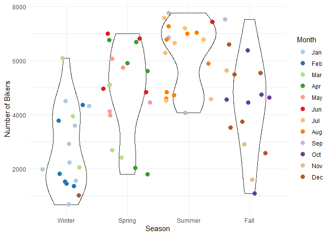
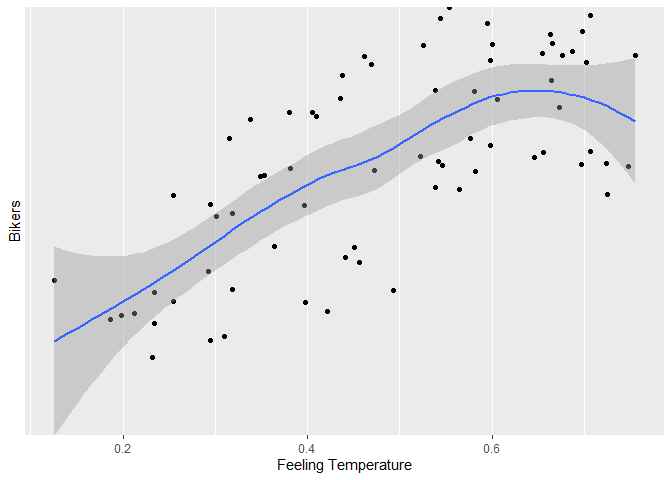

Bike Share Project
================
Soohee Jung, Kera Whitley

# Set up

Libraries and other set up should be in this chunk

``` r
library(tidyverse)
library(caret)
library(gbm)
library(shiny)
```

# Introduction

This dataset compiles the daily casual, registered and total (combined
casual and residual) bikers using this bike share. Looking at the
available variables in the dataset, there are several that are
attributes of the date, and the rest are attributes of the weather. We
will specifically be looking at the temperature, season, year and the
weather to predict the total number of bikers using the bike share.

\[Explain the variables\]

# Data

``` r
# Read in dataset
day.data <- read_csv("day.csv")
```

    ## 
    ## -- Column specification -------------------------------------------------------------------------------------------------------------------
    ## cols(
    ##   instant = col_double(),
    ##   dteday = col_date(format = ""),
    ##   season = col_double(),
    ##   yr = col_double(),
    ##   mnth = col_double(),
    ##   holiday = col_double(),
    ##   weekday = col_double(),
    ##   workingday = col_double(),
    ##   weathersit = col_double(),
    ##   temp = col_double(),
    ##   atemp = col_double(),
    ##   hum = col_double(),
    ##   windspeed = col_double(),
    ##   casual = col_double(),
    ##   registered = col_double(),
    ##   cnt = col_double()
    ## )

``` r
# Convert weekday column from numeric to character value
day.data$days[day.data$weekday==0] <- "Sunday"
day.data$days[day.data$weekday==1] <- "Monday"
day.data$days[day.data$weekday==2] <- "Tuesday"
day.data$days[day.data$weekday==3] <- "Wednesday"
day.data$days[day.data$weekday==4] <- "Thursday"
day.data$days[day.data$weekday==5] <- "Friday"
day.data$days[day.data$weekday==6] <- "Saturday"

# Get unique days
weekdays <- unique(day.data$days)

day <- day.data %>% filter(days == params$Day)

# Converting variables that should be factors into factor variables
day$season <- factor(day$season)
levels(day$season) <- c("Winter","Spring", "Summer", "Fall")

day$yr <- factor(day$yr)
levels(day$yr) <- c("2011", "2012")

day$mnth <- factor(day$mnth)
levels(day$mnth) <- c("Jan", "Feb", "Mar", "Apr", "May", "Jun", "Jul", "Aug", "Sep", "Oct", "Nov", "Dec")

day$holiday <- factor(day$holiday)
levels(day$holiday) <- c("Not Holiday", "Holiday")

day$workingday <- factor(day$workingday)
levels(day$workingday) <- c("Not Working", "Working")

day$weathersit <- factor(day$weathersit)
levels(day$weathersit) <- c("Fair", "Misty", "Light Snow/Rain", "Heavy Rain/Ice/Snow")

set.seed(13)
# The training set should be 70% of the data
n <- nrow(day) * 0.7
train <- sample_n(day, n, replace = FALSE)
test <- anti_join(day, train, by = "dteday")
```

# Summarizations

``` r
# Numerical summaries
summary(train)
```

    ##     instant          dteday              season      yr          mnth           holiday      weekday        workingday
    ##  Min.   :  4.0   Min.   :2011-01-04   Winter:18   2011:30   Jan    : 8   Not Holiday:71   Min.   :2   Not Working: 1  
    ##  1st Qu.:212.2   1st Qu.:2011-07-31   Spring:19   2012:42   Aug    : 8   Holiday    : 1   1st Qu.:2   Working    :71  
    ##  Median :420.5   Median :2012-02-24   Summer:19             Jul    : 7                    Median :2                   
    ##  Mean   :387.4   Mean   :2012-01-22   Fall  :16             Dec    : 7                    Mean   :2                   
    ##  3rd Qu.:565.8   3rd Qu.:2012-07-18                         Feb    : 6                    3rd Qu.:2                   
    ##  Max.   :725.0   Max.   :2012-12-25                         Mar    : 6                    Max.   :2                   
    ##                                                             (Other):30                                                
    ##                weathersit      temp            atemp             hum           windspeed           casual         registered  
    ##  Fair               :44   Min.   :0.1500   Min.   :0.1263   Min.   :0.2900   Min.   :0.05321   Min.   :   9.0   Min.   : 573  
    ##  Misty              :25   1st Qu.:0.3506   1st Qu.:0.3464   1st Qu.:0.5401   1st Qu.:0.13806   1st Qu.: 219.8   1st Qu.:2816  
    ##  Light Snow/Rain    : 3   Median :0.4933   Median :0.4830   Median :0.6485   Median :0.19061   Median : 542.5   Median :4057  
    ##  Heavy Rain/Ice/Snow: 0   Mean   :0.5040   Mean   :0.4828   Mean   :0.6367   Mean   :0.19641   Mean   : 572.0   Mean   :4019  
    ##                           3rd Qu.:0.6621   3rd Qu.:0.6160   3rd Qu.:0.7359   3rd Qu.:0.23632   3rd Qu.: 886.8   3rd Qu.:5358  
    ##                           Max.   :0.8183   Max.   :0.7557   Max.   :0.9625   Max.   :0.38807   Max.   :1348.0   Max.   :6697  
    ##                                                                                                                               
    ##       cnt           days          
    ##  Min.   : 683   Length:72         
    ##  1st Qu.:2930   Class :character  
    ##  Median :4620   Mode  :character  
    ##  Mean   :4591                     
    ##  3rd Qu.:6316                     
    ##  Max.   :7767                     
    ## 

``` r
train %>% select(casual, registered) %>% colSums()
```

    ##     casual registered 
    ##      41187     289373

``` r
table(train$season, train$weathersit)
```

    ##         
    ##          Fair Misty Light Snow/Rain Heavy Rain/Ice/Snow
    ##   Winter   12     6               0                   0
    ##   Spring   11     8               0                   0
    ##   Summer   16     3               0                   0
    ##   Fall      5     8               3                   0

``` r
table(train$workingday, train$weathersit)
```

    ##              
    ##               Fair Misty Light Snow/Rain Heavy Rain/Ice/Snow
    ##   Not Working    0     1               0                   0
    ##   Working       44    24               3                   0

``` r
train %>% group_by(yr) %>% summarize(Total.Bikers=sum(cnt))
```

    ## # A tibble: 2 x 2
    ##   yr    Total.Bikers
    ##   <fct>        <dbl>
    ## 1 2011         96140
    ## 2 2012        234420

``` r
# We can inspect the trend of users across years
ggplot(train, aes(x = yr, y = cnt)) + 
  geom_violin(fill = "dark grey", color = "dark red") + 
  geom_jitter(shape = 16) + 
  labs(x = "Year", y = "Number of Bikers") + 
  theme_minimal()
```

<!-- -->

``` r
train %>% group_by(mnth) %>% 
  summarize(Total.casual=sum(casual),Total.registered=sum(registered),
            Total.Bikers=sum(cnt))
```

    ## # A tibble: 12 x 4
    ##    mnth  Total.casual Total.registered Total.Bikers
    ##    <fct>        <dbl>            <dbl>        <dbl>
    ##  1 Jan           1455            20392        21847
    ##  2 Feb            717            13578        14295
    ##  3 Mar           2869            19466        22335
    ##  4 Apr           4098            24745        28843
    ##  5 May           4278            25209        29487
    ##  6 Jun           4253            26820        31073
    ##  7 Jul           6537            37138        43675
    ##  8 Aug           8132            40038        48170
    ##  9 Sep           3153            23089        26242
    ## 10 Oct           2793            23101        25894
    ## 11 Nov            699             9456        10155
    ## 12 Dec           2203            26341        28544

``` r
# We can inspect the trend of users across months using this plot.
# There may be a seasonal effect present.
ggplot(train, aes(x = mnth, y = cnt, fill = "red")) + 
  geom_col() + 
  geom_col(data = train, aes(x = mnth, y = casual, fill = "blue")) +
  labs(x = "Month", y = "Total Number of Bikers") +
  scale_fill_discrete(name = "Biker Type", labels = c("Casual", "Registered"))
```

<!-- -->

``` r
train %>% group_by(season,mnth) %>% 
  summarize(Total.casual=sum(casual),Total.registered=sum(registered),
            Total.Bikers=sum(cnt))
```

    ## `summarise()` has grouped output by 'season'. You can override using the `.groups` argument.

    ## # A tibble: 16 x 5
    ## # Groups:   season [4]
    ##    season mnth  Total.casual Total.registered Total.Bikers
    ##    <fct>  <fct>        <dbl>            <dbl>        <dbl>
    ##  1 Winter Jan           1455            20392        21847
    ##  2 Winter Feb            717            13578        14295
    ##  3 Winter Mar           1561            10544        12105
    ##  4 Winter Dec            440              573         1013
    ##  5 Spring Mar           1308             8922        10230
    ##  6 Spring Apr           4098            24745        28843
    ##  7 Spring May           4278            25209        29487
    ##  8 Spring Jun           3176            20455        23631
    ##  9 Summer Jun           1077             6365         7442
    ## 10 Summer Jul           6537            37138        43675
    ## 11 Summer Aug           8132            40038        48170
    ## 12 Summer Sep           2308            16396        18704
    ## 13 Fall   Sep            845             6693         7538
    ## 14 Fall   Oct           2793            23101        25894
    ## 15 Fall   Nov            699             9456        10155
    ## 16 Fall   Dec           1763            25768        27531

``` r
# We can inspect the trend of all users across season using this plot.
# There may be weather or temperature effect present.
ggplot(train, aes(x = season, y = cnt)) + 
  geom_violin() +
  geom_jitter(shape = 16, size = 3, aes(color = mnth)) +
  labs(x = "Season", y = "Number of Bikers") +
  scale_color_manual(name = "Month", values = c("#a6cee3", "#1f78b4", "#b2df8a", "#33a02c", 
                                                "#fb9a99", "#e31a1c", "#fdbf6f", "#ff7f00", 
                                                "#cab2d6", "#6a3d9a", "#dfc27d", "#b15928")) +
  theme_minimal()
```

<!-- -->

``` r
by.weather <- train %>% group_by(weathersit) %>% 
  summarize(Total.casual=sum(casual),Total.registered=sum(registered),
            Total.Bikers=sum(cnt))
by.weather
```

    ## # A tibble: 3 x 4
    ##   weathersit      Total.casual Total.registered Total.Bikers
    ##   <fct>                  <dbl>            <dbl>        <dbl>
    ## 1 Fair                   29262           194628       223890
    ## 2 Misty                  11415            86415        97830
    ## 3 Light Snow/Rain          510             8330         8840

``` r
# We can inspect the trend of all users across weather condition using this plot.
ggplot(by.weather, aes(x=weathersit, y=Total.Bikers))+geom_col(fill="cornflowerblue", width = 0.8)+
  scale_x_discrete(name="Weather")
```

<!-- -->

``` r
# We can inspect the trend of all users across temperature using this plot.
ggplot(train, aes(x=temp, y=cnt)) + geom_point() + geom_smooth()+
  scale_x_continuous(name="Temperature")+scale_y_discrete(name="Bikers")
```

    ## `geom_smooth()` using method = 'loess' and formula 'y ~ x'

<!-- -->

``` r
by.holi <- train %>% group_by(holiday) %>% 
  summarize(Total.casual=sum(casual),Total.registered=sum(registered),
            Total.Bikers=sum(cnt))
by.holi
```

    ## # A tibble: 2 x 4
    ##   holiday     Total.casual Total.registered Total.Bikers
    ##   <fct>              <dbl>            <dbl>        <dbl>
    ## 1 Not Holiday        40747           288800       329547
    ## 2 Holiday              440              573         1013

``` r
# We can inspect the trend of all users across whether holiday or not using this plot.
ggplot(by.holi, aes(x=holiday, y=Total.Bikers)) + geom_col(fill="darkgoldenrod1", width = 0.7)+
  scale_x_discrete(name="Holiday")
```

<!-- -->

``` r
# We can inspect the trend of casual users across whether holiday or not using this plot.
ggplot(train, aes(x=holiday, y=casual))+geom_boxplot(fill="darkmagenta")+
  scale_x_discrete(name="Holiday")+scale_y_continuous(name="Casual Users")
```

<!-- -->

``` r
# We can inspect the trend of registered users across whether holiday or not using this plot.
ggplot(train, aes(x=holiday, y=registered))+geom_boxplot(fill="darkorchid")+
  scale_x_discrete(name="Holiday")+scale_y_continuous(name="Registered Users")
```

<!-- -->

# Modeling

## Linear Regression Model

*Linear regression* tries to find a linear equation which describe the
relationship between a response variable and a explanation variable. The
best model fit is made by minimizing the sum of squared residuals.
Simple linear regression model can be extended in many ways and we call
them *Multiple Linear Regression*.

``` r
set.seed(13)
# multiple linear regression model 1
lmFit <- train(cnt ~ season + temp + I(temp^2), data=train, method="lm",
               trControl=trainControl(method="cv",number=10))
summary(lmFit)
```

    ## 
    ## Call:
    ## lm(formula = .outcome ~ ., data = dat)
    ## 
    ## Residuals:
    ##      Min       1Q   Median       3Q      Max 
    ## -2963.78  -994.19    85.96  1029.59  2375.03 
    ## 
    ## Coefficients:
    ##                Estimate Std. Error t value Pr(>|t|)    
    ## (Intercept)   -2590.333   1385.449  -1.870 0.065966 .  
    ## seasonSpring     33.612    659.267   0.051 0.959492    
    ## seasonSummer   1108.496    845.661   1.311 0.194467    
    ## seasonFall       -4.481    607.621  -0.007 0.994139    
    ## temp          24859.097   6730.700   3.693 0.000451 ***
    ## `I(temp^2)`  -19552.785   6638.910  -2.945 0.004454 ** 
    ## ---
    ## Signif. codes:  0 '***' 0.001 '**' 0.01 '*' 0.05 '.' 0.1 ' ' 1
    ## 
    ## Residual standard error: 1376 on 66 degrees of freedom
    ## Multiple R-squared:  0.5486, Adjusted R-squared:  0.5144 
    ## F-statistic: 16.04 on 5 and 66 DF,  p-value: 2.527e-10

``` r
lmPred <- predict(lmFit, newdata=test)

# multiple linear regression model 2
set.seed(13)
mlrFit <- train(cnt ~ season + temp + yr, data = train, method = "lm", 
               trControl = trainControl(method = "cv", number = 10))
summary(mlrFit)
```

    ## 
    ## Call:
    ## lm(formula = .outcome ~ ., data = dat)
    ## 
    ## Residuals:
    ##     Min      1Q  Median      3Q     Max 
    ## -3811.1  -523.6   322.7   534.3  1566.4 
    ## 
    ## Coefficients:
    ##              Estimate Std. Error t value Pr(>|t|)    
    ## (Intercept)     268.0      433.1   0.619 0.538142    
    ## seasonSpring    861.8      461.7   1.866 0.066424 .  
    ## seasonSummer   1222.6      621.9   1.966 0.053539 .  
    ## seasonFall     1095.0      398.9   2.745 0.007788 ** 
    ## temp           4592.2     1222.3   3.757 0.000366 ***
    ## yr2012         2082.9      245.3   8.492 3.49e-12 ***
    ## ---
    ## Signif. codes:  0 '***' 0.001 '**' 0.01 '*' 0.05 '.' 0.1 ' ' 1
    ## 
    ## Residual standard error: 1011 on 66 degrees of freedom
    ## Multiple R-squared:  0.756,  Adjusted R-squared:  0.7375 
    ## F-statistic: 40.89 on 5 and 66 DF,  p-value: < 2.2e-16

``` r
mlrPred <- predict(mlrFit, newdata = test)
```

## Random Forest Model

*Random forest model* is one of 3 major methods of *Ensemble tree
model*. Create a tree from a random subset of predictors for a bootstrap
sample and then train the tree. Repeat this for many times, say 100 or
1000 repeats. The final prediction is average of these predictions.

``` r
set.seed(13)
# Get random forest model fit
rfFit <- train(cnt ~ season + temp + weathersit, data=train,
               method="rf", 
               trControl=trainControl(method="cv",number=10))
rfFit
```

    ## Random Forest 
    ## 
    ## 72 samples
    ##  3 predictor
    ## 
    ## No pre-processing
    ## Resampling: Cross-Validated (10 fold) 
    ## Summary of sample sizes: 66, 66, 65, 64, 65, 65, ... 
    ## Resampling results across tuning parameters:
    ## 
    ##   mtry  RMSE      Rsquared   MAE     
    ##   2     1367.266  0.5610586  1195.971
    ##   4     1359.990  0.5390040  1152.087
    ##   7     1403.857  0.5133676  1178.916
    ## 
    ## RMSE was used to select the optimal model using the smallest value.
    ## The final value used for the model was mtry = 4.

``` r
rfPred <- predict(rfFit, newdata=test)
```

## Boosted Tree Model

The *boosted tree model* is a type of *ensemble tree model*. The way the
boosted tree works is that the trees are fit sequentially. Each new tree
is fit on on a modified version of the original data and the predictions
are updated as the trees are grown.

``` r
library(gbm)
set.seed(13)

boostFit <- gbm(cnt ~ season + temp + yr + weathersit, data = train, distribution = "gaussian", n.trees = 5000, 
                shrinkage = 0.1, interaction.depth = 4)
boostFit
```

    ## gbm(formula = cnt ~ season + temp + yr + weathersit, distribution = "gaussian", 
    ##     data = train, n.trees = 5000, interaction.depth = 4, shrinkage = 0.1)
    ## A gradient boosted model with gaussian loss function.
    ## 5000 iterations were performed.
    ## There were 4 predictors of which 4 had non-zero influence.

``` r
boostPred <- predict(boostFit, newdata = test, n.trees = 5000)
boostPred
```

    ##  [1] 1221.5679 1756.6507 1734.3135 2051.5379 4598.6645 4400.8721 3911.5163 4529.0354 5719.0473 4631.5298 4631.5298 4631.5298 6033.9717
    ## [14] 3803.5369 4692.6440 4617.5358 5842.9908 4080.1713 3355.4059 3276.6705 4672.7064 1818.5068 5281.8896  626.1017 6241.6387 5048.6145
    ## [27] 5525.7887 7471.8013 8563.8690 4950.8039 4175.8007 2550.1544

# Comparison

``` r
set.seed(13)
# multiple linear regression model 1
multiRMSE <- postResample(lmPred, test$cnt)
multiRMSE
```

    ##         RMSE     Rsquared          MAE 
    ## 1493.9099902    0.2118677 1196.8311467

``` r
# multiple linear regression model 2
mlrRMSE <- postResample(mlrPred, test$cnt)
mlrRMSE
```

    ##        RMSE    Rsquared         MAE 
    ## 787.0478162   0.7298493 649.7310252

``` r
# random forest model
rfRMSE <- postResample(rfPred, test$cnt)
rfRMSE
```

    ##         RMSE     Rsquared          MAE 
    ## 1419.6134302    0.3493314 1223.4492541

``` r
# boosted tree model
boostRMSE <- postResample(boostPred, test$cnt)
boostRMSE
```

    ##        RMSE    Rsquared         MAE 
    ## 925.3309943   0.7176932 671.5618266

``` r
# compare
lowestRMSE <- c(MultipleLR1=multiRMSE[1],MultipleLR2=mlrRMSE[1],RandomForest=rfRMSE[1],Boosting=boostRMSE[1])
lowestRMSE
```

    ##  MultipleLR1.RMSE  MultipleLR2.RMSE RandomForest.RMSE     Boosting.RMSE 
    ##         1493.9100          787.0478         1419.6134          925.3310

The preferred model has the lowest RMSE. The model that has the lowest
RMSE for \[day\] is 2, and has the model \[equation\].
