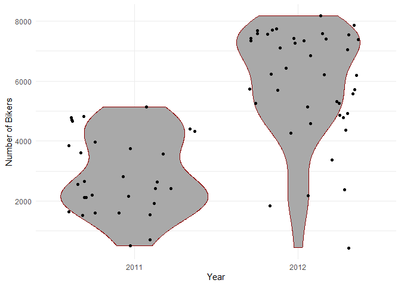
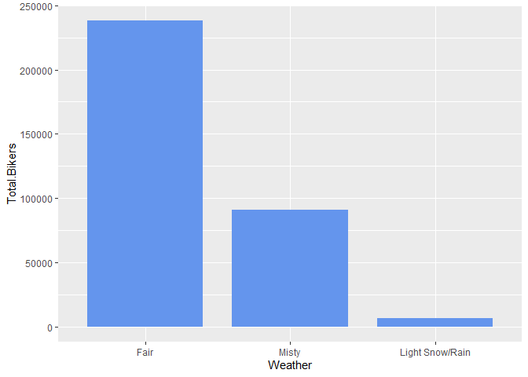
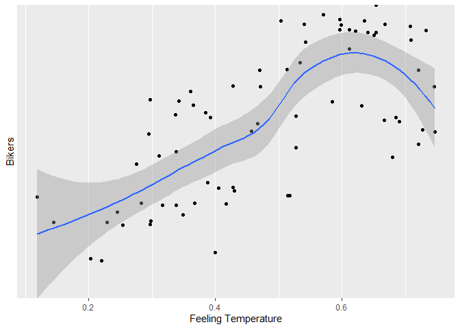
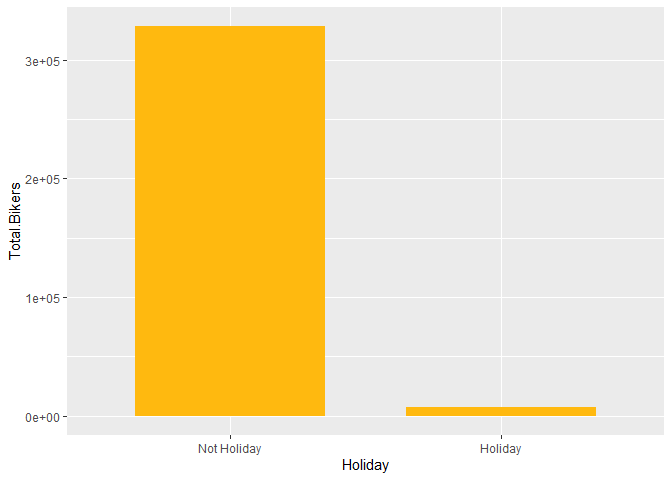

Bike Share Project
================
Soohee Jung, Kera Whitley

# Set up

Libraries and other set up should be in this chunk

``` r
library(tidyverse)
library(caret)
library(gbm)
library(shiny)
```

# Introduction

This dataset compiles the daily casual, registered and total (combined
casual and residual) bikers using this bike share. Looking at the
available variables in the dataset, there are several that are
attributes of the date, and the rest are attributes of the weather. We
will specifically be looking at the temperature, season, year and the
weather to predict the total number of bikers using the bike share.

\[Explain the variables\]

# Data

``` r
# Read in dataset
day.data <- read_csv("day.csv")
```

    ## 
    ## -- Column specification -------------------------------------------------------------------------------------------------------------------
    ## cols(
    ##   instant = col_double(),
    ##   dteday = col_date(format = ""),
    ##   season = col_double(),
    ##   yr = col_double(),
    ##   mnth = col_double(),
    ##   holiday = col_double(),
    ##   weekday = col_double(),
    ##   workingday = col_double(),
    ##   weathersit = col_double(),
    ##   temp = col_double(),
    ##   atemp = col_double(),
    ##   hum = col_double(),
    ##   windspeed = col_double(),
    ##   casual = col_double(),
    ##   registered = col_double(),
    ##   cnt = col_double()
    ## )

``` r
# Convert weekday column from numeric to character value
day.data$days[day.data$weekday==0] <- "Sunday"
day.data$days[day.data$weekday==1] <- "Monday"
day.data$days[day.data$weekday==2] <- "Tuesday"
day.data$days[day.data$weekday==3] <- "Wednesday"
day.data$days[day.data$weekday==4] <- "Thursday"
day.data$days[day.data$weekday==5] <- "Friday"
day.data$days[day.data$weekday==6] <- "Saturday"

# Get unique days
weekdays <- unique(day.data$days)

day <- day.data %>% filter(days == params$Day)

# Converting variables that should be factors into factor variables
day$season <- factor(day$season)
levels(day$season) <- c("Winter","Spring", "Summer", "Fall")

day$yr <- factor(day$yr)
levels(day$yr) <- c("2011", "2012")

day$mnth <- factor(day$mnth)
levels(day$mnth) <- c("Jan", "Feb", "Mar", "Apr", "May", "Jun", "Jul", "Aug", "Sep", "Oct", "Nov", "Dec")

day$holiday <- factor(day$holiday)
levels(day$holiday) <- c("Not Holiday", "Holiday")

day$workingday <- factor(day$workingday)
levels(day$workingday) <- c("Not Working", "Working")

day$weathersit <- factor(day$weathersit)
levels(day$weathersit) <- c("Fair", "Misty", "Light Snow/Rain", "Heavy Rain/Ice/Snow")

set.seed(13)
# The training set should be 70% of the data
n <- nrow(day) * 0.7
train <- sample_n(day, n, replace = FALSE)
test <- anti_join(day, train, by = "dteday")
```

# Summarizations

``` r
# Numerical summaries
summary(train)
```

    ##     instant          dteday              season      yr          mnth           holiday      weekday        workingday
    ##  Min.   :  5.0   Min.   :2011-01-05   Winter:18   2011:30   Aug    : 9   Not Holiday:71   Min.   :3   Not Working: 1  
    ##  1st Qu.:213.2   1st Qu.:2011-08-01   Spring:20   2012:42   Jan    : 7   Holiday    : 1   1st Qu.:3   Working    :71  
    ##  Median :421.5   Median :2012-02-25   Summer:19             Feb    : 7                    Median :3                   
    ##  Mean   :388.4   Mean   :2012-01-23   Fall  :15             Dec    : 7                    Mean   :3                   
    ##  3rd Qu.:566.8   3rd Qu.:2012-07-19                         Mar    : 6                    3rd Qu.:3                   
    ##  Max.   :726.0   Max.   :2012-12-26                         Apr    : 6                    Max.   :3                   
    ##                                                             (Other):30                                                
    ##                weathersit      temp            atemp             hum           windspeed           casual         registered  
    ##  Fair               :42   Min.   :0.1075   Min.   :0.1193   Min.   :0.3600   Min.   :0.06096   Min.   :   9.0   Min.   : 432  
    ##  Misty              :25   1st Qu.:0.3463   1st Qu.:0.3412   1st Qu.:0.5308   1st Qu.:0.13542   1st Qu.: 207.5   1st Qu.:2352  
    ##  Light Snow/Rain    : 5   Median :0.4992   Median :0.4870   Median :0.6281   Median :0.18440   Median : 497.5   Median :4224  
    ##  Heavy Rain/Ice/Snow: 0   Mean   :0.5040   Mean   :0.4820   Mean   :0.6338   Mean   :0.19410   Mean   : 575.8   Mean   :4084  
    ##                           3rd Qu.:0.6762   3rd Qu.:0.6320   3rd Qu.:0.7414   3rd Qu.:0.24877   3rd Qu.: 842.0   3rd Qu.:5663  
    ##                           Max.   :0.7933   Max.   :0.7469   Max.   :0.9704   Max.   :0.41543   Max.   :2562.0   Max.   :6946  
    ##                                                                                                                               
    ##       cnt           days          
    ##  Min.   : 441   Length:72         
    ##  1st Qu.:2530   Class :character  
    ##  Median :4776   Mode  :character  
    ##  Mean   :4659                     
    ##  3rd Qu.:6905                     
    ##  Max.   :8173                     
    ## 

``` r
train %>% select(casual, registered) %>% colSums()
```

    ##     casual registered 
    ##      41456     294027

``` r
table(train$season, train$weathersit)
```

    ##         
    ##          Fair Misty Light Snow/Rain Heavy Rain/Ice/Snow
    ##   Winter    8     8               2                   0
    ##   Spring   10    10               0                   0
    ##   Summer   17     2               0                   0
    ##   Fall      7     5               3                   0

``` r
table(train$workingday, train$weathersit)
```

    ##              
    ##               Fair Misty Light Snow/Rain Heavy Rain/Ice/Snow
    ##   Not Working    1     0               0                   0
    ##   Working       41    25               5                   0

``` r
train %>% group_by(yr) %>% summarize(Total.Bikers=sum(cnt))
```

    ## # A tibble: 2 x 2
    ##   yr    Total.Bikers
    ##   <fct>        <dbl>
    ## 1 2011         86717
    ## 2 2012        248766

``` r
# We can inspect the trend of users across years
ggplot(train, aes(x = yr, y = cnt)) + 
  geom_violin(fill = "dark grey", color = "dark red") + 
  geom_jitter(shape = 16) + 
  labs(x = "Year", y = "Number of Bikers") + 
  theme_minimal()
```

<!-- -->

``` r
train %>% group_by(mnth) %>% 
  summarize(Total.casual=sum(casual),Total.registered=sum(registered),
            Total.Bikers=sum(cnt))
```

    ## # A tibble: 12 x 4
    ##    mnth  Total.casual Total.registered Total.Bikers
    ##    <fct>        <dbl>            <dbl>        <dbl>
    ##  1 Jan            957            14990        15947
    ##  2 Feb           1245            17104        18349
    ##  3 Mar           2920            19773        22693
    ##  4 Apr           3164            23667        26831
    ##  5 May           3293            22734        26027
    ##  6 Jun           5338            31059        36397
    ##  7 Jul           7118            30423        37541
    ##  8 Aug           8774            46937        55711
    ##  9 Sep           3457            26849        30306
    ## 10 Oct           2957            27538        30495
    ## 11 Nov            915            10410        11325
    ## 12 Dec           1318            22543        23861

``` r
# We can inspect the trend of users across months using this plot.
# There may be a seasonal effect present.
ggplot(train, aes(x = mnth, y = cnt, fill = "red")) + 
  geom_col() + 
  geom_col(data = train, aes(x = mnth, y = casual, fill = "blue")) +
  labs(x = "Month", y = "Total Number of Bikers") +
  scale_fill_discrete(name = "Biker Type", labels = c("Casual", "Registered"))
```

<!-- -->

``` r
train %>% group_by(season,mnth) %>% 
  summarize(Total.casual=sum(casual),Total.registered=sum(registered),
            Total.Bikers=sum(cnt))
```

    ## `summarise()` has grouped output by 'season'. You can override using the `.groups` argument.

    ## # A tibble: 16 x 5
    ## # Groups:   season [4]
    ##    season mnth  Total.casual Total.registered Total.Bikers
    ##    <fct>  <fct>        <dbl>            <dbl>        <dbl>
    ##  1 Winter Jan            957            14990        15947
    ##  2 Winter Feb           1245            17104        18349
    ##  3 Winter Mar            753             6355         7108
    ##  4 Winter Dec            116             2985         3101
    ##  5 Spring Mar           2167            13418        15585
    ##  6 Spring Apr           3164            23667        26831
    ##  7 Spring May           3293            22734        26027
    ##  8 Spring Jun           4261            24801        29062
    ##  9 Summer Jun           1077             6258         7335
    ## 10 Summer Jul           7118            30423        37541
    ## 11 Summer Aug           8774            46937        55711
    ## 12 Summer Sep           2670            19903        22573
    ## 13 Fall   Sep            787             6946         7733
    ## 14 Fall   Oct           2957            27538        30495
    ## 15 Fall   Nov            915            10410        11325
    ## 16 Fall   Dec           1202            19558        20760

``` r
# We can inspect the trend of all users across season using this plot.
# There may be weather or temperature effect present.
ggplot(train, aes(x = season, y = cnt)) + 
  geom_violin() +
  geom_jitter(shape = 16, size = 3, aes(color = mnth)) +
  labs(x = "Season", y = "Number of Bikers") +
  scale_color_manual(name = "Month", values = c("#a6cee3", "#1f78b4", "#b2df8a", "#33a02c", 
                                                "#fb9a99", "#e31a1c", "#fdbf6f", "#ff7f00", 
                                                "#cab2d6", "#6a3d9a", "#dfc27d", "#b15928")) +
  theme_minimal()
```

<!-- -->

``` r
by.weather <- train %>% group_by(weathersit) %>% 
  summarize(Total.casual=sum(casual),Total.registered=sum(registered),
            Total.Bikers=sum(cnt))
by.weather
```

    ## # A tibble: 3 x 4
    ##   weathersit      Total.casual Total.registered Total.Bikers
    ##   <fct>                  <dbl>            <dbl>        <dbl>
    ## 1 Fair                   31668           206447       238115
    ## 2 Misty                   9224            81652        90876
    ## 3 Light Snow/Rain          564             5928         6492

``` r
# We can inspect the trend of all users across weather condition using this plot.
ggplot(by.weather, aes(x=weathersit, y=Total.Bikers))+geom_col(fill="cornflowerblue", width = 0.8)+
  scale_x_discrete(name="Weather")
```

<!-- -->

``` r
# We can inspect the trend of all users across temperature using this plot.
ggplot(train, aes(x=temp, y=cnt)) + geom_point() + geom_smooth()+
  scale_x_continuous(name="Temperature")+scale_y_discrete(name="Bikers")
```

    ## `geom_smooth()` using method = 'loess' and formula 'y ~ x'

<!-- -->

``` r
by.holi <- train %>% group_by(holiday) %>% 
  summarize(Total.casual=sum(casual),Total.registered=sum(registered),
            Total.Bikers=sum(cnt))
by.holi
```

    ## # A tibble: 2 x 4
    ##   holiday     Total.casual Total.registered Total.Bikers
    ##   <fct>              <dbl>            <dbl>        <dbl>
    ## 1 Not Holiday        38894           289186       328080
    ## 2 Holiday             2562             4841         7403

``` r
# We can inspect the trend of all users across whether holiday or not using this plot.
ggplot(by.holi, aes(x=holiday, y=Total.Bikers)) + geom_col(fill="darkgoldenrod1", width = 0.7)+
  scale_x_discrete(name="Holiday")
```

<!-- -->

``` r
# We can inspect the trend of casual users across whether holiday or not using this plot.
ggplot(train, aes(x=holiday, y=casual))+geom_boxplot(fill="darkmagenta")+
  scale_x_discrete(name="Holiday")+scale_y_continuous(name="Casual Users")
```

<!-- -->

``` r
# We can inspect the trend of registered users across whether holiday or not using this plot.
ggplot(train, aes(x=holiday, y=registered))+geom_boxplot(fill="darkorchid")+
  scale_x_discrete(name="Holiday")+scale_y_continuous(name="Registered Users")
```

<!-- -->

# Modeling

## Linear Regression Model

*Linear regression* tries to find a linear equation which describe the
relationship between a response variable and a explanation variable. The
best model fit is made by minimizing the sum of squared residuals.
Simple linear regression model can be extended in many ways and we call
them *Multiple Linear Regression*.

``` r
set.seed(13)
# multiple linear regression model 1
lmFit <- train(cnt ~ season + temp + I(temp^2), data=train, method="lm",
               trControl=trainControl(method="cv",number=10))
summary(lmFit)
```

    ## 
    ## Call:
    ## lm(formula = .outcome ~ ., data = dat)
    ## 
    ## Residuals:
    ##     Min      1Q  Median      3Q     Max 
    ## -3874.7 -1275.8   544.2  1241.4  2430.3 
    ## 
    ## Coefficients:
    ##              Estimate Std. Error t value Pr(>|t|)  
    ## (Intercept)   -1668.9     1458.9  -1.144   0.2568  
    ## seasonSpring    686.7      683.9   1.004   0.3190  
    ## seasonSummer   1644.6      894.8   1.838   0.0706 .
    ## seasonFall      922.5      650.8   1.418   0.1610  
    ## temp          18135.2     6884.9   2.634   0.0105 *
    ## `I(temp^2)`  -12548.9     6771.3  -1.853   0.0683 .
    ## ---
    ## Signif. codes:  0 '***' 0.001 '**' 0.01 '*' 0.05 '.' 0.1 ' ' 1
    ## 
    ## Residual standard error: 1579 on 66 degrees of freedom
    ## Multiple R-squared:  0.5313, Adjusted R-squared:  0.4958 
    ## F-statistic: 14.96 on 5 and 66 DF,  p-value: 8.372e-10

``` r
lmPred <- predict(lmFit, newdata=test)

# multiple linear regression model 2
set.seed(13)
mlrFit <- train(cnt ~ season + temp + yr, data = train, method = "lm", 
               trControl = trainControl(method = "cv", number = 10))
summary(mlrFit)
```

    ## 
    ## Call:
    ## lm(formula = .outcome ~ ., data = dat)
    ## 
    ## Residuals:
    ##      Min       1Q   Median       3Q      Max 
    ## -3094.01  -346.13    79.63   651.74  1480.44 
    ## 
    ## Coefficients:
    ##              Estimate Std. Error t value Pr(>|t|)    
    ## (Intercept)    -186.0      386.2  -0.482 0.631743    
    ## seasonSpring   1030.7      394.7   2.611 0.011157 *  
    ## seasonSummer   1592.3      533.6   2.984 0.003984 ** 
    ## seasonFall     1425.1      365.2   3.902 0.000227 ***
    ## temp           4617.1     1039.4   4.442 3.48e-05 ***
    ## yr2012         2597.5      228.7  11.356  < 2e-16 ***
    ## ---
    ## Signif. codes:  0 '***' 0.001 '**' 0.01 '*' 0.05 '.' 0.1 ' ' 1
    ## 
    ## Residual standard error: 942.3 on 66 degrees of freedom
    ## Multiple R-squared:  0.8331, Adjusted R-squared:  0.8204 
    ## F-statistic: 65.88 on 5 and 66 DF,  p-value: < 2.2e-16

``` r
mlrPred <- predict(mlrFit, newdata = test)
```

## Random Forest Model

*Random forest model* is one of 3 major methods of *Ensemble tree
model*. Create a tree from a random subset of predictors for a bootstrap
sample and then train the tree. Repeat this for many times, say 100 or
1000 repeats. The final prediction is average of these predictions.

``` r
set.seed(13)
# Get random forest model fit
rfFit <- train(cnt ~ season + temp + weathersit, data=train,
               method="rf", 
               trControl=trainControl(method="cv",number=10))
rfFit
```

    ## Random Forest 
    ## 
    ## 72 samples
    ##  3 predictor
    ## 
    ## No pre-processing
    ## Resampling: Cross-Validated (10 fold) 
    ## Summary of sample sizes: 66, 66, 65, 64, 65, 65, ... 
    ## Resampling results across tuning parameters:
    ## 
    ##   mtry  RMSE      Rsquared   MAE     
    ##   2     1308.950  0.7090502  1185.421
    ##   4     1258.745  0.7021585  1096.286
    ##   7     1308.244  0.6784910  1093.825
    ## 
    ## RMSE was used to select the optimal model using the smallest value.
    ## The final value used for the model was mtry = 4.

``` r
rfPred <- predict(rfFit, newdata=test)
```

## Boosted Tree Model

The *boosted tree model* is a type of *ensemble tree model*. The way the
boosted tree works is that the trees are fit sequentially. Each new tree
is fit on on a modified version of the original data and the predictions
are updated as the trees are grown.

``` r
library(gbm)
set.seed(13)

boostFit <- gbm(cnt ~ season + temp + yr + weathersit, data = train, distribution = "gaussian", n.trees = 5000, 
                shrinkage = 0.1, interaction.depth = 4)
boostFit
```

    ## gbm(formula = cnt ~ season + temp + yr + weathersit, distribution = "gaussian", 
    ##     data = train, n.trees = 5000, interaction.depth = 4, shrinkage = 0.1)
    ## A gradient boosted model with gaussian loss function.
    ## 5000 iterations were performed.
    ## There were 4 predictors of which 4 had non-zero influence.

``` r
boostPred <- predict(boostFit, newdata = test, n.trees = 5000)
boostPred
```

    ##  [1] 2256.8033 1731.4705 1461.0840 4846.2387 3193.6512 4473.8082 4944.5804 4169.4436 4446.2908 4477.7840 4797.0839 4446.2908 5330.6295
    ## [14] 2510.9430 5133.1035 3839.4106 4633.8340 3924.6151 3625.5251 4119.5378  966.6127 2251.1164 2505.7106 4116.7405 6791.9885 7075.2683
    ## [27] 6296.0973 5678.4056 8030.5529 5415.9148 5503.7525 5503.7525

# Comparison

``` r
set.seed(13)
# multiple linear regression model 1
multiRMSE <- postResample(lmPred, test$cnt)
multiRMSE
```

    ##         RMSE     Rsquared          MAE 
    ## 1672.2135236    0.1835882 1408.3507398

``` r
# multiple linear regression model 2
mlrRMSE <- postResample(mlrPred, test$cnt)
mlrRMSE
```

    ##        RMSE    Rsquared         MAE 
    ## 892.9117086   0.6964942 718.3239730

``` r
# random forest model
rfRMSE <- postResample(rfPred, test$cnt)
rfRMSE
```

    ##         RMSE     Rsquared          MAE 
    ## 1640.1823810    0.3823921 1442.1100412

``` r
# boosted tree model
boostRMSE <- postResample(boostPred, test$cnt)
boostRMSE
```

    ##        RMSE    Rsquared         MAE 
    ## 660.3234701   0.8338963 495.9183926

``` r
# compare
lowestRMSE <- c(MultipleLR1=multiRMSE[1],MultipleLR2=mlrRMSE[1],RandomForest=rfRMSE[1],Boosting=boostRMSE[1])
lowestRMSE
```

    ##  MultipleLR1.RMSE  MultipleLR2.RMSE RandomForest.RMSE     Boosting.RMSE 
    ##         1672.2135          892.9117         1640.1824          660.3235

The preferred model has the lowest RMSE. The model that has the lowest
RMSE for \[day\] is 4, and has the model \[equation\].
